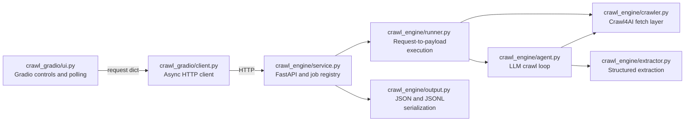
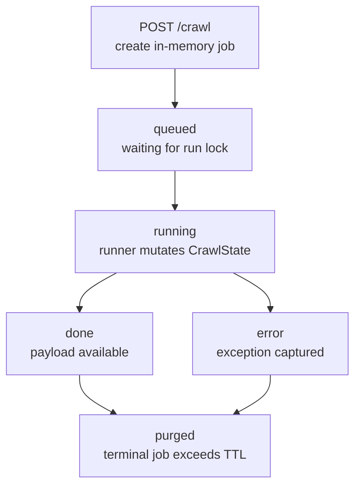

# Architecture — crawl-tool

**Prepared:** 2026-06-12

**Revision history:**
- Initial draft: documented the original in-process CLI and Gradio crawler architecture
- Rev 2: replaced the in-process UI coupling with a two-package HTTP API architecture

---

## System Overview

The repository is a `uv` workspace containing two independently packageable applications:

- `crawl_engine` owns crawling, extraction, serialization, the CLI, and the FastAPI service.
- `crawl_gradio` is a reference HTTP client that owns only UI concerns and result rendering.

The packages share no Python code. Their only integration contract is the engine HTTP API,
which allows a future non-Python frontend to live in a separate repository.



---

## Package Responsibilities

| Package or module | Role |
|---|---|
| `crawl_engine.contract` | Pydantic request and response models that drive OpenAPI |
| `crawl_engine.service` | FastAPI endpoints, in-memory jobs, CORS, locking, and TTL cleanup |
| `crawl_engine.runner` | Select direct fetch or agent crawl and build the result payload |
| `crawl_engine.config` | User crawl configuration and hard depth ceiling |
| `crawl_engine.agent` | Observe, decide, and act loop with crawl guardrails |
| `crawl_engine.crawler` | Crawl4AI wrapper and retry policy |
| `crawl_engine.extractor` | Claude schema inference and structured extraction |
| `crawl_engine.output` | JSON and JSONL serialization |
| `crawl_engine.cli` | Local command-line entry point that calls `runner` directly |
| `crawl_gradio.client` | The only UI-to-engine coupling; all calls use `httpx` |
| `crawl_gradio.ui` | Request JSON construction, polling, progress, and result display |
| `crawl_gradio.ui_results` | Payload-to-HTML result rendering |

---

## HTTP Contract

FastAPI publishes the contract at `/openapi.json` and interactive documentation at `/docs`.

| Method | Path | Behavior |
|---|---|---|
| `GET` | `/healthz` | Return process health |
| `POST` | `/crawl` | Validate a `CrawlRequest`, queue a job, and return its ID |
| `GET` | `/crawl/{job_id}` | Return job status, live page count, payload, or error |
| `GET` | `/crawl/{job_id}/result` | Download JSON or JSONL after the job is done |

`CrawlRequest` contains the existing user-facing crawl controls. `JobResult` has the
following shape:

```json
{
  "status": "queued",
  "progress": {
    "pages_collected": 0
  },
  "payload": null,
  "error": null
}
```

The result endpoint owns artifact serialization. Clients choose `json` or `jsonl` through
the `format` query parameter and do not import engine output code.

---

## Job Lifecycle



- Each request receives a UUID and returns immediately.
- One `asyncio.Lock` serializes crawls to limit Chromium memory use.
- Running progress reads `len(CrawlState.pages)` from the injected live state.
- Background exceptions become terminal error jobs and do not crash the service.
- Jobs are held in memory and terminal jobs are purged after one hour.
- Engine restarts lose queued, running, and completed jobs.

---

## Data Flow

1. `crawl_gradio.ui` validates browser input and builds plain request JSON.
2. `crawl_gradio.client` posts the request and receives a job ID.
3. The UI polls the job endpoint and yields the collected-page count to Gradio.
4. `crawl_engine.service` runs `runner.execute` after acquiring the shared lock.
5. `runner.execute` chooses direct fetch or the agent loop and returns a result payload.
6. The UI renders the payload and downloads the serialized artifact from the engine.

The CLI skips HTTP and calls `runner.execute` directly. This preserves a local command-line
workflow without coupling the Gradio package to engine internals.

---

## Isolation Boundary

`crawl_gradio` must not import:

- `crawl_engine`
- `crawl4ai`
- `playwright`
- `anthropic`

An AST-based boundary test enforces this rule. The Gradio image installs only Gradio and
`httpx`, while the engine image carries Crawl4AI, Chromium, and the Anthropic SDK.

---

## Deployment

| Service | Port | Runtime command | Environment |
|---|---|---|---|
| Engine | `8000` | `uvicorn crawl_engine.service:app` | `ANTHROPIC_API_KEY`, `CORS_ALLOW_ORIGINS` |
| Gradio | `7860` | `python -m crawl_gradio.app` | `ENGINE_URL` |

Docker Compose connects the Gradio client to `http://engine:8000` and publishes both ports.
Publishing the engine port allows another trusted frontend to consume the same OpenAPI
contract.

---

## Known Limitations

- Jobs are in memory and are not durable across engine restarts.
- The single run lock intentionally prevents horizontal crawl concurrency.
- Authentication is not implemented; public deployment requires an API token and restricted CORS.
- Progress is a collected-page count rather than a per-page event stream.
- The future non-Python frontend is out of scope and should use the same HTTP contract.
