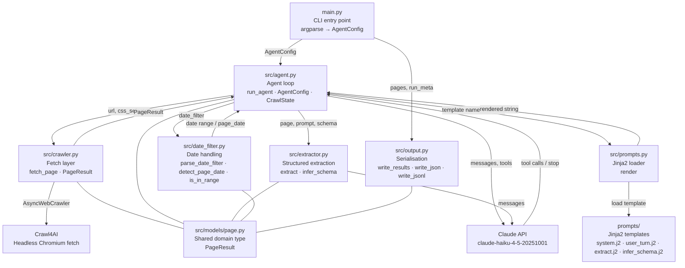
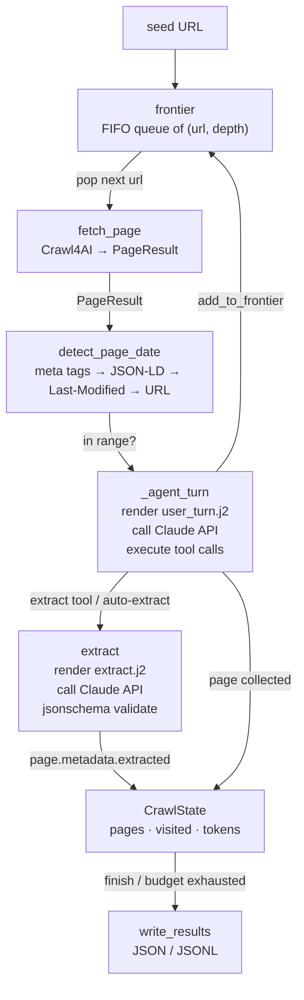

# Architecture — crawl-tool

---

## Module Overview

---

## Data Flow

---

## Module Responsibilities

| Module | Role | Key exports |
|---|---|---|
| `main.py` | CLI entry point — argparse, config assembly, single-page and agent-crawl dispatch | `build_parser`, `run` |
| `src/models/page.py` | Shared domain type used by every module | `PageResult` |
| `src/agent.py` | Observe → decide → act loop; all guardrail logic; token and page budget enforcement | `run_agent`, `AgentConfig`, `CrawlState` |
| `src/crawler.py` | Thin Crawl4AI wrapper; retry policy; article-body targeting; byline extraction | `fetch_page` |
| `src/extractor.py` | Claude-powered structured extraction; JSON Schema inference and validation | `extract`, `infer_schema` |
| `src/date_filter.py` | NL date range parsing; page date detection from meta, JSON-LD, headers, URL; range check | `parse_date_filter`, `detect_page_date`, `is_in_range` |
| `src/prompts.py` | Jinja2 loader with `StrictUndefined` | `render` |
| `src/output.py` | JSON and JSONL serialization; strips `html` and `raw_markdown` from output | `write_results` |
| `src/logging_config.py` | structlog configuration; stable JSON field ordering | `configure_logging` |

---

## Key Design Decisions

### Claude drives navigation; code enforces guardrails

The agent loop never hard-codes which links to follow. Claude receives the current page as markdown and decides which URLs to add to the frontier. Depth ceiling, domain restriction, pattern filters, and URL deduplication are enforced in `_execute_tool` — Claude's choices are silently clipped, not negotiated.

### `PageResult` is the shared currency

Every module that touches page data imports `PageResult` from `src/models`. No module outside `crawler.py` ever imports from `crawl4ai`. This keeps the fetch implementation swappable without touching agent, extractor, or filter logic.

### Prompts are Jinja2 templates, not f-strings

All Claude prompts live in `prompts/*.j2` and are rendered at runtime by `src/prompts.py`. `StrictUndefined` means a missing variable raises immediately rather than silently producing a partial prompt. Prompt iteration never requires a code change.

### Extraction errors are surfaced, not fatal

`extract()` catches JSON parse and schema validation failures and returns `{"error": "..."}` rather than raising. The agent loop attaches the error to `page.metadata["extraction_error"]` and continues. A single bad page cannot abort a 500-page crawl.

### `finish` is guarded, not trusted

When Claude calls `finish`, `_execute_tool` checks: (1) are there still reachable URLs in the frontier? (2) does the goal specify a minimum article count that hasn't been met? If either check fails, finish is rejected and Claude is told to continue. This prevents premature termination on large crawls.

### Token budget is checked before each fetch, not after

The budget guard runs at the top of the loop — before `fetch_page` is called — so the crawl never fetches a page it cannot afford to process. This ensures `state.tokens_used` never significantly overshoots `config.token_budget`.

### Retry policy is in the crawler, not the agent

Exponential backoff (max 3 attempts, 1 s / 2 s), `Retry-After`-aware 429 handling, and the "never raises" guarantee are all in `fetch_page`. The agent loop sees either a successful `PageResult` or `PageResult(success=False)` — it never needs to retry itself.

---

## `AgentConfig` Reference

| Field | Type | Default | Description |
|---|---|---|---|
| `goal` | `str` | `""` | Natural-language crawl goal sent to Claude |
| `max_depth` | `int` | `1` | Hard depth ceiling; seed is depth 0 |
| `max_pages` | `int` | `100` | Hard page cap; checked before each fetch |
| `token_budget` | `int` | `500_000` | Total input + output token cap |
| `same_domain` | `bool` | `True` | Restrict crawl to the seed domain |
| `include_patterns` | `list[str]` | `[]` | Glob patterns URLs must match |
| `exclude_patterns` | `list[str]` | `[]` | Glob patterns that block a URL |
| `model` | `str` | `"claude-haiku-4-5-20251001"` | Anthropic model used for navigation and extraction |
| `extract_prompt` | `str` | `""` | Natural-language extraction instruction |
| `extract_schema` | `dict \| None` | `None` | JSON Schema for extraction; inferred from prompt if absent |
| `date_filter` | `str` | `""` | NL date range, e.g. `"last 7 days"`; empty = no filter |
| `include_undated` | `bool` | `True` | Keep article pages with no detectable publish date |
| `css_selector` | `str` | `""` | CSS selector forwarded to Crawl4AI to scope extraction |
| `max_chars` | `int` | `0` | Truncate page markdown to this many chars before sending to Claude; 0 = no limit |

---

## `CrawlState` Reference

| Field | Type | Description |
|---|---|---|
| `frontier` | `list[tuple[str, int]]` | FIFO queue of `(url, depth)` |
| `visited` | `set[str]` | Canonical URLs already fetched or skipped |
| `pages` | `list[PageResult]` | Successfully collected pages |
| `total_input_tokens` | `int` | Cumulative Claude input tokens |
| `total_output_tokens` | `int` | Cumulative Claude output tokens |
| `finished` | `bool` | True when agent called `finish` |
| `finish_reason` | `str` | Agent's stated finish reason |
| `stop_reason` | `str` | `"agent_finish"` / `"max_pages"` / `"token_budget"` / `"frontier_empty"` |
| `article_pages` | `list[str]` | URLs classified as article pages |
| `frontier_at_finish` | `list[str]` | Remaining frontier URLs at stop time |
| `tokens_used` *(computed)* | `int` | `total_input_tokens + total_output_tokens` |

---

## Date Detection Priority Order

`detect_page_date` checks signals in this order, returning the first valid result:

1. `article:published_time` or `og:updated_time` in `page.metadata`
2. `datePublished` or `dateModified` in `page.metadata` (Crawl4AI-promoted JSON-LD)
3. `datePublished` or `dateModified` parsed directly from `<script type="application/ld+json">` blocks in `page.html`
4. HTTP `Last-Modified` response header via `email.utils.parsedate_to_datetime`
5. Vietnamese news URL pattern — CafeF (`-1NNyyMMddHHmmssID.chn`) and TuoiTre / generic (`-yyyyMMddHHmmssID.html`)

---

## Known Limitations

- **`max_chars` is a character slice, not a token count** — the number of Claude tokens varies with content; a character cap is a reliable proxy but not exact
- **`css_selector` applies uniformly to every page** — seed, category, and article pages all receive the same selector; sites with different DOM structures per page type may need per-depth selector configuration
- **`since` / `between` date trimming is right-greedy** — the parser trims trailing words from the right until a date parses; a trailing word that itself looks like a date token could be misread; acceptable for the target input vocabulary
- **Vietnamese URL pattern assumes 2000s dates** — the CafeF regex prepends `20` to a 2-digit year; URLs with years outside 2000–2099 would be misclassified; this covers all current target sites
- **Date filter not applied to the seed page** — the seed is always fetched for navigation regardless of date range; by design
- **No per-page token breakdown in output** — `state.tokens_used` is cumulative; identifying which pages consume the most budget requires log inspection, not output analysis
- **No `tests/test_integration.py` baseline results** — integration tests require live internet and a valid `ANTHROPIC_API_KEY`; they are excluded from the default `pytest` run and must be triggered explicitly with `pytest -m integration`
