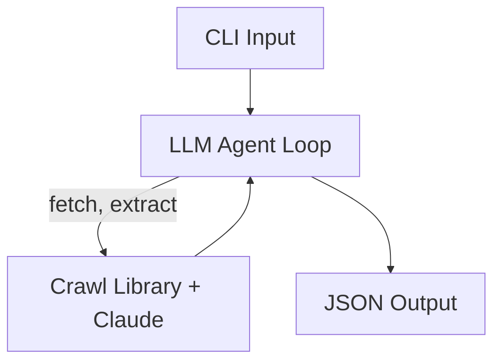

# Crawl Tool — Intern Project Plan

---

## Project Overview

### Project Identity

<details open>
<summary>Name, Scope, Role Split, and Key Constraints</summary>

---

#### Identity

| Field | Value |
|---|---|
| **Project name** | Agent Crawl MVP |
| **Duration** | 6 weeks |
| **Scope** | Goal-directed LLM crawler with structured extraction, depth control, date filtering, and JSON output |

---

#### Project Description

- A CLI tool that crawls Vietnamese economy and finance news sites (CafeF, VnEconomy, etc.) and extracts structured data
- **Use case**: collect articles, market data, company announcements, and financial reports from public economy pages into structured JSON for downstream analysis
- An LLM agent (Claude) drives every crawl decision — which links to follow, what to extract, when to stop
  - Replaces hand-coded crawl orchestration with goal-directed reasoning
- The agent sits on top of an open-source crawl library (chosen during week 1 research) that handles fetching, concurrency, rate limiting, and robots.txt
- User specifies what to extract via a natural-language prompt and optionally a JSON Schema
  - Example: `"extract article title, publish date, stock tickers mentioned, and key financial figures"`
- Supports depth-controlled recursive crawling, URL pattern filtering, natural-language date filtering, and token/page budgets
- Output is a single JSON or JSONL file containing crawl metadata and per-page extraction results

---

</details>

### Handover Deliverables

<details open>
<summary>What the Intern Must Deliver at End of Week 6</summary>

---

| Deliverable | Description |
|---|---|
| **Source code** | Runnable via `python main.py ...` — no packaging required |
| **Git repo** | Clean commit history |
| **Test suite** | Unit tests for core modules and integration tests on real target sites |
| **Project docs** | - Research report: crawl library comparison, evaluation results, decision rationale<br/>- Architecture doc: module diagram, data flow, key design decisions<br/>- README: installation, quick start, CLI reference, example usage |

---

</details>

---

## Tool Requirements (MVP Scope)

### Agent-Driven Crawl Loop

<details open>
<summary>Simplified LLM Agent as the Crawl Driver</summary>

---

#### Core Loop

- An LLM agent drives every crawl decision
  - Replaces hand-coded orchestration with goal-directed reasoning
- Observe → Decide → Act → Update cycle, repeated per page
  - **Observe**: read current page content as extracted markdown
  - **Decide**: pick the next tool call from the agent toolset
  - **Act**: execute the tool call (fetch, extract, enqueue)
  - **Update**: record extracted facts, mark URL visited, refresh frontier
- Agent halts when its goal is satisfied or a budget is exhausted

---

#### Agent Toolset (MVP)

- Tools the agent may invoke per turn
  - **Navigation**
    - `fetch(url)` — fetch a URL through the crawl library
  - **Crawl state**
    - `add_to_frontier(url)` — enqueue a URL with a depth tag
    - `mark_visited(url)` — record dedup state
  - **Extraction and termination**
    - `extract(prompt, schema)` — produce structured output from the page
    - `finish(reason)` — terminate the crawl
- Hard guardrails enforced outside the agent
  - Depth ceiling, pattern filters, robots.txt, rate limits
  - Agent choices clipped — guardrails always win
---

#### Goal Specification

- User states the goal in natural language
  - Example: `"collect all 2026 product launch posts from blog.example.com"`
  - Example: `"download every PDF linked from the SEC filings index"`
- Goal expands into a working plan the agent revises as evidence accrues
- Goal plus `extract_prompt` and `date_filter` shape every decision

---

</details>

### Content Extraction


<details open>
<summary>Page Content, Metadata, and LLM-Assisted Extraction</summary>

---

#### What to Extract

- Main textual content — article body, post body, page content
- Page metadata
  - Title, author, publish date, last-modified date
  - Open Graph and Twitter card tags
  - JSON-LD structured data
- Outbound link list — used for recursive crawling

---

#### How to Extract

- Strip boilerplate — navigation, footer, ads, cookie banners
- Preserve semantic structure — headings, lists, tables, code blocks
- Convert HTML to clean markdown for downstream processing
- Honor JavaScript-rendered content
  - Use headless browser (Playwright) when needed
  - Static fetch as the fast path for plain HTML

---

#### Context Extraction (Agent-Driven)

- Agent decides per page what to extract, guided by the user's prompt
  - Example: `"extract product price and availability"`
  - Example: `"extract trade dates and counterparty names"`
- Output schema declared by user (JSON Schema) or inferred from prompt
- Agent may re-prompt itself with refined queries when first pass is sparse
- Per-page extraction errors surfaced but do not abort the crawl
- Extraction artifacts attached to the page record for the final output

---

</details>

### Date Filtering

<details open>
<summary>Prompt-Driven Date Constraint and Detection</summary>

---

#### Prompt Parsing

- Accept the date filter in natural language via prompt
  - Example: `"last 7 days"`, `"since 2026-01-01"`
  - Example: `"between Jan and Mar 2026"`, `"this quarter"`
- Parse prompt into a normalized date range `(from, to)`
- Reject ambiguous prompts with a clear error rather than guessing

---

#### Date Detection on Page

- Detect a page's effective date from multiple signals, in priority order
  - `<meta>` tags — `article:published_time`, `og:updated_time`
  - JSON-LD `datePublished` and `dateModified`
  - HTTP `Last-Modified` header (lowest priority)
- Fail gracefully when no date can be detected
  - User chooses behavior: skip page, or include with `date=unknown`
- Visible date string parsing in body text is out of scope

---

#### Filter Behavior

- Drop pages outside the resolved date range
- Log every dropped URL with the reason
- Optionally include borderline pages with a confidence score

---

</details>

### Recursive Crawling and Depth

<details open>
<summary>Depth, Scope, URL Filtering, and Deduplication</summary>

---

#### Depth Control

- User sets the `max_depth` parameter — integer, default `1`
- Seed URL is depth `0`
  - `max_depth=1` follows links once
  - `max_depth=2` follows links from those linked pages, and so on
- Tool refuses values above a configured ceiling
  - Default ceiling `5`

---

#### Scope Control

- Agent picks which outbound links to enqueue, ranked by relevance to goal
  - Selection clipped by depth ceiling and pattern filters
- Same-domain restriction toggle
  - Default `on` — never leave the seed domain
  - Off — follow any link, subject to filters
- URL include and exclude pattern lists
  - Glob or regex syntax
  - Example include: `*/articles/*`
  - Example exclude: `*/tag/*`, `*/author/*`
- Robots.txt compliance toggle
  - Default `on` — honor `Disallow` rules

---

#### Deduplication and Cycle Avoidance

- Track visited URLs in a set, keyed by canonical URL
  - Strip fragments, normalize query parameter order
- Detect crawl traps — infinite calendars, paginated dead-ends
  - Heuristic: same template + monotonic query param + zero new outlinks
- Hard cap on total pages per crawl
  - Default `1000`, user-configurable

---

</details>

### Output

<details open>
<summary>JSON / JSONL Output</summary>

---

- Tool emits a single JSON file per crawl session, or JSONL for large crawls
- Output includes crawl metadata (run info) and per-page extraction results
- Extraction shape is driven by the user's prompt and optional JSON Schema
- Exact output schema design is up to the intern

---

</details>

### Compliance

<details open>
<summary>Robots.txt and Ethical Crawling</summary>

---

- Robots.txt honored by default; explicit user override required to disable
- User-Agent string identifies the tool and a contact email
- No bypassing of paywalls, paid content, or DRM
- Credentials never written to logs or output files

---

</details>

### Architecture Overview

<details open>
<summary>High-Level Layers and Data Flow</summary>

---



| Layer | Role |
|---|---|
| **CLI Input** | Parse flags, validate, pass goal + prompt to the agent |
| **LLM Agent Loop** | Observe → decide → act cycle, clipped by guardrails (depth, patterns, robots) |
| **Crawl Library + Claude** | Fetch pages, render JS, parse content, run LLM extraction |
| **JSON Output** | Serialize crawl metadata + per-page results to JSON or JSONL |

- Intern designs concrete module structure during week 1-2

---

</details>

### Folder Structure

<details open>
<summary>Starting Project Layout</summary>

---

```
crawl-tool/
├── main.py                  # CLI entry point — argparse + dispatch to agent
├── pyproject.toml           # uv-managed deps and Ruff config
├── README.md
├── .gitignore
├── docs/
├── prompts/                 # Jinja2 prompt templates loaded by the agent at runtime
├── src/
│   ├── __init__.py
│   ├── agent.py             # LLM agent loop — observe, decide, act
│   ├── crawler.py           # Thin wrapper around the chosen crawl library
│   ├── extractor.py         # Structured extraction via Claude + schema validation
│   ├── date_filter.py       # NL date parsing + page date detection
│   ├── prompts.py           # Loads Jinja2 templates from prompts/ and renders them
│   └── output.py            # JSON / JSONL serialization
└── tests/
```

- Prompts live in `prompts/` as Jinja2 templates — keeps prompt engineering separate from code
- `src/prompts.py` is the loader: reads a template by name, renders it with context variables, returns the final string
- One module per concern — easier to test, easier for Claude Code to navigate
- `main.py` at the repo root so `python main.py ...` works without installation
- Intern can adjust layout as the project grows — this is a starting point, not a contract

---

</details>

---

## Evaluation Metrics

### Functional Metrics

<details open>
<summary>Acceptance Criteria</summary>

---

| Metric | Target |
|---|---|
| **Crawl completion** | Completes on all chosen test sites without crash |
| **Depth correctness** | Fetches exactly the expected URL set on a controlled test site |
| **Dedup correctness** | No duplicate fetches across a crawl |
| **Same-domain filter** | No off-domain URLs in output when same-domain restriction is on |
| **Extraction accuracy** | Target fields populated correctly on the benchmark set |
| **Schema validation** | Output records pass the user-supplied schema |
| **Date filter** | Pages outside the date range excluded on a site with known publish dates |
| **JSON output** | Crawl metadata block present, all required fields populated |

---

</details>

### Code Quality Metrics

<details open>
<summary>Tooling and Style Targets</summary>

---

| Metric | Target |
|---|---|
| **Ruff** | Zero errors on `ruff check .` |
| **Type hints** | Every public function signature has type hints |
| **Docstrings** | Every public function and class has a Google-style docstring |
| **Git hygiene** | Atomic commits, descriptive messages, no `fix fix fix` chains |

---

</details>

### Process Metrics

<details open>
<summary>Communication, Independence, and Weekly Cadence</summary>

---

| Metric | Target |
|---|---|
| **Blockers raised** | Within 24 hours of encountering, not end of week |
| **PR cadence** | At least 2 PRs per week from week 2 onward |

---

</details>

---

## Weekly Plan

### Week 1 — Research and Tool Exploration

<details open>
<summary>Evaluate libraries, set up repo skeleton, produce research report</summary>

---

#### Tasks

| Task | Files | Detail |
|---|---|---|
| **Read requirements** | — | Read `## Tool Requirements (MVP Scope)` above |
| **Async Python primer** | — | If unfamiliar, read up on `asyncio` and `async/await` |
| **Evaluate crawl libraries** | — | Compare Crawl4AI, Firecrawl, Stagehand on docs, API surface, gaps vs. requirements |
| **Explore Claude API tool use** | — | Read docs on the agent loop pattern — message format, tool definitions, stop conditions |
| **Repo skeleton** | `pyproject.toml`, `.gitignore`, `src/__init__.py`, empty `src/`, `tests/`, `docs/`, `prompts/` | uv-managed deps, Ruff config |
| **Write research report** | `docs/research_report.md` | Library comparison matrix, recommendation with rationale |

---

</details>

### Week 2 — First Crawl End-to-End

<details open>
<summary>Minimal CLI invoking the chosen crawl library, simple JSON output</summary>

---

#### Tasks

| Task | Files | Detail |
|---|---|---|
| **Minimal CLI** | `main.py` | `python main.py <url> --output out.json` — only essential flags |
| **Crawl library wrapper** | `src/crawler.py` | Fetch seed URL, follow links one level deep, return page content |
| **Basic JSON output** | `src/output.py` | Array of `{url, title, content}` records — no metadata block yet |
| **One real test site** | — | Run end-to-end on a CafeF or VnEconomy page; confirm pages return text content |

---

</details>

### Week 3 — Agent Loop

<details open>
<summary>Claude agent drives crawl decisions — observe, decide, act cycle</summary>

---

#### Tasks

| Task | Files | Detail |
|---|---|---|
| **Prompt loader** | `src/prompts.py`, `prompts/` | Load Jinja2 templates by name, render with context variables.<br/>Iterate prompts without touching code |
| **Agent loop skeleton** | `src/agent.py` | Observe → decide → act → update cycle.<br/>Loads system prompt via `prompts.py` |
| **Agent toolset** | `src/agent.py` | Define Claude tools: `add_to_frontier`, `mark_visited`, `finish`.<br/>Navigation handled by crawler — agent only decides *which* URLs |
| **Page + token budget** | `src/agent.py` | Per-page action budget; halt crawl when token budget exceeded |
| **Dispatch from CLI** | `main.py` | Route from CLI to agent loop instead of direct crawler call |
| **Test on a real site** | — | Agent navigates CafeF: follows goal-relevant links, skips others |

---

</details>

### Week 4 — Structured Extraction

<details open>
<summary>Agent extracts structured data per user prompt into JSON Schema</summary>

---

#### Tasks

| Task | Files | Detail |
|---|---|---|
| **Extraction templates** | `prompts/` | Add Jinja2 templates for structured extraction and schema inference |
| **Extraction module** | `src/extractor.py` | Load template via `prompts.py`, call Claude, return JSON matching schema |
| **Schema validation** | `src/extractor.py` | Validate output with `jsonschema`.<br/>Per-page errors surfaced but do not abort the crawl |
| **Schema inference** | `src/extractor.py` | When schema is omitted, infer one from the extract prompt |
| **Extract tool in agent** | `src/agent.py` | Add `extract(prompt, schema)` to the agent toolset.<br/>Inject `--extract-prompt` into system prompt |
| **CLI flags** | `main.py` | Add `--extract-prompt` and `--extract-schema` (path to JSON file) |
| **JSONL output** | `src/output.py` | Add JSONL mode toggled by `--format jsonl`; one record per line |

---

</details>

### Week 5 — Date Filtering and Reliability

<details open>
<summary>NL date filtering, retry hardening, structured logging</summary>

---

#### Tasks

| Task | Files | Detail |
|---|---|---|
| **NL date parsing** | `src/date_filter.py` | Parse prompts like `"last 7 days"`, `"since 2025-01-01"` into `(from, to)` |
| **Page date detection** | `src/date_filter.py` | Extract date from meta tags, JSON-LD, HTTP `Last-Modified` (priority order) |
| **Filter behavior** | `src/date_filter.py`, `src/agent.py` | Drop pages outside range, log dropped URLs.<br/>`--include-undated` flag |
| **CLI date flag** | `main.py` | Add `--date-filter` flag, wire to the filter |
| **Retry policy** | `src/crawler.py` | Exponential backoff on `5xx`/timeout, max 3 retries.<br/>Respect `Retry-After` on `429` |
| **Structured logging** | across modules | Per-page log: URL, status, depth, time.<br/>End-of-crawl summary in `src/output.py` |

---

</details>

### Week 6 — Testing, Docs, and Handover

<details open>
<summary>Tests on real sites, fix bugs, write docs, final handover</summary>

---

#### Tasks

| Task | Files | Detail |
|---|---|---|
| **Unit tests** | `tests/` | Cover `date_filter`, `extractor`, `output`, arg parsing |
| **Integration tests** | `tests/` | Run end-to-end on 3 real Vietnamese economy sites |
| **Bug fixing** | across `src/` | Fix edge cases from integration testing (encoding, JS-only content, unusual dates) |
| **Code cleanup** | across `src/` | Ruff clean, remove dead code, docstrings on all public functions |
| **Architecture doc** | `docs/architecture.md` | Module diagram, data flow, key design decisions, known limitations |
| **README** | `README.md` | Installation, quick start, CLI reference, example usage |
| **Handover session** | — | Walk mentor through the codebase — 30 min, no slides, just code |

---

</details>

