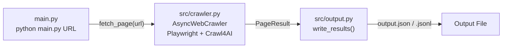

# Week 2 Implementation Report — First Crawl End-to-End

**Prepared:** 2026-05-29

**Revision history:**
- Initial draft: crawler wrapper, JSON output, CLI wiring, smoke test on CafeF
- Rev 2: `PageResult` migrated from `@dataclass` to Pydantic `BaseModel`; `src/output.py` uses `model_dump()` instead of `dataclasses.asdict`
- Rev 3: `PageResult` moved from `src/crawler.py` to `src/models/page.py`; `fetch_time` and `headers` fields added in Week 5

**commit:** [link](https://github.com/tuanhdangdinh/agentic-news-crawler/commit/7d7ce87e8e07d210c76036934caad90c22a99116)

---

## Overview

### What Week 2 Builds

- Week 1 selected the library and defined the contract — Week 2 makes it real
- Three modules implemented: `src/crawler.py`, `src/output.py`, updated `main.py`
- Goal: prove that one function, `fetch_page(url)`, reliably returns clean markdown, metadata, and links from a live Vietnamese finance site
- No agent loop yet — direct fetch → output pipeline only
- Agent loop comes in Week 3; this week's code becomes the fetch layer it calls

### What Changed From Week 1

- `src/crawler.py` — stub → full `PageResult` dataclass + `fetch_page()` implementation
- `src/output.py` — stub → `write_json()`, `write_jsonl()`, `write_results()` dispatcher
- `main.py` — placeholder print → real fetch + output pipeline
- `pyproject.toml` — `crawl4ai>=0.4.0` pinned to `crawl4ai==0.8.6` (tested version)

### Data Flow This Week



### This Report

- Documents the Week 2 implementation: design decisions, public interfaces, output schema, and smoke test results
- Each section matches a deliverable from the Week 2 task list in the intern plan

---

## Objective

- Implement `fetch_page(url) → PageResult` — the stable boundary between the crawl library and the rest of the project
- Serialize results to JSON / JSONL with a crawl metadata block
- Wire `main.py` so `python main.py <url> --output out.json` produces real output
- Verify end-to-end on CafeF (`https://cafef.vn`) and confirm acceptance criteria

---

## Module: `src/crawler.py`

### Design Decisions

- **Single public function** — `fetch_page(url, css_selector?)` is the only export the rest of the project uses; Crawl4AI internals stay hidden behind it
- **Never raises** — all failures return `PageResult(success=False, error=...)` so the agent loop never needs try/except around a fetch
- **Markdown priority** — `fit_markdown` (boilerplate-pruned) is preferred; falls back to `raw_markdown` if the content filter produces nothing
- **Link normalisation** — `result.links` from Crawl4AI is a dict of objects; `_extract_links()` flattens it to plain `list[str]` so `src/agent.py` has no Crawl4AI dependency
- **Optional CSS selector** — `css_selector` parameter lets per-domain overrides target article body elements (e.g. `.article-body`) to improve extraction quality on noisy templates

### Crawl4AI Configuration

```python
BrowserConfig(browser_type="chromium", headless=True)

CrawlerRunConfig(
    cache_mode=CacheMode.BYPASS,      # always fetch fresh
    check_robots_txt=True,            # hard guardrail
    markdown_generator=DefaultMarkdownGenerator(
        content_filter=PruningContentFilter(threshold=0.6)
    ),
)
```

- `cache_mode=BYPASS` — ensures fresh content on every run; no stale cache
- `check_robots_txt=True` — compliance enforced at fetch layer, not just agent layer
- `PruningContentFilter(threshold=0.6)` — removes low-density nodes (nav, footer, ads) before markdown conversion; threshold 0.6 is conservative (adjust per site if needed)

### `PageResult` Model

```python
class PageResult(BaseModel):
    url: str              # original requested URL
    final_url: str        # URL after redirects
    status_code: int | None
    title: str | None     # from metadata["title"] or og:title
    markdown: str         # fit_markdown (primary Claude input)
    raw_markdown: str | None = None
    html: str | None = None  # raw HTML — kept for debugging, excluded from output
    links_internal: list[str] = Field(default_factory=list)
    links_external: list[str] = Field(default_factory=list)
    metadata: dict = Field(default_factory=dict)
    success: bool = True
    error: str | None = None
```

- Pydantic `BaseModel` — provides field validation, type coercion, and `.model_dump()` serialisation
- `html` and `raw_markdown` excluded from serialised output via `model_dump(exclude={"html", "raw_markdown"})`
- `title` resolution order: `metadata["title"]` → `metadata["og:title"]` → `None`

### `fetch_page` Signature

```python
async def fetch_page(url: str, css_selector: str | None = None) -> PageResult
```

- Accepts any absolute URL
- Returns `PageResult` in all cases — caller checks `page.success` before using content
- `css_selector` is optional; when provided, Crawl4AI scopes extraction to that element

---

## Module: `src/output.py`

### Design Decisions

- **Two formats** — JSON (single file with metadata block + pages array) and JSONL (one record per line, better for large crawls and streaming ingestion)
- **Metadata block in JSON mode** — top-level `meta` object carries run context so the output file is self-describing
- **`html` and `raw_markdown` excluded** — dropped via `page.model_dump(exclude={"html", "raw_markdown"})` to keep file sizes manageable; `markdown` (filtered content) is the primary output

### JSON Output Schema

```json
{
  "meta": {
    "generated_at": "2026-05-29T05:18:50.231479+00:00",
    "total_pages": 1,
    "successful": 1,
    "failed": 0,
    "seed_url": "https://cafef.vn",
    "goal": ""
  },
  "pages": [
    {
      "url": "https://cafef.vn",
      "final_url": "https://cafef.vn",
      "status_code": 200,
      "title": "Kênh thông tin kinh tế - tài chính Việt Nam",
      "markdown": "...",
      "links_internal": ["https://cafef.vn/...", "..."],
      "links_external": ["..."],
      "metadata": { "title": "...", "og:title": "...", "...": "..." },
      "success": true,
      "error": null
    }
  ]
}
```

### JSONL Output Schema

- One JSON object per line — same fields as each `pages[n]` entry above, no wrapping envelope
- Used with `--format jsonl`; suited for large crawls where the full array would be unwieldy

### Public Interface

```python
write_results(
    pages: list[PageResult],
    path: str,
    fmt: str = "json",        # "json" or "jsonl"
    run_meta: dict | None = None,
) -> None
```

- `run_meta` is merged into the `meta` block in JSON mode — used by `main.py` to inject seed URL, goal, depth, token counts
- JSONL mode ignores `run_meta` — metadata must be handled separately if needed

---

## Module: `main.py`

### Week 2 Behaviour

- Accepts `<url>` positional argument plus all planned flags (full list below)
- Calls `fetch_page(url)` directly — no agent loop yet
- Prints per-fetch summary to stdout: status code, title, char count, link counts
- Writes output file and prints its path

### CLI Reference (Week 2 scope)

| Flag | Default | Description |
|---|---|---|
| `url` | required | Seed URL to fetch |
| `--output` | `output.json` | Output file path |
| `--format` | `json` | `json` or `jsonl` |
| `--goal` | `""` | Carried into run metadata; not yet used for decisions |
| `--max-depth` | `1` | Carried into run metadata; not yet enforced |
| `--max-pages` | `100` | Carried into run metadata; not yet enforced |
| `--verbose` | off | Enable INFO logging |

> All flags are defined and accepted in Week 2 even if not yet wired to logic — this avoids breaking the interface when the agent loop arrives in Week 3.

---

## Smoke Test Results

**Command:**
```bash
uv run python main.py https://cafef.vn --output output.json --verbose
```

**Results:**

| Check | Result |
|---|---|
| HTTP status | 200 |
| `success` | `True` |
| Title detected | `Kênh thông tin kinh tế - tài chính Việt Nam` |
| Markdown chars | 22,912 — article headlines and summaries visible |
| Internal links | 149 |
| External links | 3 |
| robots.txt | respected — no denial |
| Output file | valid JSON, metadata block present |
| Vietnamese text | encoded correctly (`ensure_ascii=False`) |
| Fetch time | ~4.9s (Playwright cold start + JS render) |

**Output file verified:**
```bash
uv run python -c "
import json
d = json.load(open('output.json'))
print(d['meta'])
print(d['pages'][0]['markdown'][:200])
"
```

---

## Known Limitations

- **~~Single-page only~~** — RESOLVED (Week 3): recursive crawl added with the agent loop; `run_agent` expands the frontier depth-first and respects `max_depth` and `max_pages` hard limits
- **~~No depth/max-pages enforcement~~** — RESOLVED (Week 3): `_allowed` guardrail in `src/agent.py` enforces depth and page-count limits in code; Claude cannot override them
- **Cold Playwright start per fetch** — `AsyncWebCrawler` opens and closes a browser instance per `fetch_page` call; on a 50-page crawl this adds ~4s overhead per page; persistent browser session not yet scheduled
- **~~No per-domain CSS selector overrides~~** — RESOLVED (Week 6): `--css-selector` flag wires a uniform CSS selector through CLI → `AgentConfig` → `fetch_page`; per-domain override configuration remains out of scope

---

## Dependency Changes

| Change | Reason |
|---|---|
| `crawl4ai>=0.4.0` → `crawl4ai==0.8.6` | Pin to tested version to prevent API drift |

---

## Week 3 Entry Criteria

- [x] `fetch_page(url)` returns valid `PageResult` on CafeF
- [x] Output JSON passes schema check (metadata block + pages array)
- [x] Vietnamese text encoded correctly
- [x] robots.txt respected at fetch layer
- [x] Failed pages return `PageResult(success=False)` — does not raise
- [ ] `ANTHROPIC_API_KEY` set in environment
- [ ] Agent loop (`src/agent.py`) implemented — observe → decide → act cycle
- [ ] Prompt templates (`prompts/system.j2`, `prompts/user_turn.j2`) created
- [ ] `main.py` routes through agent loop instead of direct `fetch_page` call
