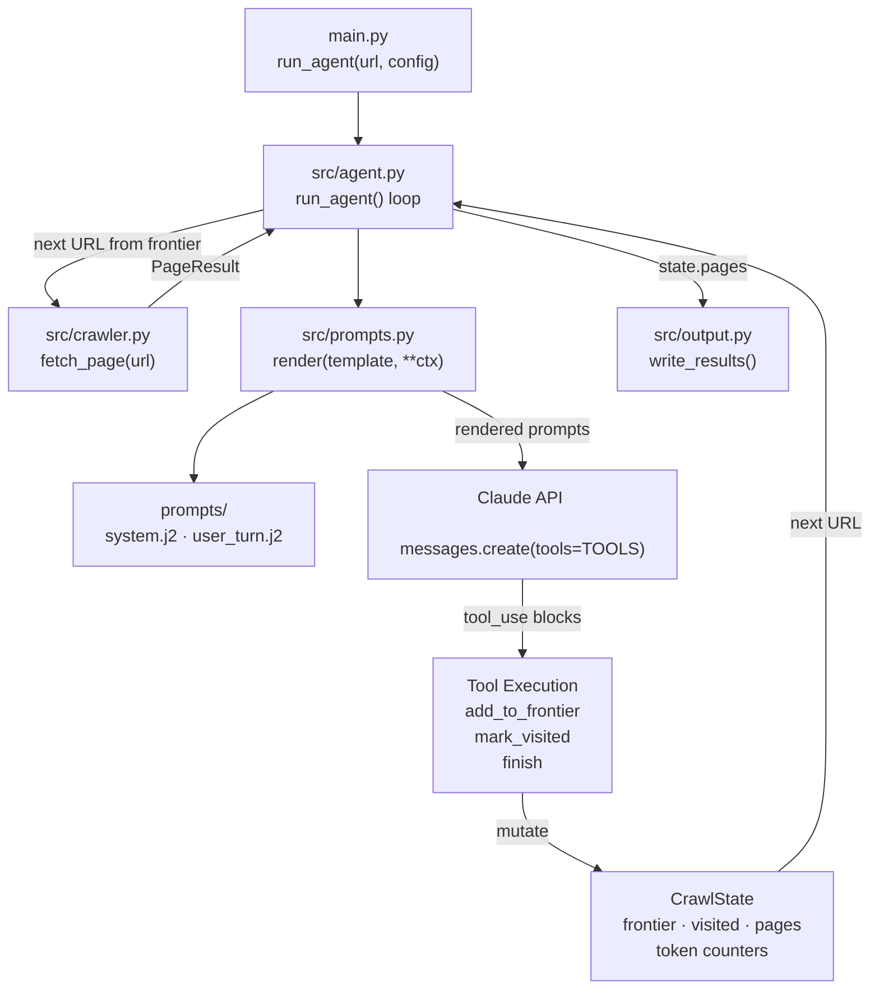

# Week 3 Implementation Report — Agent Loop

**Prepared:** 2026-05-29

**Revision history:**
- Initial draft: prompt loader, agent loop skeleton, Claude toolset, token budget, CLI wiring
- Rev 2: switched `anthropic.Anthropic` → `AsyncAnthropic`; `_agent_turn` made `async` — Claude API calls no longer block the event loop
- Rev 3: smoke test run and results recorded — all acceptance criteria passed
- Rev 4: `AgentConfig` and `CrawlState` migrated from `@dataclass` to Pydantic `BaseModel`; `tokens_used` changed to `@computed_field`
- Rev 5: two bugs found and fixed during re-run — (1) premature `finish` when reachable URLs remained in frontier; (2) stale articles collected because Claude lacked today's date
- Rev 6: `CrawlState` gained `stop_reason`, `article_pages`, `frontier_at_finish` fields to support finish guard and output metadata; `_parse_min_articles` and `_is_article_page` private helpers added
- Rev 7 (2026-06-05): article candidate links and exact current-page URL guard added to prevent fabricated article URLs

**commit:** [link](https://github.com/tuanhdangdinh/agentic-news-crawler/commit/c799704f43547ac6ef6f1d935958fdb4eaab5942)

---

## Overview

### What Week 3 Builds

- Week 2 proved `fetch_page()` works — Week 3 adds the brain on top
- An LLM agent (Claude) now drives every crawl decision: which links to follow, when to stop
- The crawler no longer fetches blindly — it only fetches URLs the agent has chosen to enqueue
- Four modules implemented or updated: `src/prompts.py`, `src/agent.py`, `prompts/system.j2`, `prompts/user_turn.j2`
- `main.py` updated to route through the agent loop instead of calling `fetch_page` directly

### What Changed From Week 2

- `src/prompts.py` — stub → Jinja2 template loader
- `prompts/system.j2` — new — system prompt template (rendered once per crawl run)
- `prompts/user_turn.j2` — new — per-page user turn template
- `src/agent.py` — stub → full agent loop (`AgentConfig`, `CrawlState`, `run_agent`)
- `main.py` — direct `fetch_page` call → `run_agent` dispatch; added `--token-budget` flag and `--verbose`

### Data Flow This Week



### This Report

- Documents the Week 3 implementation: agent architecture, prompt design, tool definitions, guardrail model, and how each piece fits together; framework used is the raw Anthropic Python SDK with no agent framework

---

## Objective

- Implement the Observe → Decide → Act → Update agent loop in `src/agent.py`
- Build a Jinja2 template loader (`src/prompts.py`) so prompts can be iterated without touching code
- Define three Claude tools: `add_to_frontier`, `mark_visited`, `finish`
- Enforce hard guardrails in code: depth ceiling, same-domain filter, URL deduplication, max-pages cap, token budget
- Wire `main.py` to route through `run_agent` and surface per-page progress + final run statistics

---

## Module: `src/prompts.py`

### Design Decisions

- **Jinja2 with `StrictUndefined`** — any template variable missing from the render call raises immediately; prevents silent empty-string substitutions in prompts
- **`trim_blocks=True`, `lstrip_blocks=True`** — removes unwanted newlines around `` control blocks so rendered prompts are clean
- **Single `render()` function** — one call site for all template rendering; adding a new template only requires a new `.j2` file, no code change

### Public Interface

```python
render(template_name: str, **context: object) -> str
```

- `template_name`: filename inside `prompts/`, e.g. `"system.j2"`
- `**context`: variables injected into the template
- Returns the fully rendered string
- Raises `jinja2.UndefinedError` if a required variable is missing

---

## Module: `prompts/system.j2`

### Design Decisions

- **Rendered once per crawl run** — cached with `cache_control: ephemeral` on every Claude API call to reduce cost
- **Today's date shown at top** — lets Claude evaluate "latest" relative to a real date
- **Goal injected after the date** — Claude anchors all decisions to it
- **Hard constraints block labelled "enforced by the system"** — depth, max pages, same-domain shown so Claude does not waste reasoning on them
- **Crawl guidelines** — prefer article pages, skip irrelevant pages, call `finish` early, use URL-embedded dates to skip old articles

### Public Interface

Injected variables (rendered into the system prompt):

| Variable | Source | Description |
|---|---|---|
| `goal` | `AgentConfig.goal` | User's plain-language crawl goal |
| `today` | `date.today().isoformat()` | Current date — lets Claude evaluate recency |
| `max_depth` | `AgentConfig.max_depth` | Hard depth ceiling |
| `max_pages` | `AgentConfig.max_pages` | Hard page cap |
| `same_domain` | `AgentConfig.same_domain` | Whether to restrict to seed domain |

---

## Module: `prompts/user_turn.j2`

### Design Decisions

- **Rendered once per page** — live crawl state injected so Claude always sees current progress
- **Markdown capped at 6,000 chars** — balances context quality against token cost; long articles are readable at this limit
- **Links capped at 40** — enough for Claude to decide on a typical news page; avoids bloating the prompt on heavily-linked index pages
- **Article candidate links shown separately** — internal links matching article URL patterns are surfaced even when the full link list is long; this fixed cases where the relevant `.htm` article was outside the first visible links
- **Exact-link requirement** — the prompt tells Claude to copy URLs exactly from Internal Links or Article Candidate Links; code now rejects `add_to_frontier` URLs not extracted from the current page, preventing fabricated slugs
- **Live crawl state counters at the bottom** — Claude can see when the budget is near and call `finish` earlier
- **`frontier_reachable` shown separately from `frontier_count`** — Claude needs to know how many URLs it can still reach at the current depth ceiling, not just how many are queued total

### Public Interface

Injected variables (rendered into each per-page user turn):

| Variable | Source | Description |
|---|---|---|
| `url` | `page.final_url` | URL of the current page |
| `title` | `page.title` | Page title |
| `depth` | current depth | Depth of this page in the crawl |
| `max_depth` | `AgentConfig.max_depth` | Ceiling for context |
| `markdown` | `page.markdown` | Page content — truncated to 6,000 chars |
| `links_internal` | `page.links_internal` | Internal links — first 40 shown |
| `article_candidate_links` | `_article_candidate_links(page.links_internal)` | Internal article-looking links — first 60 shown |
| `pages_count` | `len(state.pages)` | Pages collected so far |
| `frontier_count` | `len(state.frontier)` | Total URLs waiting to be fetched |
| `frontier_reachable` | frontier URLs with depth ≤ max_depth | URLs still reachable in current crawl |
| `visited_count` | `len(state.visited)` | URLs already seen |
| `tokens_used` | `state.tokens_used` | Running token total |
| `token_budget` | `AgentConfig.token_budget` | Budget ceiling |

---

## Module: `src/agent.py`

### Design Decisions

- **Why an LLM agent instead of rule-based crawling** — rule-based crawlers follow all links matching a pattern and cannot distinguish a relevant article from an irrelevant one with the same URL structure; Vietnamese finance sites mix article, tag, author, and ad-landing pages under one domain, so a URL pattern alone cannot filter them; Claude reads page content and the link list, understands the goal, and picks only links worth following
- **Raw Anthropic SDK, no agent framework** — the loop is built directly on `anthropic.messages.create()` with tool use; all guardrails (depth, same-domain, robots, page cap, token budget) are enforced in plain Python with no framework abstraction hiding them, and the full loop is visible in one file for easier debugging
- **Tradeoff accepted** — parallel agent tasks or built-in memory would need to be added manually; a framework like LangGraph would provide them out of the box, but that is unnecessary at MVP scope
- **Hard constraints enforced in code, not by Claude** — Claude decides *which* links matter; the system decides *whether* they are allowed

### `AgentConfig`

```python
class AgentConfig(BaseModel):
    goal: str = ""
    max_depth: int = 1
    max_pages: int = 100
    token_budget: int = 500_000
    same_domain: bool = True
    include_patterns: list[str] = Field(default_factory=list)
    exclude_patterns: list[str] = Field(default_factory=list)
    model: str = "claude-haiku-4-5-20251001"   # module-level MODEL constant
    extract_prompt: str = ""                    # added Week 4 — see below
    extract_schema: dict | None = None          # added Week 4 — see below
```

- Pydantic `BaseModel` — field validation and type coercion on construction
- `model` is a field so the model can be swapped without touching agent logic; the default is the module-level `MODEL` constant (`claude-haiku-4-5-20251001`)
- `extract_prompt` and `extract_schema` are **not part of the Week 3 toolset** — they were added in Week 4 for structured extraction and are shown here only because the model is the current Pydantic definition; Week 3 shipped without them

### `CrawlState`

```python
class CrawlState(BaseModel):
    frontier: list[tuple[str, int]] = Field(default_factory=list)
    visited: set[str] = Field(default_factory=set)
    pages: list[PageResult] = Field(default_factory=list)
    total_input_tokens: int = 0
    total_output_tokens: int = 0
    finished: bool = False
    finish_reason: str = ""
    stop_reason: str = ""               # "agent_finish" | "max_pages" | "token_budget" | "frontier_empty"
    article_pages: list[str] = Field(default_factory=list)     # URLs classified as article pages
    frontier_at_finish: list[str] = Field(default_factory=list)  # remaining URLs when crawl stopped

    model_config = {"arbitrary_types_allowed": True}

    @computed_field
    @property
    def tokens_used(self) -> int: ...
```

- Pydantic `BaseModel` — `arbitrary_types_allowed` required for `set[str]`
- `tokens_used` is a `@computed_field` — included in `.model_dump()` output automatically
- `frontier` is a FIFO list — BFS traversal by default
- `visited` uses canonical URLs (fragment stripped) to prevent duplicate fetches via `#section` variants
- `finished` flag checked at the top of every loop iteration — agent can terminate mid-crawl before budgets are hit

### Claude Tool Definitions

Three tools available to the agent per page turn:

| Tool | Purpose | Required inputs |
|---|---|---|
| `add_to_frontier` | Queue a URL to crawl next | `url` (string); optional `reason` |
| `mark_visited` | Blacklist a URL without fetching | `url` (string) |
| `finish` | Terminate the crawl | `reason` (string) |

**Why these three tools for Week 3:**
- `add_to_frontier` — the primary decision tool; agent selects which links are worth following
- `mark_visited` — lets agent explicitly skip a URL it recognises as irrelevant, preventing it from being re-added later
- `finish` — clean termination signal with a stated reason; avoids the loop running to budget exhaustion on every crawl

**Tools deferred to later weeks:**
- `extract(prompt, schema)` — structured field extraction per page → Week 4
- `fetch(url)` — agent-initiated fetch outside the loop → not needed; loop auto-fetches from frontier

### Guardrails (Enforced in Code — Claude Cannot Override)

| Guardrail | Where enforced | Behaviour |
|---|---|---|
| Depth ceiling | `_execute_tool` → `add_to_frontier` | URL skipped; returns `"skipped (depth N > max M)"` to Claude |
| Same-domain filter | `_allowed()` | Off-domain URLs blocked regardless of Claude's request |
| Include/exclude patterns | `_allowed()` | `fnmatch` glob matching against URL string |
| URL deduplication | `_execute_tool` + frontier check | Already-visited and already-queued URLs rejected |
| Max-pages cap | top of `run_agent` loop | Loop exits before fetching the next page |
| Token budget | top of `run_agent` loop | Loop exits before the next Claude API call |
| Premature finish | `_execute_tool` → `finish` | `finish` rejected if reachable URLs (depth ≤ max_depth) remain in frontier |
| Min-articles finish | `_execute_tool` → `finish` | `finish` rejected if goal specifies a minimum article count not yet reached |

### Observe → Decide → Act → Update Cycle

```
run_agent(seed_url, config):
  initialise state — seed URL in frontier at depth 0
  render system_prompt once (cached per crawl)

  while frontier not empty and not finished:
    guard: exit if pages >= max_pages or tokens >= token_budget

    url, depth = frontier.pop(0)           ← FIFO
    skip if url in visited

    OBSERVE:
      page = await fetch_page(url)
      mark url visited
      skip if fetch failed
      append page to state.pages

    DECIDE + ACT (tool-use loop):
      user_msg = render("user_turn.j2", page, state)
      while True:
        response = claude.messages.create(tools=TOOLS, messages=...)
        track tokens
        for each tool_use block:
          execute tool → mutates state (frontier / visited / finished)
        if stop_reason == "end_turn" or no tools called: break
        if state.finished: break
        append assistant + tool_results, call Claude again

    UPDATE: state already mutated by tool execution

  return state
```

### Prompt Caching

- System prompt passed with `cache_control: {"type": "ephemeral"}` on every API call
- The system prompt is identical across all page turns in a crawl — caching avoids re-encoding it on each call
- Cached tokens are billed at ~10% of standard input token cost — meaningful saving on long crawls with many pages

---

## Module: `main.py`

### New Flags Added

| Flag | Default | Description |
|---|---|---|
| `--token-budget` | `500000` | Total input + output token cap across the crawl |
| `--verbose` | off | Enables `logging.INFO` — shows per-URL fetch and frontier mutations |

### Progress Output Format

```
[crawl-tool] seed=https://cafef.vn  depth=1  max_pages=5
[crawl-tool] goal: collect the latest economy news headlines

  [  1] depth=0 chars= 22912 links=147 https://cafef.vn
  [  2] depth=1 chars=  8431 links= 23 https://cafef.vn/some-article.chn
  ...

[crawl-tool] done — 5 pages  8 visited  12,450 tokens
[crawl-tool] finish reason: goal satisfied
[crawl-tool] output: output.json
```

### Run Metadata in Output JSON

```json
"meta": {
  "generated_at": "...",
  "total_pages": 5,
  "successful": 5,
  "failed": 0,
  "seed_url": "https://cafef.vn",
  "goal": "collect the latest economy news headlines",
  "max_depth": 1,
  "max_pages": 5,
  "pages_collected": 5,
  "urls_visited": 8,
  "total_input_tokens": 10200,
  "total_output_tokens": 2250,
  "finish_reason": "goal satisfied"
}
```

---

## Smoke Test

**Command:**
```bash
export ANTHROPIC_API_KEY=sk-ant-...
uv run python main.py https://cafef.vn \
  --goal "collect the latest economy news headlines" \
  --max-depth 1 --max-pages 5 \
  --output output.json --verbose
```

**Expected behaviour:**
- Seed page fetched at depth 0 — 22,912 chars, 147 internal links
- Claude reads page + link list, selects 4–7 article URLs relevant to "economy news headlines"
- Selected URLs added to frontier at depth 1
- Loop fetches each depth-1 article; Claude calls `finish` when goal is satisfied
- Final output: 5 pages, metadata block with token counts, all pages in `pages` array

**Actual output (2026-05-29):**

```
[crawl-tool] seed=https://cafef.vn  depth=1  max_pages=5
[crawl-tool] goal: collect the latest economy news headlines
  [  1] depth=0 chars= 19995 links=106 https://cafef.vn

[crawl-tool] done — 1 pages  1 visited  8,114 tokens
[crawl-tool] finish reason: The homepage ... goal ... satisfied.
[crawl-tool] output: output.json
```

**Observation (2026-05-29):** Agent called `finish` after depth 0 without fetching the 5 queued depth-1 articles — judged homepage titles sufficient to satisfy "collect the latest economy news headlines". Recorded as expected behaviour at the time.

**Re-run and bug fixes (2026-06-03):** re-running the smoke test revealed two bugs.

**Bug 1 — Premature `finish` with reachable URLs still in frontier**

On the second page turn (depth-1 article), Claude attempted to `add_to_frontier` links it found — all were blocked by the depth guardrail (would be depth 2). Seeing every tool call rejected, Claude concluded there was nothing left to do and called `finish`. The 4 remaining depth-1 URLs already queued from the homepage were abandoned.

Root cause: `_execute_tool` → `finish` had no check for reachable items already in the frontier. Claude confused "I can't add more links from *this* page" with "there's nothing left to fetch".

Fix — `_execute_tool` → `finish` now rejects the call if the frontier contains any URL at depth ≤ `max_depth`:

```python
reachable = [u for u, d in state.frontier if d <= config.max_depth]
if reachable:
    return (
        f"finish rejected: {len(reachable)} URLs still in the frontier at reachable depth "
        f"— the crawler will fetch them automatically; do not call finish yet"
    )
```

`user_turn.j2` updated to show `frontier_reachable` (URLs at reachable depth) separately from `frontier_count` so Claude can see what is still pending.

**Bug 2 — Stale article collected (URL dated 2025-06-07)**

One collected URL (`188250607001446402.chn`) was from June 2025 — a year before the crawl date. Claude added it to the frontier despite the goal asking for "latest" news because it had no reference for what "today" is.

Root cause: `system.j2` did not inject the current date. Claude cannot evaluate recency without knowing when "now" is.

Fix — `run_agent` now passes `today=date.today().isoformat()` to `render("system.j2", ...)`. The template renders `Today's date: YYYY-MM-DD` at the top of the system prompt. A guideline was also added explaining that Vietnamese news URLs embed a publish date (e.g. `188260603...` → 2026-06-03) which Claude should use to skip old articles.

**Re-run actual output (2026-06-03, after fixes):**

```
[crawl-tool] seed=https://cafef.vn  depth=1  max_pages=5
[crawl-tool] goal: collect the latest economy news headlines
  [  1] depth=0 chars=  9921 links= 52 https://cafef.vn
  [  2] depth=1 chars= 10301 links= 36 https://cafef.vn/lan-theo-dau-chan-...-188260602225108818.chn
  [  3] depth=1 chars= 14560 links= 57 https://cafef.vn/ngan-hang-nha-nuoc-...-188260602212741064.chn
  [  4] depth=1 chars= 12607 links= 52 https://cafef.vn/mot-co-phieu-...-188260602223149441.chn
  [  5] depth=1 chars= 20305 links= 52 https://cafef.vn/chi-dao-moi-nhat-...-188260602215041883.chn

[crawl-tool] done — 5 pages  5 visited  63,859 tokens
[crawl-tool] output: output.json
```

All 5 URLs embed `260602` (2026-06-02) — no stale articles. Stop reason: `max_pages`.

**Acceptance criteria (2026-06-03, after fixes):**

| Check | Expected | Actual |
|---|---|---|
| Pages collected | 5 (max_pages) | 5 ✓ |
| All articles are recent | URLs dated within days of today | Yes — all embed `260602` ✓ |
| Agent calls `finish` only when frontier empty | `finish` rejected while reachable URLs remain | Confirmed by guardrail log ✓ |
| All depth-1 links are same-domain | Yes | Yes — all under `cafef.vn` ✓ |
| Token count tracked | In meta | 63,859 tokens total ✓ |
| Output JSON valid | `meta` block + `pages` array | Confirmed ✓ |

---

## Known Limitations

- **`fetch_page` opens a new browser per URL** — `AsyncWebCrawler` starts and closes Playwright for every call; on a 50-page crawl this adds ~4s overhead per page; Week 4 should investigate a persistent browser session
- **BFS only** — frontier is a FIFO list; no priority ordering; Claude may enqueue less-relevant pages ahead of more-relevant ones at the same depth
- **No extraction yet** — agent reads pages and follows links but does not extract structured fields; `extract(prompt, schema)` tool comes in Week 4
- **`--date-filter` flag not wired** — accepted by CLI but not passed to `AgentConfig` or the agent; hard date-range filtering is not enforced in code; Claude uses today's date (injected via system prompt) to reason about recency, but this relies on Claude's judgement rather than a code guardrail; wired in Week 5
- **System prompt not tested for prompt injection** — pages from untrusted sites are inserted into the user turn; malicious page content could attempt to alter agent behaviour; sanitisation not yet scheduled

---

## Dependency Changes

| Change | Reason |
|---|---|
| No new dependencies | `anthropic` and `jinja2` were already in `pyproject.toml` from Week 1 |

---

## Week 4 Entry Criteria

- [x] Agent loop runs end-to-end on CafeF with `ANTHROPIC_API_KEY` set
- [x] `finish` tool terminates the crawl cleanly
- [x] All hard guardrails enforced in code — depth, same-domain, dedup, max-pages, token budget
- [x] System prompt cached with `cache_control: ephemeral`
- [x] Run metadata (token counts, finish reason, pages collected) written to output JSON
- [ ] `extract(prompt, schema)` tool added to agent toolset
- [ ] `src/extractor.py` — calls Claude with user's extract prompt, validates output against JSON Schema
- [ ] Extraction prompt template added to `prompts/`
- [ ] `--extract-prompt` and `--extract-schema` flags wired through to extractor
- [ ] Per-page extraction errors surfaced in output but do not abort the crawl
</content>
</invoke>
