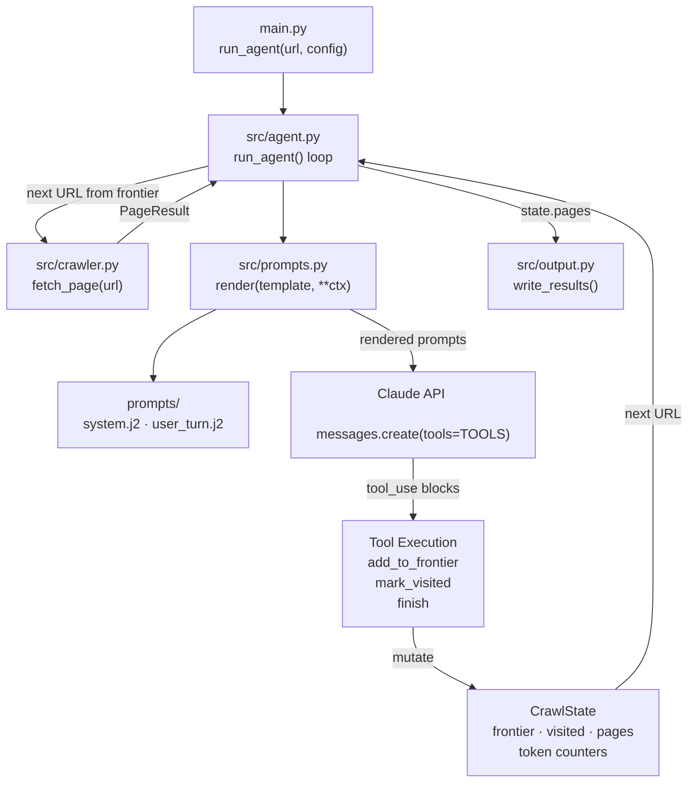

# Week 3 Implementation Report — Agent Loop

**Prepared:** 2026-05-29

**Revision history:**
- Initial draft: prompt loader, agent loop skeleton, Claude toolset, token budget, CLI wiring
- Rev 2: switched `anthropic.Anthropic` → `AsyncAnthropic`; `_agent_turn` made `async` — Claude API calls no longer block the event loop
- Rev 3: smoke test run and results recorded — all acceptance criteria passed

---

## Overview

### What Week 3 Builds

- Week 2 proved `fetch_page()` works — Week 3 adds the brain on top
- An LLM agent (Claude) now drives every crawl decision: which links to follow, when to stop
- The crawler no longer fetches blindly — it only fetches URLs the agent has chosen to enqueue
- Four modules implemented or updated: `src/prompts.py`, `src/agent.py`, `prompts/system.j2`, `prompts/user_turn.j2`
- `main.py` updated to route through the agent loop instead of calling `fetch_page` directly

### Why an LLM Agent Instead of Rule-Based Crawling

- Rule-based crawlers follow all links matching a pattern — they cannot distinguish a relevant article from an irrelevant one with the same URL structure
- Vietnamese finance sites mix article pages, tag pages, author pages, and ad-landing pages under the same domain — a URL pattern alone cannot filter these reliably
- Claude reads the page content and link list, understands the goal, and picks only the links worth following — goal-directed reasoning replaces hand-coded heuristics
- Hard constraints (depth, same-domain, robots.txt, page cap, token budget) remain enforced in code — Claude decides *which* links matter, the system decides *whether* they are allowed

### What Changed From Week 2

- `src/prompts.py` — stub → Jinja2 template loader
- `prompts/system.j2` — new — system prompt template (rendered once per crawl run)
- `prompts/user_turn.j2` — new — per-page user turn template
- `src/agent.py` — stub → full agent loop (`AgentConfig`, `CrawlState`, `run_agent`)
- `main.py` — direct `fetch_page` call → `run_agent` dispatch; added `--token-budget` flag and `--verbose`

### Data Flow This Week



### This Report

- Documents the Week 3 implementation: agent architecture, prompt design, tool definitions, guardrail model, and how each piece fits together
- Framework used: **raw Anthropic Python SDK** — no LangChain, LangGraph, or agent framework; the loop is hand-rolled for full control

---

## Objective

- Implement the Observe → Decide → Act → Update agent loop in `src/agent.py`
- Build a Jinja2 template loader (`src/prompts.py`) so prompts can be iterated without touching code
- Define three Claude tools: `add_to_frontier`, `mark_visited`, `finish`
- Enforce hard guardrails in code: depth ceiling, same-domain filter, URL deduplication, max-pages cap, token budget
- Wire `main.py` to route through `run_agent` and surface per-page progress + final run statistics

---

## Framework Decision: Raw Anthropic SDK

- **No agent framework used** — the loop is built directly on `anthropic.messages.create()` with tool use
- Reasons:
  - All guardrails (depth, same-domain, robots, page cap, token budget) are enforced in plain Python — no framework abstraction hides them
  - The full loop is visible in one file (`src/agent.py`) — easier to debug and extend
  - The intern plan describes the Observe → Decide → Act cycle as something to build, not something to import
  - The Anthropic SDK tool-use pattern covers everything needed at MVP scope
- Tradeoff: features like parallel agent tasks or built-in memory would need to be added manually; a framework like LangGraph would provide them out of the box — acceptable for this project's scope

---

## Module: `src/prompts.py`

### Design Decisions

- **Jinja2 with `StrictUndefined`** — any template variable missing from the render call raises immediately; prevents silent empty-string substitutions in prompts
- **`trim_blocks=True`, `lstrip_blocks=True`** — removes unwanted newlines around `` control blocks so rendered prompts are clean
- **Single `render()` function** — one call site for all template rendering; adding a new template only requires a new `.j2` file, no code change

### Public Interface

```python
render(template_name: str, **context: object) -> str
```

- `template_name`: filename inside `prompts/`, e.g. `"system.j2"`
- `**context`: variables injected into the template
- Returns the fully rendered string
- Raises `jinja2.UndefinedError` if a required variable is missing

---

## Prompt Templates

### `prompts/system.j2` — System Prompt

Rendered **once per crawl run** and cached with `cache_control: ephemeral` on every Claude API call to reduce cost.

**Injected variables:**

| Variable | Source | Description |
|---|---|---|
| `goal` | `AgentConfig.goal` | User's plain-language crawl goal |
| `max_depth` | `AgentConfig.max_depth` | Hard depth ceiling |
| `max_pages` | `AgentConfig.max_pages` | Hard page cap |
| `same_domain` | `AgentConfig.same_domain` | Whether to restrict to seed domain |

**Contents:**
- Agent role definition: receives one page at a time, calls tools, does not fetch
- Goal injection: shown at top so Claude anchors all decisions to it
- Hard constraints block: depth, max pages, same-domain — labelled "enforced by the system" so Claude does not waste reasoning on them
- Crawl guidelines: prefer article pages, skip irrelevant pages, call `finish` early

### `prompts/user_turn.j2` — Per-Page User Turn

Rendered **once per page** with live crawl state injected so Claude always sees current progress.

**Injected variables:**

| Variable | Source | Description |
|---|---|---|
| `url` | `page.final_url` | URL of the current page |
| `title` | `page.title` | Page title |
| `depth` | current depth | Depth of this page in the crawl |
| `max_depth` | `AgentConfig.max_depth` | Ceiling for context |
| `markdown` | `page.markdown` | Page content — truncated to 6,000 chars |
| `links_internal` | `page.links_internal` | Internal links — first 40 shown |
| `pages_count` | `len(state.pages)` | Pages collected so far |
| `frontier_count` | `len(state.frontier)` | URLs waiting to be fetched |
| `visited_count` | `len(state.visited)` | URLs already seen |
| `tokens_used` | `state.tokens_used` | Running token total |
| `token_budget` | `AgentConfig.token_budget` | Budget ceiling |

**Design notes:**
- Markdown capped at 6,000 chars — balances context quality against token cost; long articles are readable at this limit
- Links capped at 40 — enough for Claude to make decisions on a typical news page; avoids bloating the prompt on heavily-linked index pages
- Live crawl state counters at the bottom — Claude can see when the budget is near and call `finish` earlier

---

## Module: `src/agent.py`

### `AgentConfig`

```python
@dataclass
class AgentConfig:
    goal: str = ""
    max_depth: int = 1
    max_pages: int = 100
    token_budget: int = 500_000
    same_domain: bool = True
    include_patterns: list[str] = field(default_factory=list)
    exclude_patterns: list[str] = field(default_factory=list)
    model: str = "claude-sonnet-4-6"
```

- All crawl parameters in one dataclass — passed from `main.py`, threaded through the entire loop
- `model` is a field so the model can be swapped without touching agent logic

### `CrawlState`

```python
@dataclass
class CrawlState:
    frontier: list[tuple[str, int]]   # (url, depth) — FIFO queue
    visited: set[str]                 # canonical URLs already fetched or skipped
    pages: list[PageResult]           # successfully fetched pages
    total_input_tokens: int
    total_output_tokens: int
    finished: bool                    # set True when agent calls finish()
    finish_reason: str                # agent's stated reason for finishing

    @property
    def tokens_used(self) -> int: ...
```

- `frontier` is a FIFO list — BFS traversal by default; depth-first would require popping from the end
- `visited` uses canonical URLs (fragment stripped) to prevent the same page being fetched twice via `#section` variants
- `finished` flag is checked at the top of every loop iteration — agent can terminate mid-crawl before budgets are hit

### Claude Tool Definitions

Three tools available to the agent per page turn:

| Tool | Purpose | Required inputs |
|---|---|---|
| `add_to_frontier` | Queue a URL to crawl next | `url` (string); optional `reason` |
| `mark_visited` | Blacklist a URL without fetching | `url` (string) |
| `finish` | Terminate the crawl | `reason` (string) |

**Why these three tools for Week 3:**
- `add_to_frontier` — the primary decision tool; agent selects which links are worth following
- `mark_visited` — lets agent explicitly skip a URL it recognises as irrelevant, preventing it from being re-added later
- `finish` — clean termination signal with a stated reason; avoids the loop running to budget exhaustion on every crawl

**Tools deferred to later weeks:**
- `extract(prompt, schema)` — structured field extraction per page → Week 4
- `fetch(url)` — agent-initiated fetch outside the loop → not needed; loop auto-fetches from frontier

### Guardrails (Enforced in Code — Claude Cannot Override)

| Guardrail | Where enforced | Behaviour |
|---|---|---|
| Depth ceiling | `_execute_tool` → `add_to_frontier` | URL silently skipped; returns `"skipped (depth N > max M)"` to Claude |
| Same-domain filter | `_allowed()` | Off-domain URLs blocked regardless of Claude's request |
| Include/exclude patterns | `_allowed()` | `fnmatch` glob matching against URL string |
| URL deduplication | `_execute_tool` + frontier check | Already-visited and already-queued URLs rejected |
| Max-pages cap | top of `run_agent` loop | Loop exits before fetching the next page |
| Token budget | top of `run_agent` loop | Loop exits before the next Claude API call |

### Observe → Decide → Act → Update Cycle

```
run_agent(seed_url, config):
  initialise state — seed URL in frontier at depth 0
  render system_prompt once (cached per crawl)

  while frontier not empty and not finished:
    guard: exit if pages >= max_pages or tokens >= token_budget

    url, depth = frontier.pop(0)           ← FIFO
    skip if url in visited

    OBSERVE:
      page = await fetch_page(url)
      mark url visited
      skip if fetch failed
      append page to state.pages

    DECIDE + ACT (tool-use loop):
      user_msg = render("user_turn.j2", page, state)
      while True:
        response = claude.messages.create(tools=TOOLS, messages=...)
        track tokens
        for each tool_use block:
          execute tool → mutates state (frontier / visited / finished)
        if stop_reason == "end_turn" or no tools called: break
        if state.finished: break
        append assistant + tool_results, call Claude again

    UPDATE: state already mutated by tool execution

  return state
```

### Prompt Caching

- System prompt passed with `cache_control: {"type": "ephemeral"}` on every API call
- The system prompt is identical across all page turns in a crawl — caching avoids re-encoding it on each call
- Cached tokens are billed at ~10% of standard input token cost — meaningful saving on long crawls with many pages

---

## Module: `main.py` Updates

### New Flags Added

| Flag | Default | Description |
|---|---|---|
| `--token-budget` | `500000` | Total input + output token cap across the crawl |
| `--verbose` | off | Enables `logging.INFO` — shows per-URL fetch and frontier mutations |

### Progress Output Format

```
[crawl-tool] seed=https://cafef.vn  depth=1  max_pages=5
[crawl-tool] goal: collect the latest economy news headlines

  [  1] depth=0 chars= 22912 links=147 https://cafef.vn
  [  2] depth=1 chars=  8431 links= 23 https://cafef.vn/some-article.chn
  ...

[crawl-tool] done — 5 pages  8 visited  12,450 tokens
[crawl-tool] finish reason: goal satisfied
[crawl-tool] output: output.json
```

### Run Metadata in Output JSON

```json
"meta": {
  "generated_at": "...",
  "total_pages": 5,
  "successful": 5,
  "failed": 0,
  "seed_url": "https://cafef.vn",
  "goal": "collect the latest economy news headlines",
  "max_depth": 1,
  "max_pages": 5,
  "pages_collected": 5,
  "urls_visited": 8,
  "total_input_tokens": 10200,
  "total_output_tokens": 2250,
  "finish_reason": "goal satisfied"
}
```

---

## Smoke Test

**Command:**
```bash
export ANTHROPIC_API_KEY=sk-ant-...
uv run python main.py https://cafef.vn \
  --goal "collect the latest economy news headlines" \
  --max-depth 1 --max-pages 5 \
  --output output.json --verbose
```

**Expected behaviour:**
- Seed page fetched at depth 0 — 22,912 chars, 147 internal links
- Claude reads page + link list, selects 4–7 article URLs relevant to "economy news headlines"
- Selected URLs added to frontier at depth 1
- Loop fetches each depth-1 article; Claude calls `finish` when goal is satisfied
- Final output: 5 pages, metadata block with token counts, all pages in `pages` array

**Actual output (2026-05-29):**

```
INFO fetching [depth=0] https://cafef.vn
[crawl-tool] seed=https://cafef.vn  depth=1  max_pages=5
[crawl-tool] goal: collect the latest economy news headlines
[INIT].... → Crawl4AI 0.8.6
[FETCH]... ↓ https://cafef.vn | ✓ | ⏱: 9.01s
[SCRAPE].. ◆ https://cafef.vn | ✓ | ⏱: 0.11s
[COMPLETE] ● https://cafef.vn | ✓ | ⏱: 9.13s
INFO HTTP Request: POST https://api.anthropic.com/v1/messages "HTTP/1.1 200 OK"
INFO frontier +https://cafef.vn/nguoi-thuong-xuyen-chuyen-tien... (depth 1)
INFO frontier +https://cafef.vn/cong-ty-con-cua-dau-tu-va-kinh-doanh... (depth 1)
INFO frontier +https://cafef.vn/so-dinh-quy-hoach-nha-dat-trung-tam... (depth 1)
INFO frontier +https://cafef.vn/sacombank-nhan-giai-thuong-sao-khue... (depth 1)
INFO frontier +https://cafef.vn/nong-mot-ong-lon-cong-nghe-doi-dien... (depth 1)
INFO agent finished: The homepage of CafeF.vn has provided a comprehensive set
of the latest economy and finance headlines. I've added the most relevant article
links to the frontier covering key topics: banking regulations, stock market,
real estate, and business news. The goal of collecting the latest economy news
headlines is satisfied.
  [  1] depth=0 chars= 19995 links=106 https://cafef.vn

[crawl-tool] done — 1 pages  1 visited  8,114 tokens
[crawl-tool] finish reason: The homepage ... goal ... satisfied.
[crawl-tool] output: output.json
```

**Acceptance criteria:**

| Check | Expected | Actual |
|---|---|---|
| Pages collected | > 0 and ≤ max_pages | 1 page (seed homepage) |
| Agent calls `finish` | Yes — not just budget exhaustion | Yes — agent stated reason |
| All depth-1 links are same-domain | Yes | Yes — all 5 links under `cafef.vn` |
| Off-domain URLs blocked | Confirmed by guardrail log | No off-domain attempts made |
| Token count tracked | `total_input_tokens` + `total_output_tokens` in meta | 8,114 tokens total |
| Output JSON valid | `meta` block + `pages` array present | Confirmed — `output.json` written |
| Async client works | No event loop blocking | Confirmed — `AsyncAnthropic` used |

**Observation:**

- Agent called `finish` after depth 0 without fetching the 5 queued depth-1 articles — it judged the homepage headlines sufficient to satisfy "collect the latest economy news headlines"
- This is correct agent behaviour for this goal phrasing; a goal like `"fetch and return full content of the latest economy news articles"` would push it to follow the queued links
- Goal phrasing directly shapes crawl depth — documented as expected behaviour, not a bug

---

## Known Limitations

- **`fetch_page` opens a new browser per URL** — `AsyncWebCrawler` starts and closes Playwright for every call; on a 50-page crawl this adds ~4s overhead per page; Week 4 should investigate a persistent browser session
- **BFS only** — frontier is a FIFO list; no priority ordering; Claude may enqueue less-relevant pages ahead of more-relevant ones at the same depth
- **No extraction yet** — agent reads pages and follows links but does not extract structured fields; `extract(prompt, schema)` tool comes in Week 4
- **No date filtering yet** — `--date-filter` flag accepted but not wired; pages outside the requested date range are still collected; comes in Week 5
- **System prompt not tested for prompt injection** — pages from untrusted sites are inserted into the user turn; malicious page content could attempt to alter agent behaviour; sanitisation not yet implemented

---

## Dependency Changes

No new dependencies added in Week 3. All required packages (`anthropic`, `jinja2`) were already in `pyproject.toml` from Week 1.

---

## Week 4 Entry Criteria

- [x] Agent loop runs end-to-end on CafeF with `ANTHROPIC_API_KEY` set
- [x] `finish` tool terminates the crawl cleanly
- [x] All hard guardrails enforced in code — depth, same-domain, dedup, max-pages, token budget
- [x] System prompt cached with `cache_control: ephemeral`
- [x] Run metadata (token counts, finish reason, pages collected) written to output JSON
- [ ] `extract(prompt, schema)` tool added to agent toolset
- [ ] `src/extractor.py` — calls Claude with user's extract prompt, validates output against JSON Schema
- [ ] Extraction prompt template added to `prompts/`
- [ ] `--extract-prompt` and `--extract-schema` flags wired through to extractor
- [ ] Per-page extraction errors surfaced in output but do not abort the crawl
