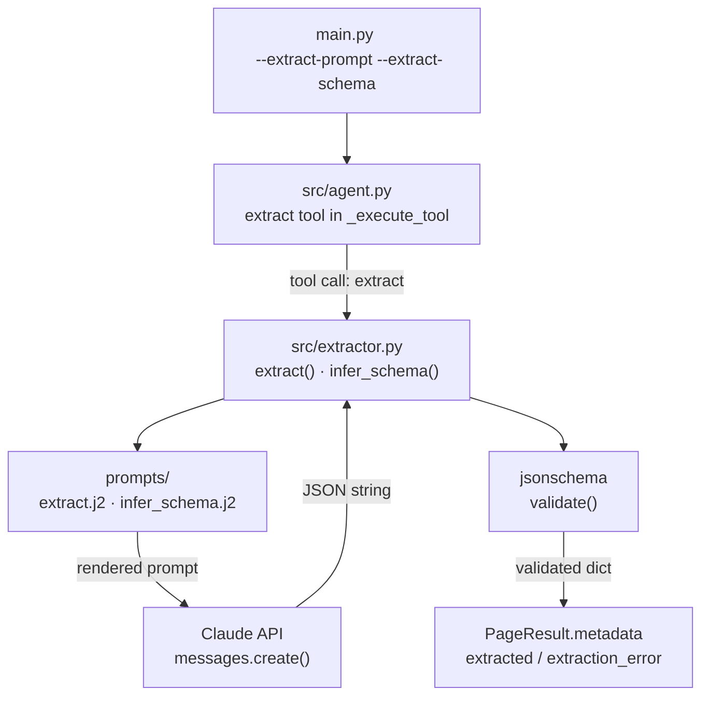

# Week 4 Implementation Report — Structured Extraction

**Prepared:** 2026-06-02

**Revision history:**
- Initial draft: extractor module, prompt templates, extract tool in agent, CLI wiring, Pydantic migration
- Rev 2 (2026-06-03): five bugs found and fixed during smoke test — markdown code fence stripping, schema inferred once, nullable properties, auto-extraction fallback, article body truncation
- Rev 3 (2026-06-04): `PageResult` moved from `src/crawler.py` to `src/models/page.py` — all modules import via `from src.models import PageResult`

---

## Overview

### What Week 4 Builds

- Week 3 proved the agent can navigate and collect pages — Week 4 adds the ability to extract structured data from each page
- Three new files: `src/extractor.py`, `prompts/extract.j2`, `prompts/infer_schema.j2`
- `src/agent.py` gains a fourth tool: `extract(prompt, schema)`
- `AgentConfig` gains `extract_prompt` and `extract_schema` fields
- All three data models (`PageResult`, `AgentConfig`, `CrawlState`) migrated from `@dataclass` to Pydantic `BaseModel`

### What Changed From Week 3

- `src/extractor.py` — stub → `extract()` and `infer_schema()` implementation
- `prompts/extract.j2` — new — user turn for structured extraction
- `prompts/infer_schema.j2` — new — user turn for schema inference
- `src/agent.py` — `extract` tool added; `_execute_tool` made `async`; `AgentConfig` and `CrawlState` migrated to Pydantic
- `src/crawler.py` — `PageResult` migrated to Pydantic `BaseModel`
- `src/output.py` — `dataclasses.asdict` replaced with `page.model_dump()`
- `prompts/system.j2` — conditional extraction instruction block added
- `main.py` — `--extract-schema` loads JSON from file; both flags wired into `AgentConfig`

### Data Flow This Week



### This Report

- Documents Week 4 implementation: extractor design, prompt templates, agent tool wiring, Pydantic migration

---

## Objective

- Implement `extract(page, prompt, schema)` — calls Claude, validates output, never raises
- Implement `infer_schema(prompt)` — derives a JSON Schema from a natural-language extraction prompt
- Add `extract` tool to the agent toolset so Claude can trigger extraction per page
- Migrate all data models to Pydantic for field validation and cleaner serialisation
- Wire `--extract-prompt` and `--extract-schema` CLI flags end-to-end

---

## Module: `src/extractor.py`

### Design Decisions

- **Never raises** — both `extract()` and `infer_schema()` return a dict in all cases; failures return `{"error": "...", "raw": "..."}` so per-page extraction errors do not abort the crawl
- **Schema inference as fallback** — when `schema=None`, `infer_schema()` is called automatically; user does not need to supply a schema to get structured output
- **Validation with `jsonschema`** — Claude output is parsed as JSON then validated against the schema; both parse errors and schema violations are caught and surfaced as error dicts
- **Extraction stored in `page.metadata`** — result attached to `page.metadata["extracted"]` or `page.metadata["extraction_error"]`; no new fields added to `PageResult`

### `infer_schema`

```python
async def infer_schema(prompt: str) -> dict
```

- Renders `prompts/infer_schema.j2` with the user's extract prompt
- Asks Claude to generate a JSON Schema (draft-07) with `type: object` and a `properties` block
- Falls back to `{"type": "object", "properties": {}}` if Claude's response cannot be parsed as JSON
- Post-processes the returned schema before returning:
  - Strips `required` — prevents validation failure when a field is absent in an article
  - Converts each property's `type` from `"string"` → `["string", "null"]` — prevents `None is not of type 'string'` validation errors when Claude returns null for a missing field
- Strips markdown code fences (` ```json ... ``` `) that Claude sometimes adds despite instructions

### `extract`

```python
async def extract(page: PageResult, prompt: str, schema: dict | None = None) -> dict
```

- Returns `{"error": "page has no markdown content", "raw": ""}` immediately if `page.markdown` is empty
- Calls `infer_schema(prompt)` when `schema` is `None`
- Renders `prompts/extract.j2` with `markdown`, `prompt`, and `schema`
- Parses Claude's response as JSON; returns error dict on `JSONDecodeError`
- Validates parsed JSON against schema; returns error dict on `ValidationError`
- Returns validated extraction dict on success

**Private helpers:**
- `_validate` — wraps `jsonschema.validate`, returns `(bool, error_message)`
- `_strip_fences` — removes ` ```json ``` ` or ` ``` ``` ` wrappers Claude sometimes adds to JSON responses

---

## Prompt Templates

### `prompts/extract.j2`

**Injected variables:**

| Variable | Source | Description |
|---|---|---|
| `prompt` | `AgentConfig.extract_prompt` or tool input | What fields to extract |
| `schema` | `AgentConfig.extract_schema` or inferred | JSON Schema for output validation |
| `markdown` | `page.markdown` | Page content — truncated to 12,000 chars |

- Instructs Claude to respond with raw JSON only — no code fences, no explanation
- Schema shown inline so Claude's output matches the expected structure
- Explicitly instructs Claude to extract from the **main article body only** — ignore navigation, sidebars, related-article teasers, social buttons, and footer; set fields to `null` when not found in the main article
- Truncation raised from 6,000 → 12,000 chars: on CafeF article pages the main article H1 starts at ~6,400 chars due to the sidebar news ticker, so 6,000 chars cut off before the article body began

### `prompts/infer_schema.j2`

**Injected variables:**

| Variable | Source | Description |
|---|---|---|
| `prompt` | user's extraction prompt | Natural-language field description |

- Instructs Claude to generate a minimal JSON Schema — only fields mentioned in the prompt
- Requires `type: object` and a `properties` block at minimum

---

## Module: `src/agent.py` Updates

### `extract` Tool

```python
{
    "name": "extract",
    "description": "Extract structured fields from the current page using a natural-language prompt.",
    "input_schema": {
        "type": "object",
        "properties": {
            "prompt": {"type": "string"},
            "schema": {"type": "object"},
        },
        "required": ["prompt"],
    },
}
```

- Agent calls `extract` on article pages when `--extract-prompt` is set
- `schema` is optional — falls back to `AgentConfig.extract_schema` then to inference
- Result stored in `page.metadata["extracted"]` on success, `page.metadata["extraction_error"]` on failure
- `_execute_tool` made `async` to support `await extractor_extract(...)`

### Schema Inferred Once Per Run

`infer_schema` is called **once** in `run_agent` before the crawl loop starts, when `extract_prompt` is set and `extract_schema` is `None`. The inferred schema is stored back into `config.extract_schema` and reused for every article page.

Previous behaviour: `infer_schema` was called per page inside `extractor.extract()`, producing a different schema on each call — camelCase field names on one page, snake_case on another, making the output dataset inconsistent across pages.

### Auto-Extraction Fallback

After `_agent_turn` returns for each page, `run_agent` checks whether extraction was done. If `config.extract_prompt` is set, the page is an article (`_is_article_page`), and neither `extracted` nor `extraction_error` is in `page.metadata`, extraction is called automatically:

```python
if config.extract_prompt and _is_article_page(page) \
        and "extracted" not in page.metadata \
        and "extraction_error" not in page.metadata:
    result = await extractor_extract(page, config.extract_prompt, config.extract_schema)
```

This guarantees every article page is extracted even when Claude's tool-use is inconsistent.

### Depth Written to Page Metadata

`page.metadata["depth"] = depth` is set immediately after a successful fetch so the crawl depth is preserved in every page's output record.

### `system.j2` Update

- Conditional `` block injected when `extract_prompt` is non-empty
- Instructs agent to call `extract` on every article page before deciding which links to follow

---

## Pydantic Migration

All three data models migrated from `@dataclass` to Pydantic `BaseModel`:

| Model | File | Key change |
|---|---|---|
| `PageResult` | `src/models/page.py` | `@dataclass` → `BaseModel`; moved to `src/models/` package so it is decoupled from the crawler implementation |
| `AgentConfig` | `src/agent.py` | `@dataclass` → `BaseModel`; `Field(default_factory=...)` |
| `CrawlState` | `src/agent.py` | `@dataclass` → `BaseModel`; `@property tokens_used` → `@computed_field`; `model_config = {"arbitrary_types_allowed": True}` for `set[str]`; new fields: `stop_reason`, `article_pages`, `frontier_at_finish` |

**`src/output.py`:** `dataclasses.asdict(page)` + manual field removal → `page.model_dump(exclude={"html", "raw_markdown"})` — cleaner and Pydantic-native.

---

## Module: `main.py` Updates

- `--extract-schema` reads JSON from file path; validates file exists before starting the crawl
- `--extract-prompt` and loaded schema wired into `AgentConfig.extract_prompt` and `AgentConfig.extract_schema`
- Both fields default to empty — extraction is opt-in; crawl runs without extraction if neither flag is set

---

## Smoke Test

**Command:**
```bash
uv run python main.py https://cafef.vn \
  --goal "collect the latest banking and stock market articles" \
  --extract-prompt "extract the article title, publish date, author, and a one-sentence summary" \
  --max-depth 1 --max-pages 5 \
  --output output.json
```

**Actual output (2026-06-03, after fixes):**

```
[crawl-tool] seed=https://cafef.vn  depth=1  max_pages=5
[crawl-tool] goal: collect the latest banking and stock market articles
  [  1] depth=0 chars= 17006 links= 84 https://cafef.vn
  [  2] depth=1 chars= 10832 links= 51 https://cafef.vn/bsc-chot-ngay-phat-hanh-...-188260603140302855.chn
  [  3] depth=1 chars= 10940 links= 54 https://cafef.vn/sao-thang-long-giai-trinh-...-188260603140153954.chn
  [  4] depth=1 chars= 11173 links= 56 https://cafef.vn/pv-drilling-muon-phat-hanh-...-18826060313594512.chn
  [  5] depth=1 chars= 14868 links= 60 https://cafef.vn/ong-trum-noxh-hoang-quan-...-188260603121844378.chn

[crawl-tool] done — 5 pages  5 visited  68,184 tokens
```

**Sample extracted data (page 2):**
```json
{
  "title": "BSC chốt ngày phát hành 24,53 triệu cổ phiếu trả cổ tức",
  "publishDate": "03-06-2026 - 14:02 PM",
  "author": "Hoàng Lam",
  "summary": "BSC sẽ chốt danh sách cổ đông vào ngày 16/6 để phân bổ quyền nhận cổ tức bằng cổ phiếu năm 2025..."
}
```

**Acceptance criteria:**

| Check | Expected | Actual |
|---|---|---|
| All 4 article pages extracted | No extraction errors | ✓ — all 4 articles have `extracted` field |
| Consistent field names across pages | Same schema used for all pages | ✓ — schema inferred once, reused |
| Null fields allowed | Missing fields → `null`, not validation error | ✓ — author is `null` on page 3 |
| Depth in metadata | Each page has `metadata.depth` | ✓ — depth 0 for seed, 1 for articles |
| No markdown fence errors | JSON parsed correctly | ✓ — `_strip_fences` handles wrapped responses |

---

## Known Limitations

- **One Claude call per extraction** — `extract()` creates a new `AsyncAnthropic` client per call; a shared client passed through from `run_agent` would be cleaner; deferred to Week 5 cleanup
- **Schema inference quality** — inferred schemas are minimal; field naming (camelCase vs snake_case) varies across Claude responses; user-supplied schemas via `--extract-schema` are always more reliable
- **No retry on extraction failure** — if Claude returns malformed JSON, the error is recorded and the page moves on; no retry attempt; acceptable at MVP scope
- **Extraction not date-filtered** — pages outside the date range are still extracted; date filtering comes in Week 5
- **Sidebar dominates early markdown** — CafeF article body starts at ~6,400 chars due to a news ticker sidebar; extraction truncation raised to 12,000 chars as a workaround; a proper fix (H1-slice or `trafilatura`) is deferred to Week 5

---

## Dependency Changes

No new dependencies added in Week 4. `jsonschema` and `pydantic` were already in `pyproject.toml` from Week 1.

---

## Week 5 Entry Criteria

- [x] `extract()` returns structured dict from a real CafeF article page
- [x] `infer_schema()` returns a valid JSON Schema from a natural-language prompt
- [x] Extraction errors stored in `page.metadata` — crawl continues on failure
- [x] `--extract-prompt` and `--extract-schema` flags wired end-to-end
- [x] All models using Pydantic `BaseModel` — `ruff check` passes
- [ ] `src/date_filter.py` — `parse_date_filter`, `detect_page_date`, `is_in_range`
- [ ] Date filter wired into agent loop — pages outside range dropped
- [ ] `--date-filter` and `--include-undated` flags wired
- [ ] Retry policy in `fetch_page` — exponential backoff on 5xx/timeout, max 3 retries
- [ ] Structured per-page logging — URL, status, depth, fetch time
