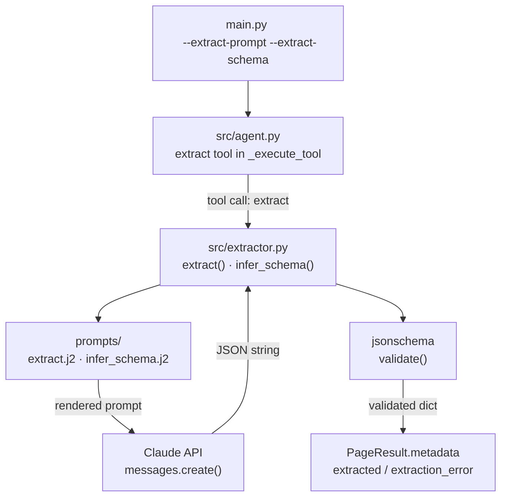

# Week 4 Implementation Report — Structured Extraction

**Prepared:** 2026-06-02

**Revision history:**
- Initial draft: extractor module, prompt templates, extract tool in agent, CLI wiring, Pydantic migration
- Rev 2 (2026-06-03): five bugs found and fixed during smoke test — markdown code fence stripping, schema inferred once, nullable properties, auto-extraction fallback, article body truncation
- Rev 3 (2026-06-04): `PageResult` moved from `src/crawler.py` to `src/models/page.py` — all modules import via `from src.models import PageResult`
- Rev 4 (2026-06-04): logging migrated from stdlib to structlog with JSON output; `src/logging_config.py` added
- Rev 5 (2026-06-04): extraction hardened — snake_case schema keys, recursive nullable, title/date header injection, and article-body scoping that strips sidebar noise without truncation
- Rev 6 (2026-06-05): author extraction and article-body scoping hardened across Vietnamese publishers; near-empty scoped markdown now falls back to full-page fetch
- Rev 7 (2026-06-12): validation strictness split — `_make_nullable` moved from `infer_schema` to extract-time validation behind a `lenient` flag; explicit (user-file and registry) schemas now validate strictly as written, inferred schemas validate against a nullable copy, and Claude is always shown the original schema

**commit:** [link](https://github.com/tuanhdangdinh/agentic-news-crawler/commit/4c181a30de2931d54cccafb1edd93b401d9ee898)

---

## Overview

### What Week 4 Builds

- Week 3 proved the agent can navigate and collect pages — Week 4 adds the ability to extract structured data from each page
- Three new files: `src/extractor.py`, `prompts/extract.j2`, `prompts/infer_schema.j2`
- `src/agent.py` gains a fourth tool: `extract(prompt, schema)`
- `AgentConfig` gains `extract_prompt` and `extract_schema` fields
- All three data models (`PageResult`, `AgentConfig`, `CrawlState`) migrated from `@dataclass` to Pydantic `BaseModel`

### What Changed From Week 3

- `src/extractor.py` — stub → `extract()` and `infer_schema()` implementation
- `prompts/extract.j2` — new — user turn for structured extraction
- `prompts/infer_schema.j2` — new — user turn for schema inference
- `src/agent.py` — `extract` tool added; `_execute_tool` made `async`; `AgentConfig` and `CrawlState` migrated to Pydantic
- `src/crawler.py` — `PageResult` migrated to Pydantic `BaseModel`
- `src/output.py` — `dataclasses.asdict` replaced with `page.model_dump()`
- `prompts/system.j2` — conditional extraction instruction block added
- `main.py` — `--extract-schema` loads JSON from file; both flags wired into `AgentConfig`

### Data Flow This Week



### This Report

- Documents Week 4 implementation: extractor design, prompt templates, agent tool wiring, and the Pydantic migration

---

## Objective

- Implement `extract(page, prompt, schema)` — calls Claude, validates output, never raises
- Implement `infer_schema(prompt)` — derives a JSON Schema from a natural-language extraction prompt
- Add `extract` tool to the agent toolset so Claude can trigger extraction per page
- Migrate all data models to Pydantic for field validation and cleaner serialisation
- Wire `--extract-prompt` and `--extract-schema` CLI flags end-to-end

---

## Module: `src/extractor.py`

### Design Decisions

- **Never raises** — both `extract()` and `infer_schema()` return a dict in all cases; `extract()` failures return `{"error": "...", "raw": "..."}`, while `infer_schema()` failures fall back to an empty schema `{"type": "object", "properties": {}}` — so per-page extraction errors never abort the crawl
- **Schema inference as fallback** — when `schema=None`, `infer_schema()` is called automatically; user does not need to supply a schema to get structured output
- **Validation with `jsonschema`** — Claude output is parsed as JSON then validated against the schema; both parse errors and schema violations are caught and surfaced as error dicts
- **Extraction stored in `page.metadata`** — result attached to `page.metadata["extracted"]` or `page.metadata["extraction_error"]`; no new fields added to `PageResult`
- **Explicit byline context injected** — `extract()` prepends `Author: ...` from `page.metadata["byline_author"]` when available, plus source metadata, so article-body scoping can omit visual headers without losing author/source fields

### Public Interface

```python
async def infer_schema(prompt: str) -> dict
```

- Renders `prompts/infer_schema.j2` with the user's extract prompt
- Asks Claude to generate a JSON Schema (draft-07) with `type: object` and a `properties` block
- Template requires snake_case property names (Rev 5) — without it the inferred schema mixed `publishDate` and `publish_date` across pages, producing an inconsistent dataset
- Falls back to `{"type": "object", "properties": {}}` if Claude's response cannot be parsed as JSON
- Post-processes the returned schema via `_make_nullable` before returning:
  - Strips `required` — prevents validation failure when a field is absent in an article
  - Converts each property's `type` from `"string"` → `["string", "null"]` — prevents `None is not of type 'string'` validation errors when Claude returns null for a missing field
  - Recurses into nested `properties` and array `items` (Rev 5) — a null inside an array-of-objects field (e.g. `key_financial_figures[].label`) previously failed validation because only top-level types were made nullable
- Strips markdown code fences (` ```json ... ``` `) that Claude sometimes adds despite instructions

```python
async def extract(page: PageResult, prompt: str, schema: dict | None = None) -> dict
```

- Returns `{"error": "page has no markdown content", "raw": ""}` immediately if `page.markdown` is empty
- Calls `infer_schema(prompt)` when `schema` is `None`
- Prepends a title + publish-date header to the markdown before extraction (Rev 5) — `# {page.title}` plus `Published: {detect_page_date(page)}`; on the CafeF/TuoiTre scoped article bodies the H1 and date can sit outside the selected body element, so without this injection Claude returns `null` for title and date on those article-body fetches
- Prepends author and source when available (Rev 6) — `Author: {page.metadata["byline_author"]}` and `Source: {page.metadata["og:site_name"]}`; this fixed VIR and other pages where the visible author is in full HTML but not in the scoped markdown body
- Uses `detect_page_date` (from `src/date_filter.py`) as the single source of truth for the date — metadata, then header, then URL pattern — so the date is correct even when the page exposes no date meta tag
- Renders `prompts/extract.j2` with `markdown`, `prompt`, and `schema_json`
- Parses Claude's response as JSON; returns error dict on `JSONDecodeError`
- Validates parsed JSON against schema; returns error dict on `ValidationError`
- Returns validated extraction dict on success

**Private helpers:**
- `_validate` — wraps `jsonschema.validate`, returns `(bool, error_message)`
- `_strip_fences` — removes ` ```json ``` ` or ` ``` ``` ` wrappers Claude sometimes adds to JSON responses
- `_make_nullable` (Rev 5) — recursively marks every typed field nullable, descending into nested `properties` and array `items`

---

## Module: `prompts/extract.j2`

### Design Decisions

- Instructs Claude to respond with raw JSON only — no code fences, no explanation
- Schema shown inline so Claude's output matches the expected structure
- Explicitly instructs Claude to extract from the **main article body only** — ignore navigation, sidebars, related-article teasers, social buttons, and footer; set fields to `null` when not found in the main article
- Instructs Claude to use the exact property names from the schema (Rev 5) — a second guard against key drift, complementing snake_case enforcement in `infer_schema.j2`
- Truncation raised from 6,000 → 12,000 chars: on CafeF article pages the main article H1 starts at ~6,400 chars due to the sidebar news ticker, so 6,000 chars cut off before the article body began; with article-body scoping (Rev 5, see `src/crawler.py`) the markdown is now ~2,500–4,500 chars and truncation rarely triggers

### Public Interface

Injected variables (rendered into the extraction user turn):

| Variable | Source | Description |
|---|---|---|
| `prompt` | `AgentConfig.extract_prompt` or tool input | What fields to extract |
| `schema_json` | `AgentConfig.extract_schema` or inferred, JSON-encoded | JSON Schema for output validation |
| `markdown` | title/date header + `page.markdown` | Page content — truncated to 12,000 chars |

---

## Module: `prompts/infer_schema.j2`

### Design Decisions

- Instructs Claude to generate a minimal JSON Schema — only fields mentioned in the prompt
- Requires `type: object` and a `properties` block at minimum
- Requires snake_case property names (Rev 5) — keeps field naming consistent across every article in a run

### Public Interface

Injected variables (rendered into the schema-inference user turn):

| Variable | Source | Description |
|---|---|---|
| `prompt` | user's extraction prompt | Natural-language field description |

---

## Module: `src/agent.py`

### Design Decisions

- **`extract` tool added to the toolset** — Claude can trigger structured extraction per page; `schema` is optional and falls back to `AgentConfig.extract_schema` then to inference; results land in `page.metadata["extracted"]` or `page.metadata["extraction_error"]`
- **`_execute_tool` made `async`** — to support `await extractor_extract(...)`
- **Auto-extraction fallback** — guarantees every article page is extracted even when Claude's tool-use is inconsistent
- **Schema inferred once per run** — one shared schema keeps field naming consistent across every page
- **Pydantic migration** — all three data models moved from `@dataclass` to `BaseModel` for field validation and cleaner serialisation

### `extract` Tool

```python
{
    "name": "extract",
    "description": "Extract structured fields from the current page using a natural-language prompt.",
    "input_schema": {
        "type": "object",
        "properties": {
            "prompt": {"type": "string", "description": "What fields to extract"},
            "schema": {"type": "object", "description": "Optional JSON Schema to validate output"},
        },
        "required": ["prompt"],
    },
}
```

- Agent calls `extract` on article pages when `--extract-prompt` is set
- `schema` is optional — falls back to `AgentConfig.extract_schema` then to inference
- Result stored in `page.metadata["extracted"]` on success, `page.metadata["extraction_error"]` on failure
- `_execute_tool` made `async` to support `await extractor_extract(...)`

### Schema Inferred Once Per Run

`infer_schema` is called **once** in `run_agent` before the crawl loop starts, when `extract_prompt` is set and `extract_schema` is `None`. The inferred schema is stored back into `config.extract_schema` and reused for every article page.

A second inference path exists in the `extract` tool itself (`_execute_tool`): if Claude invokes `extract` with no schema and `config.extract_schema` is still `None` (e.g. `--extract-prompt` was not set, so the pre-loop inference did not run), it infers once and caches the result back into `config.extract_schema` — so subsequent pages still share one schema.

Previous behaviour: `infer_schema` was called per page inside `extractor.extract()`, producing a different schema on each call — camelCase field names on one page, snake_case on another, making the output dataset inconsistent across pages.

### Auto-Extraction Fallback

After `_agent_turn` returns for each page, `run_agent` checks whether extraction was done. If `config.extract_prompt` is set, the page is an article (`_is_article_page`), and neither `extracted` nor `extraction_error` is in `page.metadata`, extraction is called automatically:

```python
if config.extract_prompt and _is_article_page(page) \
        and "extracted" not in page.metadata \
        and "extraction_error" not in page.metadata:
    result = await extractor_extract(page, config.extract_prompt, config.extract_schema)
```

This guarantees every article page is extracted even when Claude's tool-use is inconsistent.

### Depth Written to Page Metadata

`page.metadata["depth"] = depth` is set immediately after a successful fetch so the crawl depth is preserved in every page's output record.

### `system.j2` Update

- Conditional `` block injected when `extract_prompt` is non-empty
- Instructs agent to call `extract` on every article page before deciding which links to follow

### Pydantic Migration

All three data models migrated from `@dataclass` to Pydantic `BaseModel`:

| Model | File | Key change |
|---|---|---|
| `PageResult` | `src/models/page.py` | `@dataclass` → `BaseModel`; moved to `src/models/` package so it is decoupled from the crawler implementation |
| `AgentConfig` | `src/agent.py` | `@dataclass` → `BaseModel`; `Field(default_factory=...)` |
| `CrawlState` | `src/agent.py` | `@dataclass` → `BaseModel`; `@property tokens_used` → `@computed_field`; `model_config = {"arbitrary_types_allowed": True}` for `set[str]`; new fields: `stop_reason`, `article_pages`, `frontier_at_finish` |

**`src/output.py`:** `dataclasses.asdict(page)` + manual field removal → `page.model_dump(exclude={"html", "raw_markdown"})` — cleaner and Pydantic-native.

---

## Module: `src/crawler.py` updates (Rev 6)

### Design Decisions

- **Use `target_elements`, not `css_selector`, for article-body scoping** — markdown is limited to article regions while full-page metadata and links remain available to the agent
- **Prefer domain-specific targets over generic targets** — known CMS templates such as Baodautu and VietnamPlus need narrower selectors than the generic fallback can safely provide
- **Treat near-empty scoped markdown as failure** — selectors can match but produce only whitespace; retrying full-page prevents false-success article pages with no body
- **Extract byline from full HTML** — scoped markdown may omit visual headers, so full HTML is parsed for explicit author selectors before output/extraction

### Public Interface

```python
async def fetch_page(
    url: str,
    css_selector: str | None = None,
    *,
    article_body: bool = True,
) -> PageResult
```

- `article_body=True` uses known, domain-specific, or generic article targets for article-looking URLs
- Known selectors remain clean for CafeF, TuoiTre, and VnEconomy
- Domain-specific targets added:
  - `baodautu.vn` → `.col630.ml-auto.mb40`
  - `vietnamplus.vn` → `.article__title`, `.article__sapo`, `.article__meta`, `.article__body.zce-content-body.cms-body`
- Generic targets remain as fallback for unknown article pages and include common title, date, byline, summary, and body selectors
- `metadata["byline_author"]` is populated from explicit byline selectors such as `.author-detail`, `.byline`, `.article-author`, `.cms-author`, and `.author`
- Byline cleanup removes prefixes such as `By` and strips email/date suffixes such as `Mai Phương - email` or `Hà Nguyễn - 05/06/2026 08:03`
- Scoped fetches retry full-page when markdown is empty, whitespace-only, or shorter than the minimum usable threshold

---

## Module: `main.py`

### Design Decisions

- `--extract-schema` reads JSON from file path; validates file exists before starting the crawl
- `--extract-prompt` and loaded schema wired into `AgentConfig.extract_prompt` and `AgentConfig.extract_schema`
- Both fields default to empty — extraction is opt-in; crawl runs without extraction if neither flag is set

---

## Smoke Test

**Command:**
```bash
uv run python main.py https://cafef.vn \
  --goal "collect the latest banking and stock market articles" \
  --extract-prompt "extract the article title, publish date, author, and a one-sentence summary" \
  --max-depth 1 --max-pages 5 \
  --output output.json
```

**Actual output (2026-06-03, after fixes; pre-Rev 5 — full-page markdown before article-body scoping, hence the 10k–14k char sizes):**

```
[crawl-tool] seed=https://cafef.vn  depth=1  max_pages=5
[crawl-tool] goal: collect the latest banking and stock market articles
  [  1] depth=0 chars= 17006 links= 84 https://cafef.vn
  [  2] depth=1 chars= 10832 links= 51 https://cafef.vn/bsc-chot-ngay-phat-hanh-...-188260603140302855.chn
  [  3] depth=1 chars= 10940 links= 54 https://cafef.vn/sao-thang-long-giai-trinh-...-188260603140153954.chn
  [  4] depth=1 chars= 11173 links= 56 https://cafef.vn/pv-drilling-muon-phat-hanh-...-18826060313594512.chn
  [  5] depth=1 chars= 14868 links= 60 https://cafef.vn/ong-trum-noxh-hoang-quan-...-188260603121844378.chn

[crawl-tool] done — 5 pages  5 visited  68,184 tokens
```

**Sample extracted data (page 2):**
```json
{
  "title": "BSC chốt ngày phát hành 24,53 triệu cổ phiếu trả cổ tức",
  "publishDate": "03-06-2026 - 14:02 PM",
  "author": "Hoàng Lam",
  "summary": "BSC sẽ chốt danh sách cổ đông vào ngày 16/6 để phân bổ quyền nhận cổ tức bằng cổ phiếu năm 2025..."
}
```

**Acceptance criteria:**

| Check | Expected | Actual |
|---|---|---|
| All 4 article pages extracted | No extraction errors | ✓ — all 4 articles have `extracted` field |
| Consistent field names across pages | Same schema used for all pages | ✓ — schema inferred once, reused |
| Null fields allowed | Missing fields → `null`, not validation error | ✓ — author is `null` on page 3 |
| Depth in metadata | Each page has `metadata.depth` | ✓ — depth 0 for seed, 1 for articles |
| No markdown fence errors | JSON parsed correctly | ✓ — `_strip_fences` handles wrapped responses |

**Rev 5 re-verification (2026-06-04):** same command with `--extract-prompt "extract title, publish date, mentioned companies, stock tickers, and key financial figures"`, run across CafeF, TuoiTre, and VnEconomy.

| Check | Expected | Actual |
|---|---|---|
| Consistent snake_case keys | `publish_date`, not mixed `publishDate` | ✓ — snake_case on every page across all three sites |
| Nested null allowed | `key_financial_figures[].label = null` validates | ✓ — recursive `_make_nullable` accepts nested nulls |
| Title populated under article-body scoping | `title` non-null even when the H1 sits outside the scoped body (CafeF/TuoiTre) | ✓ — header injection supplies `# {page.title}` |
| Publish date populated | `publish_date` resolved from the page's own signals | ✓ — `2026-06-04` from the URL date pattern (CafeF/TuoiTre) and the `article:published_time` meta tag (VnEconomy) |
| Full-page links preserved | Article fetch keeps nav links for the frontier | ✓ — 56/179/116 internal links via `target_elements` scoping |

**Rev 6 re-verification (2026-06-05):** author and article-body checks across live Vietnamese economy/news sites.

| Check | Expected | Actual |
|---|---|---|
| VIR byline recovered outside scoped markdown | `author == "Ngan Ha"` | ✓ — full HTML byline stored as `metadata.byline_author` and injected into extraction |
| Baodautu near-empty scoped markdown fixed | Article markdown is not `"\n"` and author is present | ✓ — `8,929` chars and `author == "Hà Nguyễn"` |
| VietnamPlus noisy full-page markdown reduced | Article body excludes large footer/list noise | ✓ — article markdown reduced to `7,243` chars with `author == "Khánh Ly"` |
| Generic no-byline article does not guess author | `author == null` when only agency credit exists | ✓ — Vietnam News returned `null` for person author and kept source `vietnamnews.vn` |
| Token budget remains sufficient for two-page smoke runs | Run stays far below `500,000` default token budget | ✓ — observed runs used roughly `12,587` to `31,054` tokens |

---

## Known Limitations

- **~~One Claude call per extraction~~** — RESOLVED (Week 6): `infer_schema` and `extract` now accept an optional `client: AsyncAnthropic | None` parameter; `run_agent` passes its own client through `_execute_tool`, so every extraction reuses the same connection instead of creating a new one per call
- **~~Schema inference quality~~** — RESOLVED (Rev 5): snake_case enforcement in `infer_schema.j2` plus an exact-key instruction in `extract.j2` keep field naming consistent across pages; recursive `_make_nullable` removes the nested-null validation failures; user-supplied schemas via `--extract-schema` remain the most reliable for a fixed contract
- **No retry on extraction failure** — if Claude returns malformed JSON, the error is recorded and the page moves on; no retry attempt; acceptable at MVP scope
- **~~Extraction not date-filtered~~** — RESOLVED (Week 5): the agent loop drops article pages outside the date range before extraction; see the Week 5 report
- **~~Sidebar dominates early markdown~~** — RESOLVED (Rev 5/6): article-body scoping via Crawl4AI `target_elements` uses known, domain-specific, and generic selector maps in `src/crawler.py`, keeping head metadata and full-page links intact; Baodautu now returns `8,929` article chars instead of a one-character false success, and VietnamPlus drops from noisy `17k–23k` markdown to `7,243` chars
- **Residual related-item tails** — some publishers include one related story inside the article body container, especially VietnamPlus; extraction prompt ignores related teasers, but a future post-processing pass could remove repeated headings after the main article source marker
- **Publish date precision** — `detect_page_date` resolves date only (no time); adequate for a publish-date field but not for intraday ordering; not yet scheduled

---

## Dependency Changes

| Change | Reason |
|---|---|
| No new dependencies | `jsonschema` and `pydantic` were already in `pyproject.toml` from Week 1 |

---

## Week 5 Entry Criteria

This checklist is the original Week-4 forecast and is kept as a historical snapshot — the unchecked items were delivered in Week 5 and are tracked in the Week 5 report, not back-checked here. (The Rev 5 amendments above are later additions noting where Week 5 work resolved Week 4 limitations.)

- [x] `extract()` returns structured dict from a real CafeF article page
- [x] `infer_schema()` returns a valid JSON Schema from a natural-language prompt
- [x] Extraction errors stored in `page.metadata` — crawl continues on failure
- [x] `--extract-prompt` and `--extract-schema` flags wired end-to-end
- [x] All models using Pydantic `BaseModel` — `ruff check` passes
- [ ] `src/date_filter.py` — `parse_date_filter`, `detect_page_date`, `is_in_range`
- [ ] Date filter wired into agent loop — pages outside range dropped
- [ ] `--date-filter` and `--include-undated` flags wired
- [ ] Retry policy in `fetch_page` — exponential backoff on 5xx/timeout, max 3 retries
- [ ] Structured per-page logging — URL, status, depth, fetch time
</content>
</invoke>
