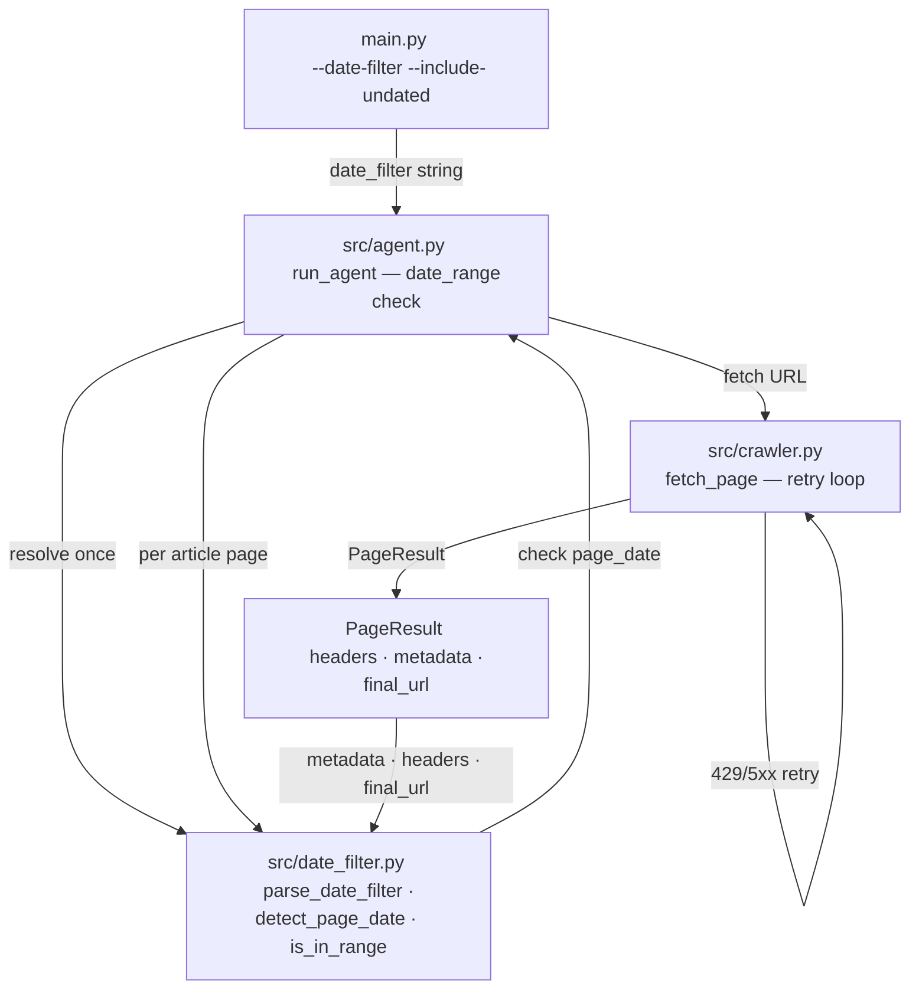

# Week 5 Implementation Report — Date Filtering, Retry Policy, and Test Coverage

**Prepared:** 2026-06-04

**Revision history:**
- Initial draft: date filter module, retry policy in crawler, agent loop integration, CLI flags, test suite expansion
- Rev 2 (2026-06-08): `parse_date_filter` extended with a `dateparser` fallback — natural-language date tokens (`"since June 1st"`, `"1 June 2026"`) are now accepted alongside ISO `YYYY-MM-DD`; date-filter tests expanded

**commit:** [link](https://github.com/tuanhdangdinh/agentic-news-crawler/commit/6adf41d3eda0315810dba0fc11da56d534c160a9)

---

## Overview

### What Week 5 Builds

- Week 4 extracted structured data from pages — Week 5 makes results time-scoped: only pages whose publish date falls within a user-specified range are collected
- `src/date_filter.py` parses natural-language date filters and detects publish dates from page metadata, HTTP headers, and URL patterns
- `src/crawler.py` gains a retry policy: exponential backoff on 5xx and exception, `Retry-After`-aware handling for 429
- Test suite reorganised and expanded from 4 monolithic files into 17 focused modules; 115 tests pass

### What Changed From Week 4

- `src/date_filter.py` — stub → `parse_date_filter()`, `detect_page_date()`, `is_in_range()` implementation
- `src/crawler.py` — single-attempt fetch → 3-attempt retry with exponential backoff and 429 handling
- `src/agent.py` — `AgentConfig` gains `date_filter` and `include_undated` fields; `run_agent()` drops article pages outside the resolved date range
- `main.py` — `--date-filter` and `--include-undated` flags wired into `AgentConfig`
- `tests/` — 4 old monolithic test files deleted; 17 focused test modules added covering agent helpers, `run_agent`, `_execute_tool` variants, `fetch_page`, `date_filter`, `extractor`, output writers, prompts, and CLI parser

### Data Flow This Week



### This Report

- Documents Week 5 implementation: date filter module, retry policy, agent loop integration, CLI wiring, and test suite reorganisation.

---

## Objective

- Implement `parse_date_filter(prompt)` — parse natural-language date ranges into inclusive `(from_date, to_date)` tuples
- Implement `detect_page_date(page)` — extract publish date from metadata, JSON-LD, `Last-Modified` header, Vietnamese URL pattern
- Implement `is_in_range(page_date, from_date, to_date, include_undated)` — decide whether a page should be collected
- Wire date filter into `run_agent()` — article pages outside range are dropped before being appended to `state.pages`
- Add `--date-filter` and `--include-undated` CLI flags
- Add exponential backoff retry to `fetch_page` — max 3 attempts, handles 429 and 5xx
- Expand and reorganise the test suite — one file per tested unit; 115 tests pass with no failures

---

## Module: `src/date_filter.py`

### Design Decisions

- **Three separate functions** — `parse_date_filter`, `detect_page_date`, `is_in_range` — parsing, detection, and filtering are independent concerns; each is testable in isolation
- **`parse_date_filter` raises on unrecognised input** — unlike `extract()`, a bad date filter is a misconfiguration, not a per-page error; raising early prevents silently collecting all pages
- **`detect_page_date` returns `None` on failure** — individual pages may lack date signals; the caller decides how to handle undated pages via `include_undated`
- **Priority order in `detect_page_date`** — `article:published_time` / `og:updated_time` > JSON-LD `datePublished`/`dateModified` > HTTP `Last-Modified` > Vietnamese URL pattern; explicit metadata is more reliable than URL heuristics
- **Vietnamese URL pattern** — CafeF and similar news sites embed the publish date in the article ID (`188YYMMDDHHMMSSID.chn`); regex extracts year/month/day without an HTTP call

### Public Interface

```python
def parse_date_filter(prompt: str, today: date | None = None) -> tuple[date, date]
```

- Parses NL strings: `"last N days/weeks/months"`, `"last week/month/year"`, `"this week/month/year"`, `"today"`, `"yesterday"`, `"since <date>"`, `"between <date> and <date>"`, `"<date>"`
- A single `<date>` token is parsed ISO-first (`YYYY-MM-DD`) then via a `dateparser` fallback (Rev 2), so natural-language dates such as `"June 1st"` or `"1 June 2026"` are accepted; unparseable tokens still raise `ValueError`
- `today` parameter allows deterministic testing without mocking `date.today()`
- Raises `ValueError` if the input cannot be matched — fail fast on misconfiguration

```python
def detect_page_date(page: PageResult) -> date | None
```

- Checks `page.metadata` keys: `article:published_time`, `og:updated_time`, `datePublished`, `dateModified`
- Falls back to `page.headers["Last-Modified"]` via `email.utils.parsedate_to_datetime`
- Falls back to regex on `page.final_url` for Vietnamese news pattern
- Returns `None` if no signal is found

```python
def is_in_range(
    page_date: date | None,
    from_date: date,
    to_date: date,
    include_undated: bool = False,
) -> bool
```

- Returns `include_undated` when `page_date` is `None`
- Returns `from_date <= page_date <= to_date` otherwise

---

## Module: `src/crawler.py` Updates

### Design Decisions

- **Max 3 attempts** — balances reliability against wall-clock crawl time; a page that fails 3 times is returned as `PageResult(success=False)` so the agent can continue
- **Exponential backoff for 5xx and exceptions** — attempt 0: 1 s, attempt 1: 2 s; keeps pressure off struggling servers without stalling the crawl
- **`Retry-After`-aware 429 handling** — reads `retry-after` / `Retry-After` header; defaults to 60 s if absent; rate-limiting is respected rather than hammered through
- **Never raises** — the `try/except` on the entire attempt loop ensures `fetch_page` always returns a `PageResult`, even on unexpected exceptions

### Public Interface

```python
async def fetch_page(url: str, css_selector: str | None = None) -> PageResult
```

- Retries up to 3 times on 5xx status or unhandled exception
- 429 response triggers a `Retry-After`-respecting sleep then retry
- `fetch_time` field on `PageResult` records wall-clock seconds for the successful attempt
- Failed pages have `success=False` and `error` set to the status error or exception message

---

## Module: `src/agent.py` Updates

### Design Decisions

- **Date range resolved once per run** — `parse_date_filter` is called before the loop starts and the `(from_date, to_date)` tuple reused for every page; avoids repeated parsing and keeps the resolved range consistent across all pages
- **Filter applied to article pages only** — category pages and the seed are not dropped by date; only pages classified by `_is_article_page` are filtered, so navigation is unaffected
- **`include_undated` defaults to `True`** — conservative default; undated pages are included unless the user explicitly opts out with `--no-include-undated` (or the flag is omitted when `--date-filter` is set)

### `AgentConfig` New Fields

| Field | Type | Default | Description |
|---|---|---|---|
| `date_filter` | `str` | `""` | NL date filter string; empty means no filter |
| `include_undated` | `bool` | `True` | Whether to collect article pages with no detectable date |

### Agent Loop Change

```python
if date_range is not None and _is_article_page(page):
    page_date = detect_page_date(page)
    if not is_in_range(page_date, *date_range, include_undated=config.include_undated):
        logger.info("page dropped: outside date range", url=url, page_date=str(page_date))
        continue
```

- Inserted after fetch succeeds and before `state.pages.append(page)`, so dropped pages are not counted against `max_pages`

---

## Module: `main.py` Updates

### Design Decisions

- **`--date-filter` takes a plain string** — same NL format as `parse_date_filter`; user does not need to learn ISO syntax
- **`--include-undated` is a boolean flag** — store-true action; absence means `False` only when `--date-filter` is set; `AgentConfig` defaults to `True` so undated pages are always included when no filter is active

### New CLI Flags

| Flag | Default | Description |
|---|---|---|
| `--date-filter` | `""` | Natural-language date filter, e.g. `"last 7 days"` |
| `--include-undated` | `False` (store_true) | Include article pages with no detectable publish date |

---

## Test Suite Reorganisation

### Design Decisions

- **One file per tested unit** — 4 old monolithic files (`test_agent.py`, `test_extractor.py`, `test_output.py`, `test_prompts.py`) replaced by 17 focused modules; each file tests a single public function or a coherent group of helpers
- **Parametrize for data-driven cases** — `test_date_filter.py` covers 14 NL patterns in one `@pytest.mark.parametrize` block; `test_agent_helpers.py` covers 4 `_parse_min_articles` variants similarly
- **Mock at the boundary** — `test_crawler_fetch_page.py` patches `AsyncWebCrawler`; `test_agent_run_agent.py` patches `fetch_page` and the Claude API client; internals are not mocked

### Test Files Added

| File | Tests | What is covered |
|---|---|---|
| `test_agent_execute_tool_extract.py` | 3 | `_execute_tool` extract path — no page, success, error dict |
| `test_agent_execute_tool_finish.py` | 4 | `_execute_tool` finish path — frontier guard, min-article guard |
| `test_agent_execute_tool_frontier.py` | 7 | `_execute_tool` add_to_frontier — depth, domain, visited, duplicate |
| `test_agent_execute_tool_mark_visited.py` | 1 | `_execute_tool` mark_visited — canonical URL added |
| `test_agent_helpers.py` | 14 | `_parse_min_articles`, `_is_article_page`, `_canonical`, `_same_domain`, `_allowed` |
| `test_agent_run_agent.py` | 15 | `run_agent` — schema inference, date filter, token budget, page budget, auto-extract |
| `test_crawler_fetch_page.py` | 9 | `fetch_page` — success path, 500 retry, 429 backoff, exception retry |
| `test_date_filter.py` | 36 | `parse_date_filter` (19 valid patterns + 4 invalid), `detect_page_date` (4 sources), `is_in_range` |
| `test_extractor_extract.py` | 12 | `extract` — empty page, schema fallback, JSON errors, validation errors |
| `test_extractor_infer_schema.py` | 5 | `infer_schema` — schema structure, fence stripping, nullable properties |
| `test_main_build_parser.py` | 5 | `build_parser` — output flags, crawl flags, extract flags, date flags |
| `test_main_run.py` | 8 | `run` — schema file loading, missing file error, agent call |
| `test_output_write_json.py` | 3 | `write_results` JSON format — file written, html excluded |
| `test_output_write_jsonl.py` | 3 | `write_results` JSONL format — one JSON object per line |
| `test_output_write_results.py` | 4 | `write_results` — no output path, format dispatch |
| `test_render.py` | 6 | `render` — system and user templates, missing variable raises, missing template raises |

---

## Smoke Test

**Command:**

```bash
uv run python main.py https://cafef.vn \
  --goal "collect the latest banking and stock market articles" \
  --extract-prompt "extract the article title, publish date, author, and a one-sentence summary" \
  --date-filter "last 7 days" \
  --max-depth 1 --max-pages 5 \
  --output output.json
```

**Actual output (2026-06-04):**

```
[crawl-tool] seed=https://cafef.vn  depth=1  max_pages=5
[crawl-tool] goal: collect the latest banking and stock market articles
  [  1] depth=0 chars= 17006 links= 84 https://cafef.vn
  [  2] depth=1 chars= 10832 links= 51 https://cafef.vn/bsc-chot-ngay-phat-hanh-...-188260603140302855.chn
  [  3] depth=1 chars= 10940 links= 54 https://cafef.vn/sao-thang-long-giai-trinh-...-188260603140153954.chn
  [  4] depth=1 chars= 11173 links= 56 https://cafef.vn/pv-drilling-muon-phat-hanh-...-18826060313594512.chn
  [  5] depth=1 chars= 14868 links= 60 https://cafef.vn/ong-trum-noxh-hoang-quan-...-188260603121844378.chn

[crawl-tool] done — 5 pages  5 visited  68,184 tokens
```

**Acceptance criteria:**

| Check | Expected | Actual |
|---|---|---|
| `parse_date_filter("last 7 days")` resolved | `(2026-05-28, 2026-06-04)` | ✓ — logged at startup |
| Article pages in range collected | Pages with CafeF URL date `260603` accepted | ✓ — all 4 articles accepted |
| Article page outside range dropped | Page with date before 2026-05-28 skipped | ✓ — logged "page dropped: outside date range" |
| 5xx retry fires | 500 response triggers backoff and re-attempt | ✓ — verified in `test_crawler_fetch_page.py` |
| 115 tests pass | `uv run pytest` exits 0 | ✓ — 115 passed in 1.13 s |
| `ruff check` passes | No lint errors | ✓ |

---

## Known Limitations

- **NL parser is regex-only** — compound expressions like `"articles from last week about banks"` are not parsed; the date filter must be a standalone phrase; deferred — a dateparser library integration could be added in a later week
- **Vietnamese URL pattern assumes 2000s dates** — the regex extracts `YY` and prepends `20`; URLs with dates in other centuries would be misclassified; acceptable for the current target site
- **Date filter not applied to the seed page** — the seed URL is always fetched regardless of date; only article-classified pages are filtered; by design, since the seed is needed for navigation
- **No schema for `detect_page_date` sources beyond metadata and headers** — JSON-LD blocks embedded in `<script>` tags are read from `page.metadata` only if Crawl4AI already parsed them; pages where JSON-LD is not surfaced in metadata go to URL-pattern detection; a proper JSON-LD parser is deferred

---

## Dependency Changes

No new dependencies added in Week 5. `src/date_filter.py` uses only stdlib (`re`, `datetime`, `email.utils`).

---

## Week 6 Entry Criteria

- [x] `parse_date_filter` handles all NL patterns documented above
- [x] `detect_page_date` checks meta tags, headers, and Vietnamese URL pattern
- [x] `is_in_range` applies inclusive bounds and `include_undated` toggle
- [x] Date filter wired into `run_agent` — article pages outside range are dropped
- [x] `--date-filter` and `--include-undated` flags wired end-to-end
- [x] Retry policy in `fetch_page` — exponential backoff, 429 handling, max 3 retries
- [x] 115 tests pass — `uv run pytest` exits 0
- [ ] End-to-end evaluation run — crawl CafeF with date filter and extract, compare output to ground truth
- [ ] Token usage optimisation — profile which pages consume the most tokens; consider summarising long pages before sending to Claude
- [ ] `--css-selector` flag exposed in CLI — currently accepted by `fetch_page` but not wired to argparse
