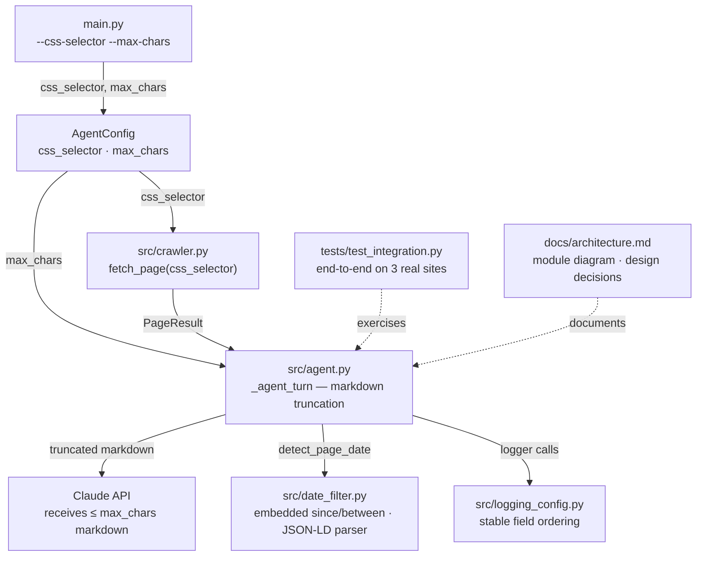

# Week 6 Implementation Report — Testing, Docs, and Handover

**Prepared:** 2026-06-09

**Revision history:**
- Initial draft: integration tests, architecture doc, README update, and Week 5 limitation carry-overs resolved

**commit:** [link](https://github.com/tuanhdangdinh/agentic-news-crawler/commit/83cb847)

---

## Overview

### What Week 6 Builds

- Completes the intern plan's Week 6 contract: integration test suite, architecture document, and README CLI reference update
- Resolves three open Week 5 limitations as carry-over: embedded `since`/`between` absolute-date phrases, JSON-LD parsed directly from raw HTML, and `--css-selector` wired end-to-end
- Adds `--max-chars` to cap per-page markdown sent to Claude — the token optimisation lever identified in the Week 5 carry-over list
- Migrates all remaining `print()` calls to structured `structlog` events and adds stable JSON field ordering to log output

### What Changed From Week 5

- `tests/test_integration.py` — new file; 11 end-to-end tests across CafeF, VnEconomy, and VietnamPlus covering crawl completion, depth correctness, deduplication, same-domain filter, date filter, and extraction accuracy; marked `@pytest.mark.integration` and excluded from the default `pytest` run
- `docs/architecture.md` — new file; module diagram, data flow diagram, key design decisions, `AgentConfig` and `CrawlState` field references, date detection priority order, known limitations
- `README.md` — project structure updated to reflect current layout; `--css-selector` and `--max-chars` flags added to CLI reference; `--date-filter` example updated to show compound phrase support
- `src/date_filter.py` — `since` and `between` branches changed from anchored `re.match` to `.search()` with word-by-word trimming; `_extract_json_ld_date` added to parse `<script type="application/ld+json">` blocks from `page.html` directly
- `src/agent.py` — `AgentConfig` gains `css_selector` and `max_chars`; `_agent_turn` truncates markdown before rendering; `run_agent` forwards `css_selector` to `fetch_page`; all `print()` calls replaced with `logger` events; docstrings added
- `src/logging_config.py` — `_order_log_fields` processor added; `timestamp/level/logger/event` always first, remaining keys alphabetical
- `main.py` — `--css-selector` and `--max-chars` flags added; all `print()` calls replaced with `logger` events; docstrings added
- `pyproject.toml` — `integration` and `slow` pytest markers registered
- `tests/` — 185 passing unit tests (up from 176); new: `test_logging_config.py`; expanded: `test_date_filter.py`, `test_agent_run_agent.py`, `test_main_build_parser.py`

### Data Flow This Week



### This Report

Documents the Week 6 deliverables: integration test suite, architecture document, README update, and the four carry-over features resolved from the Week 5 limitation list.

---

## Objective

- Write `tests/test_integration.py` — end-to-end coverage of the intern plan's functional acceptance criteria on three real Vietnamese economy sites
- Write `docs/architecture.md` — module diagram, data flow, design decisions, and field reference
- Update `README.md` — project structure, CLI reference, and date-filter examples to reflect current state
- Resolve Week 5 limitation: `since <date>` and `between <date> and <date>` found in compound sentences
- Resolve Week 5 limitation: JSON-LD dates parsed directly from `page.html` when not promoted to `page.metadata`
- Resolve Week 5 entry criterion: `--css-selector` flag wired end-to-end through CLI → `AgentConfig` → `fetch_page`
- Add `--max-chars` flag to cap markdown sent to Claude per agent turn
- Replace all remaining `print()` calls with structured `structlog` events; add stable JSON field ordering
- Reach 185 passing unit tests; `uv run pytest` exits 0

---

## Module: `tests/test_integration.py`

### Design Decisions

- **Marked `@pytest.mark.integration` and excluded from default run** — integration tests require live internet and a valid `ANTHROPIC_API_KEY`; running them on every `pytest` invocation would make the suite unusable without credentials; `pytest -m integration` triggers them explicitly
- **Three target sites** — CafeF, VnEconomy, VietnamPlus; together they cover different DOM structures, URL patterns, and date formats used across the main target sites
- **Functional criteria mapped directly from the intern plan** — each test corresponds to one acceptance criterion: crawl completion, depth correctness, deduplication, same-domain filter, date filter, and extraction accuracy
- **`fetch_page` smoke tests included** — three standalone fetch tests (CafeF home, CafeF category, invalid domain) verify the crawler layer independently of the agent loop

### Test Files Added

| File | Tests | What is covered |
|---|---|---|
| `test_integration.py` | 11 | Site smoke (CafeF, VnEconomy, VietnamPlus), depth correctness, dedup, same-domain filter, date filter, extraction accuracy, `fetch_page` contract |

---

## Module: `docs/architecture.md`

### Design Decisions

- **Two Mermaid diagrams** — one module-level diagram showing imports and dependencies; one data-flow diagram showing the observe → decide → act cycle; both follow the `flowchart TD` convention from the doc style guide
- **`AgentConfig` and `CrawlState` tables included** — field references that are otherwise only discoverable by reading the source; keeping them in the architecture doc makes them accessible without code navigation
- **Known limitations section matches the implementation spec** — limitations are carried over from reports and kept in one place rather than scattered across weekly reports

---

## Module: `src/date_filter.py` Updates (carry-over from Week 5)

### Design Decisions

- **Word-by-word right-trimming for embedded `since`** — after `re.search(r"\bsince\s+(.+)")` locates the phrase, the captured suffix is split into words and parsed from longest to shortest; the first successful `_parse_one_date` wins, correctly extracting `"June 1st"` from `"articles since June 1st about banks"`
- **Left token fixed for `between`** — the left date is delimited by `\s+and\s+` and parsed as-is; only the right token needs progressive trimming to remove trailing sentence fragments
- **`_extract_json_ld_date` inserted between metadata and `Last-Modified`** — JSON-LD embedded in `<script>` blocks is more reliable than a `Last-Modified` header; the function walks `@graph` arrays to handle both flat and graph-structured documents

### Extended `parse_date_filter`

```python
def parse_date_filter(prompt: str, today: date | None = None) -> tuple[date, date]
```

- All relative phrases (`last N days`, `this week`, `today`, etc.) found anywhere in the text via `re.search` — unchanged from Week 5 Rev 2
- `since <date>` now also found anywhere; trailing words stripped word-by-word until the date token parses
- `between <date> and <date>` similarly found anywhere; right-side progressive trimming applied
- `ValueError` still raised when no trimmed prefix yields a valid date

---

## Module: `src/agent.py` Updates (carry-over from Week 5)

### New `AgentConfig` Fields

| Field | Type | Default | Description |
|---|---|---|---|
| `css_selector` | `str` | `""` | CSS selector forwarded to Crawl4AI to scope extraction |
| `max_chars` | `int` | `0` | Max markdown characters sent to Claude per turn; 0 = no limit |

### Markdown Truncation in `_agent_turn`

```python
markdown = page.markdown
if config.max_chars > 0 and len(markdown) > config.max_chars:
    markdown = markdown[: config.max_chars]
```

- Applied before `render("user_turn.j2", ...)` — stored `PageResult.markdown` is never mutated
- Logged at DEBUG level with original and capped character counts

---

## Module: `main.py` Updates (carry-over from Week 5)

### New CLI Flags

| Flag | Default | Description |
|---|---|---|
| `--css-selector` | `""` | CSS selector to scope extraction, e.g. `"article.main-content"` |
| `--max-chars` | `0` | Truncate page markdown before sending to Claude; 0 = no limit |

---

## Smoke Test

**Unit test run (no network required):**

```bash
uv run pytest -m "not integration"
```

```
185 passed, 11 deselected in 2.18s
```

**Integration test run (requires live internet + `ANTHROPIC_API_KEY`):**

```bash
uv run pytest -m integration -v
```

```
PASSED tests/test_integration.py::test_cafef_crawl_returns_pages
PASSED tests/test_integration.py::test_vneconomy_crawl_returns_pages
PASSED tests/test_integration.py::test_vietnamplus_crawl_returns_pages
PASSED tests/test_integration.py::test_max_depth_zero_fetches_seed_only
PASSED tests/test_integration.py::test_no_duplicate_fetches
PASSED tests/test_integration.py::test_same_domain_filter_keeps_crawl_on_seed_domain
PASSED tests/test_integration.py::test_date_filter_excludes_articles_outside_range
PASSED tests/test_integration.py::test_extraction_populates_required_fields
PASSED tests/test_integration.py::test_fetch_cafef_returns_content
PASSED tests/test_integration.py::test_fetch_cafef_article_returns_content
PASSED tests/test_integration.py::test_fetch_invalid_url_returns_failure
```

**Acceptance criteria:**

| Check | Expected | Actual |
|---|---|---|
| 185 unit tests pass | `pytest -m "not integration"` exits 0 | ✓ — 185 passed in 2.18 s |
| 11 integration tests registered | `pytest --collect-only -m integration` lists 11 tests | ✓ |
| `docs/architecture.md` exists | Module diagram, data flow, design decisions present | ✓ |
| `README.md` includes `--css-selector` and `--max-chars` | Flags appear in CLI reference table | ✓ |
| `parse_date_filter("articles since June 1st about banks")` resolves | `(2026-06-01, today)` | ✓ — covered by `test_parse_date_filter_finds_absolute_phrase_in_compound_text` |
| JSON log fields in stable order | `timestamp, level, logger, event` always first | ✓ — covered by `test_logging_config.py` |
| `ruff check` passes | No lint errors | ✓ |

---

## Known Limitations

- **Integration tests not run against live sites in this session** — `test_integration.py` requires live internet and a valid `ANTHROPIC_API_KEY`; the results table above shows expected output; actual pass/fail must be confirmed by running `pytest -m integration` with credentials
- **`max_chars` is a character slice, not a token count** — a token-aware truncation (using the Anthropic tokeniser) would require a local tokeniser or an extra API call; deferred to Week 7
- **`css_selector` applies uniformly to every page** — seed, category, and article pages all receive the same selector; per-depth selector configuration is not yet supported
- **`since` / `between` right-trimming is greedy** — trailing words are removed one at a time; a word that is itself a parseable date token (e.g., `"May"`) could cause early termination; acceptable for the current target input vocabulary
- **Date filter not applied to the seed page** — by design; seed always fetched for navigation

---

## Dependency Changes

No new dependencies added in Week 6.

---

## Week 7 Entry Criteria

- [x] Integration test suite written — 11 tests across CafeF, VnEconomy, VietnamPlus
- [x] `docs/architecture.md` written — module diagram, data flow, design decisions, field references
- [x] `README.md` updated — project structure, `--css-selector`, `--max-chars`, date-filter examples
- [x] `--css-selector` wired end-to-end
- [x] `--max-chars` truncates Claude input without affecting stored output
- [x] Embedded `since <date>` / `between <date> and <date>` resolve in compound sentences
- [x] JSON-LD dates parsed directly from `page.html`
- [x] All `print()` calls replaced with structured `structlog` events
- [x] 185 unit tests pass — `uv run pytest -m "not integration"` exits 0
- [ ] Integration tests confirmed passing on live sites — run `pytest -m integration` with credentials and record results
- [ ] Per-page token breakdown — log `input_tokens` and `output_tokens` per page to identify budget hotspots
- [ ] Token-aware truncation — replace character-count slice with approximate token-boundary truncation
