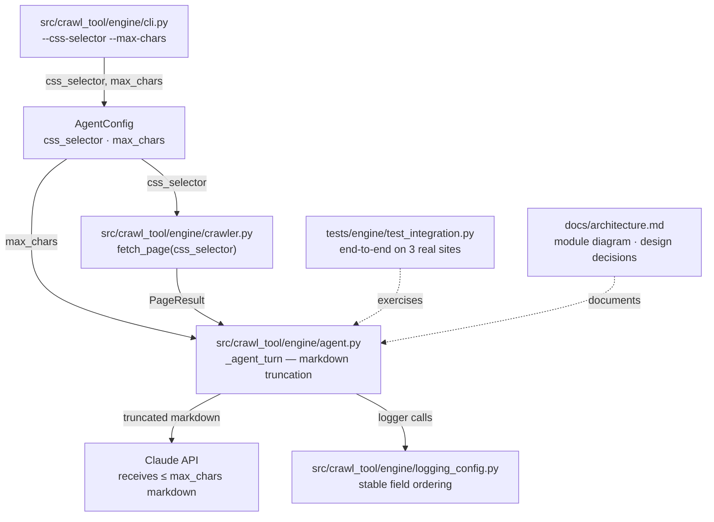

# Week 6 Implementation Report — Testing, Docs, Handover, and Object Storage

**Prepared:** 2026-06-09

**Revision history:**
- Initial draft: integration tests, architecture doc, README update, css-selector flag, max-chars truncation, structured logging migration
- Rev 2 (2026-06-09): recorded the live integration result and corrected the standalone fetch test targets
- Rev 3 (2026-06-10): strengthened acceptance assertions, documented the Gradio and schema-registry paths, and recorded fresh verification
- Rev 4 (2026-06-12): plan-compliance review — added Plan Deviations section; implemented depth ceiling, identifying User-Agent, and query-parameter canonicalization
- Rev 5 (2026-06-29): Added Object Storage section — MinIO storage module, DuckDB query layer, `/query` and `/storage` API endpoints, Gradio History tab, CLI `query` subcommand, and integration tests
- Rev 6 (2026-06-29): Corrected current package paths, storage UI/client names, CLI query behavior, dependency changes, and User-Agent contact

**commit:** [link](https://github.com/tuanhdangdinh/agentic-news-crawler/commit/741b97d397db7a62236aeb47afedcb288518a6a5)

---

## Overview

### What Week 6 Builds

- Completes the intern plan's Week 6 contract: integration test suite on three real Vietnamese economy sites, architecture document, and README CLI reference update
- Adds `--css-selector` flag — the outstanding Week 5 entry criterion; wired end-to-end through CLI → `AgentConfig` → `fetch_page`
- Adds `--max-chars` to cap per-page markdown sent to Claude, providing direct control over per-turn token cost
- Migrates crawl-path `print()` calls to structured `structlog` events and adds stable JSON field ordering

### What Changed From Week 5

- `tests/engine/test_integration.py` — new file; 11 end-to-end tests across CafeF, VnEconomy, and VietnamPlus covering crawl completion, depth correctness, deduplication, same-domain filter, date filter, and extraction accuracy; marked `@pytest.mark.integration` and excluded from the default `pytest` run
- `docs/architecture.md` — new file; module diagram, data flow diagram, key design decisions, `AgentConfig` and `CrawlState` field references, date detection priority order, known limitations
- `README.md` — project structure updated to reflect current layout; `--css-selector` and `--max-chars` added to CLI reference
- `src/crawl_tool/engine/agent.py` — `AgentConfig` gains `css_selector` and `max_chars`; `_agent_turn` truncates markdown before rendering; `run_agent` forwards `css_selector` to `fetch_page`; crawl-path `print()` calls replaced with `logger` events; docstrings added to public functions
- `src/crawl_tool/engine/logging_config.py` — `_order_log_fields` processor added; `timestamp/level/logger/event` always first, remaining keys alphabetical
- `src/crawl_tool/engine/cli.py` — `--css-selector` and `--max-chars` flags added; crawl command output migrated to logger events; docstrings added
- `pyproject.toml` — `integration` and `slow` pytest markers registered
- `tests/` — 189 passing unit tests (up from 176); new: `test_logging_config.py`; expanded: `test_agent_run_agent.py`, `test_main_build_parser.py`

Post-week Rev 3 updates:

- `tests/engine/test_integration.py` — depth and dedup assertions now inspect real fetch calls; domain checks normalize hostnames; date filtering requires a dated article; extraction requires title, publish date, author, and summary
- `docs/architecture.md` — current-state diagrams now include the Gradio interface and registered-schema-first extraction flow
- `README.md` — current-state usage now documents the Gradio launcher and schema precedence
- `.gitignore` — failed-run logs and integration result artifacts are excluded from source control

Post-week Rev 6 updates:

- Historical shorthand paths such as `src/agent.py`, `src/crawler.py`, `src/logging_config.py`, `main.py`, and `tests/test_integration.py` now map to `src/crawl_tool/engine/agent.py`, `src/crawl_tool/engine/crawler.py`, `src/crawl_tool/engine/logging_config.py`, `src/crawl_tool/engine/cli.py`, and `tests/engine/test_integration.py`
- Object storage UI lives in `src/crawl_tool/gradio/ui_storage.py` as the Storage page, not `src/crawl_tool/gradio/ui.py`
- `crawl-tool query` calls the engine `/query` endpoint via `ENGINE_URL` and prints an ASCII table; it does not read `MINIO_*` directly or emit JSONL
- Storage downloads use `download_from_storage(job_id, fmt)` for `/storage/{job_id}`; `download_result(job_id, fmt)` remains the completed-job download helper for `/crawl/{job_id}/result`
- Current crawler User-Agent contact is `tuanhdangdinh@gmail.com`

### Data Flow This Week



### This Report

Documents the Week 6 deliverables: integration test suite, architecture document, README update, `--css-selector` flag, `--max-chars` truncation, and structured logging migration.

---

## Objective

- Write `tests/engine/test_integration.py` — end-to-end coverage of the intern plan's functional acceptance criteria on three real Vietnamese economy sites
- Write `docs/architecture.md` — module diagram, data flow, design decisions, and field reference
- Update `README.md` — project structure, CLI reference, and examples to reflect current state
- Wire `--css-selector` end-to-end through CLI → `AgentConfig` → `fetch_page`
- Add `--max-chars` flag to cap markdown sent to Claude per agent turn
- Replace crawl-path `print()` calls with structured `structlog` events; add stable JSON field ordering
- Reach 189 passing unit tests; `uv run pytest -m "not integration"` exits 0

---

## Module: `tests/engine/test_integration.py`

### Design Decisions

- **Marked `@pytest.mark.integration` and excluded from default run** — integration tests require live internet and a valid `ANTHROPIC_API_KEY`; running them on every `pytest` invocation would make the suite unusable without credentials; `pytest -m integration` triggers them explicitly
- **Three target sites** — CafeF, VnEconomy, VietnamPlus; together they cover different DOM structures, URL patterns, and date formats across the main target sites
- **Functional criteria mapped directly from the intern plan** — each test corresponds to one acceptance criterion: crawl completion, depth correctness, deduplication, same-domain filter, date filter, and extraction accuracy
- **`fetch_page` smoke tests included** — three standalone fetch tests (VnEconomy home, VnEconomy stock-market section, invalid domain) verify the crawler layer independently of the agent loop

### Test Files Added

| File | Tests | What is covered |
|---|---|---|
| `tests/engine/test_integration.py` | 11 | Site smoke (CafeF, VnEconomy, VietnamPlus), depth correctness, dedup, same-domain filter, date filter, extraction accuracy, `fetch_page` contract |

---

## Module: `docs/architecture.md`

### Design Decisions

- **Two Mermaid diagrams** — one module-level diagram showing imports and dependencies; one data-flow diagram showing the observe → decide → act cycle; both follow the `flowchart TD` convention from the doc style guide
- **`AgentConfig` and `CrawlState` tables included** — field references otherwise only discoverable by reading the source; keeping them in the architecture doc makes them accessible without code navigation
- **Known limitations section** — limitations consolidated from weekly reports into one authoritative place

---

## Module: `src/crawl_tool/engine/agent.py` Updates

### Design Decisions

- **`max_chars` applied in `_agent_turn`, not on the stored `PageResult`** — the full markdown is preserved in `state.pages` and written to output; only the string passed to `render("user_turn.j2", ...)` is sliced; the stored record stays complete while Claude's input is controlled
- **`max_chars = 0` means no limit** — zero is the natural "off" default for a char cap; matches `int` type expectations in argparse
- **`css_selector` forwarded as `None` when empty** — `fetch_page` accepts `str | None`; converting the empty string avoids a behaviour difference between "flag not passed" and "flag passed empty"
- **Truncation logged at DEBUG** — truncation is expected behaviour when `max_chars` is set, not a warning; INFO output stays clean for users monitoring the crawl

### New `AgentConfig` Fields

| Field | Type | Default | Description |
|---|---|---|---|
| `css_selector` | `str` | `""` | CSS selector forwarded to Crawl4AI to scope content extraction |
| `max_chars` | `int` | `0` | Max markdown characters sent to Claude per turn; 0 = no limit |

### Markdown Truncation in `_agent_turn`

```python
markdown = page.markdown
if config.max_chars > 0 and len(markdown) > config.max_chars:
    markdown = markdown[: config.max_chars]
```

- Applied before `render("user_turn.j2", ...)` — `page.markdown` is never mutated
- Logged at DEBUG with original and capped character counts

---

## Module: `src/crawl_tool/engine/logging_config.py` Updates

### Design Decisions

- **Standard fields ordered first, custom fields alphabetical** — `timestamp`, `level`, `logger`, `event` always appear in that position; remaining keys sorted; predictable field order makes log parsing and `jq` queries reliable
- **Implemented as a structlog processor** — `_order_log_fields` inserts into the processor chain and is independently testable without touching call sites

### Processor

```python
def _order_log_fields(
    logger: object, method_name: str, event_dict: dict[str, object]
) -> dict[str, object]
```

- Pops the four standard fields into a new dict in declaration order
- Copies remaining keys in `sorted()` order
- Returns the reordered dict for the next processor in the chain

---

## Module: `src/crawl_tool/engine/cli.py` Updates

### New CLI Flags

| Flag | Default | Description |
|---|---|---|
| `--css-selector` | `""` | CSS selector to scope extraction, e.g. `"article.main-content"` |
| `--max-chars` | `0` | Truncate page markdown before sending to Claude; 0 = no limit |

---

## Object Storage

### Overview

Crawl results are now automatically persisted to MinIO (S3-compatible object storage) on job completion. A DuckDB-based query layer reads directly from the S3 bucket, enabling history search without a relational database. The Gradio UI gains a Storage page for browsing, querying, downloading, and deleting past runs.

### Design Decisions

- **MinIO as the storage backend** — S3-compatible API means the same client works against AWS S3 in production without code changes; `StorageSettings.enabled` guards every call so the system degrades gracefully when `MINIO_ENDPOINT` is unset
- **Async wrappers over sync MinIO client** — `asyncio.to_thread` wraps `_put_result_sync` and `_get_result_sync` to keep the FastAPI event loop unblocked; the underlying Minio SDK is synchronous
- **DuckDB `httpfs` for query** — DuckDB reads `s3://bucket/crawl-*.json` directly over the S3 API using the `httpfs` extension; no intermediate download or local index required; `IOException` is caught and returns `[]` when the bucket is empty
- **`job_id` injected into stored `meta`** — `put_result` merges `job_id` into a copy of the payload's `meta` dict before upload; the original caller payload is never mutated, so in-memory references stay consistent
- **Auto-upload on job completion** — `service.py` calls `put_result` after the job status transitions to `done`; failures are logged at WARNING and do not affect the HTTP response returned to the UI
- **`/query` and `/storage/{job_id}` return 503 when storage is disabled** — explicit error instead of silent no-op; callers can distinguish "not configured" from "not found"

### Module: `src/crawl_tool/engine/storage.py`

```text
StorageSettings.from_env()  →  reads MINIO_* env vars
StorageSettings.enabled     →  True iff MINIO_ENDPOINT is set
put_result(job_id, payload, settings)  →  upload crawl-{job_id}.json
get_result(job_id, settings)           →  bytes | None
```

- `put_result` creates the bucket if it does not exist
- `get_result` returns `None` on `NoSuchKey`; re-raises all other `S3Error` variants

### Module: `src/crawl_tool/engine/query.py`

```text
run_query(query: CrawlQuery, settings: StorageSettings) → list[CrawlSummary]
```

- Opens an in-process DuckDB connection, installs and loads `httpfs`, configures S3 credentials with parameterized `SET` statements
- Builds a `SELECT` over `read_json('s3://bucket/crawl-*.json')` with optional `WHERE` clauses for `seed_url`, `goal`, `date_from`, and `date_to`
- All filters are substring (`LIKE '%?%'`) or range comparisons; `LIMIT` is always applied
- Runs synchronously inside `asyncio.to_thread`

### Module: `src/crawl_tool/engine/contract.py` Additions

| Model | Fields | Description |
|---|---|---|
| `CrawlQuery` | `seed_url`, `goal`, `date_from`, `date_to`, `limit` (1–500) | Structured filter for history queries |
| `CrawlSummary` | `job_id`, `seed_url`, `goal`, `generated_at`, `total_pages`, `successful`, `failed` | Lightweight record returned per matching crawl |

### Service Endpoints

| Endpoint | Method | Description |
|---|---|---|
| `/query` | `POST` | Accept `CrawlQuery` body, return `list[CrawlSummary]`; 503 if storage disabled |
| `/storage/{job_id}` | `GET` | Fetch raw JSON bytes for a completed job from MinIO; 404 if not found, 503 if disabled |

### Gradio Storage Page

The Storage page in the UI (implemented in `src/crawl_tool/gradio/ui_storage.py`) provides:

- **Search form** — seed URL substring, goal substring, date range, and result limit
- **Results dataframe** — columns: `job_id`, `seed_url`, `goal`, `generated_at`, `total_pages`
- **Download form** — paste a `job_id`, choose `json` or `jsonl`, click Download; the result is fetched from `/storage/{job_id}` and offered as a file download

The Gradio client (`client.py`) exposes `query_history(filters)` for `/query` and `download_from_storage(job_id, fmt)` for `/storage/{job_id}` over the existing HTTP session.

### CLI `query` Subcommand

```bash
crawl-tool query --seed-url cafef.vn --goal "finance" --date-from 2026-06-01 --limit 10
```

- Added to `src/crawl_tool/engine/cli.py` as a `query` subcommand alongside the existing crawl command
- Reads `ENGINE_URL` to call the engine `/query` endpoint; prints storage configuration errors returned by the engine
- Outputs a compact ASCII table with `job_id`, `seed_url`, `goal`, `generated_at`, and `total_pages`

### Integration Tests

`tests/engine/test_storage_query_integration.py` — marked `@pytest.mark.integration`, skipped when Docker is unavailable

| Test | What is covered |
|---|---|
| `test_put_then_get_roundtrip` | `put_result` stores file; `get_result` retrieves identical bytes with injected `job_id` |
| `test_put_does_not_mutate_original_payload` | Caller's payload dict is not modified |
| `test_get_result_returns_none_for_missing_key` | `get_result` returns `None` for unknown `job_id` |
| `test_run_query_returns_empty_on_fresh_bucket` | `run_query` returns `[]` on an empty bucket without raising |
| `test_run_query_returns_uploaded_results` | Both uploaded jobs appear in unfiltered query |
| `test_run_query_filters_by_seed_url` | Substring filter on `seed_url` excludes non-matching records |
| `test_run_query_filters_by_date_range` | `date_from`/`date_to` excludes records outside the range |
| `test_run_query_summary_fields_match_payload` | All `CrawlSummary` fields match the stored payload `meta` |

Tests use `testcontainers.minio.MinioContainer` to spin up a real MinIO instance per module scope. A module-scoped `minio_settings` fixture creates the test bucket and yields `StorageSettings`.

Unit tests in `tests/engine/test_storage.py` cover `StorageSettings`, `_put_result_sync`, and `_get_result_sync` with mocked Minio clients.

---

## Smoke Test

**Unit test run (no network required):**

```bash
uv run pytest -m "not integration"
```

```text
189 passed, 11 deselected in 2.19s
```

**Integration test run (requires live internet + `ANTHROPIC_API_KEY`):**

```bash
uv run pytest tests/engine/test_integration.py -v -s
```

```text
======================== 11 passed in 532.24s (0:08:52) ========================
```

Post-week verification note: the local Python 3.11.7 environment segfaulted while pytest
imported the native `readline` module during startup. The run used a temporary no-op import
shim to bypass that environment issue; the shim was removed immediately afterward.

**Rev 3 verification on 2026-06-10:**

```bash
uv run pytest -m "not integration" -q
uv run pytest tests/engine/test_integration.py -m integration -v -s
uv run ruff check .
```

```text
212 passed, 11 deselected in 4.16s
======================== 11 passed in 582.35s (0:09:42) ========================
All checks passed!
```

The Rev 3 live run used the same temporary `readline` import shim because the local runtime
issue remains unresolved. The shim was outside the repository and removed after verification.

**Acceptance criteria:**

| Check | Expected | Actual |
|---|---|---|
| 189 unit tests pass | `pytest -m "not integration"` exits 0 | ✓ — 189 passed in 2.19 s |
| 11 live integration tests pass | Live sites and Anthropic API complete without assertion failures | ✓ — 11 passed in 532.24 s |
| Three target sites respond | CafeF, VnEconomy, and VietnamPlus crawls collect pages | ✓ |
| Crawler smoke tests pass | VnEconomy home, stock-market section, and invalid domain behave as expected | ✓ |
| `docs/architecture.md` exists | Module diagram, data flow, design decisions present | ✓ |
| `README.md` includes `--css-selector` and `--max-chars` | Flags appear in CLI reference table | ✓ |
| `css_selector` forwarded to `fetch_page` | Verified by `test_run_agent_passes_css_selector_to_fetch_page` | ✓ |
| JSON log fields in stable order | `timestamp, level, logger, event` always first | ✓ — verified by `test_logging_config.py` |
| `ruff check` passes | No lint errors | ✓ |
| Depth zero fetches only the seed | One real `fetch_page` call and one collected page | ✓ — Rev 3 live run |
| Dedup prevents duplicate network fetches | Every real `fetch_page` URL is unique | ✓ — Rev 3 live run |
| Date filtering is non-vacuous | At least one dated article is collected and in range | ✓ — Rev 3 live run |
| Four-field extraction succeeds | Title, publish date, author, and summary keys exist | ✓ — Rev 3 live run |
| Current unit suite passes | Non-integration suite exits 0 | ✓ — 212 passed in 4.16 s |

---

## Plan Deviations

A Rev 4 compliance review compared the delivered tool against every MVP requirement in `docs/crawl-tool-intern-plan.md`. Three gaps were closed during the review:

| Plan item | Resolution |
|---|---|
| Depth ceiling — refuse `max_depth` above 5 | `MAX_DEPTH_CEILING = 5` enforced on `AgentConfig.max_depth` (Pydantic `ge=0, le=5`); `src/crawl_tool/engine/cli.py` refuses out-of-range values with a clear error before the crawl starts |
| User-Agent identifies the tool and a contact email | `USER_AGENT = "crawl-tool/0.1 (+mailto:tuanhdangdinh@gmail.com)"` set on `BrowserConfig` in `src/crawl_tool/engine/crawler.py` |
| Canonical URL normalizes query parameter order | `_canonical` now sorts query parameters (blank values preserved) in addition to stripping fragments, so `?a=1&b=2` and `?b=2&a=1` deduplicate to one fetch |

The remaining deviations are accepted as out of MVP scope:

| Plan item | Deviation | Rationale |
|---|---|---|
| `fetch(url)` agent tool | Not implemented | The loop auto-fetches from the frontier, so an agent-initiated fetch is redundant — documented in the Week 3 report |
| robots.txt override toggle | No disable flag; robots.txt is always enforced at the fetch layer | Stricter than the plan; no use case required disabling compliance |
| Crawl trap detection heuristic | Not implemented | `max_pages`, the depth ceiling, and dedup already bound every crawl; the template+query-param heuristic adds complexity without an observed failure on target sites |
| URL pattern syntax | Glob (`fnmatch`) only; regex not supported | Glob covered every filtering need on the test sites |
| Hard page cap default | `100` instead of the plan's `1000` | Conservative default keeps token cost bounded; the cap is user-configurable |
| Borderline pages with confidence score | Not implemented | Optional plan item; the date filter is binary in/out with `--include-undated` for unknown dates |
| Research report path | `docs/reports/week1_research_report.md` instead of `docs/research_report.md` | All weekly reports are grouped under `docs/reports/` |
| PR cadence — at least 2 PRs per week | Work committed directly to `master` | Single-contributor repository; atomic Conventional Commits preserve reviewability |

---

## Known Limitations

- **Async client cleanup emits non-fatal warnings** — repeated delayed `httpx.AsyncClient.aclose()` tasks raise `RuntimeError: Event loop is closed` between tests; all assertions still pass, but client lifecycle cleanup should be addressed in Week 7
- **Local Python `readline` import segfaults during pytest startup** — Python 3.11.7 from the current Anaconda-based environment crashes before collection; the live verification required a temporary import shim, so the Python installation should be repaired or replaced in Week 7
- **The agent can attempt extraction on a homepage before article classification settles** — the Rev 3 live run rejected one oversized homepage extraction after the model response truncated, while automatic article extraction still passed; tighten tool execution so extraction is accepted only for classified article pages in Week 7
- **`max_chars` is a character slice, not a token count** — a token-aware truncation would require a local tokeniser or an extra API call; deferred to Week 7
- **`css_selector` applies uniformly to every page** — seed, category, and article pages all receive the same selector; per-depth selector configuration is not yet supported
- **Date filter not applied to the seed page** — by design; seed always fetched for navigation

---

## Dependency Changes

| Change | Reason |
|---|---|
| `fastapi`, `uvicorn[standard]`, `httpx` | Engine service and HTTP client boundary |
| `gradio` | Web UI for crawl submission, results, and storage history |
| `minio`, `duckdb` | Object storage persistence and S3-backed history query |
| `testcontainers[minio]` | Integration coverage for MinIO storage/query behavior |

---

## Week 7 Entry Criteria

- [x] Integration test suite written — 11 tests across CafeF, VnEconomy, VietnamPlus
- [x] `docs/architecture.md` written — module diagram, data flow, design decisions, field references
- [x] `README.md` updated — project structure, `--css-selector`, `--max-chars`
- [x] `--css-selector` wired end-to-end
- [x] `--max-chars` truncates Claude input without affecting stored output
- [x] Crawl-path `print()` calls replaced with structured `structlog` events
- [x] 189 unit tests pass — `uv run pytest -m "not integration"` exits 0
- [x] Integration tests confirmed passing on live sites — 11 passed in 532.24 seconds
- [x] Rev 3 integration assertions verify real fetch depth, dedup, normalized domains, non-vacuous dates, and all four extraction fields
- [x] Current Gradio and schema-registry paths documented in `README.md` and `docs/architecture.md`
- [x] Rev 3 verification passes — 212 unit tests and 11 live integration tests
- [ ] Async HTTP client cleanup — close Anthropic/httpx clients before each pytest event loop ends
- [ ] Python runtime repair — replace or repair the environment whose native `readline` import segfaults
- [ ] Reject homepage extraction tool calls before sending oversized content to the extractor
- [ ] Per-page token breakdown — log `input_tokens` and `output_tokens` per page to identify budget hotspots
- [ ] Token-aware truncation — replace character-count slice with approximate token-boundary truncation
