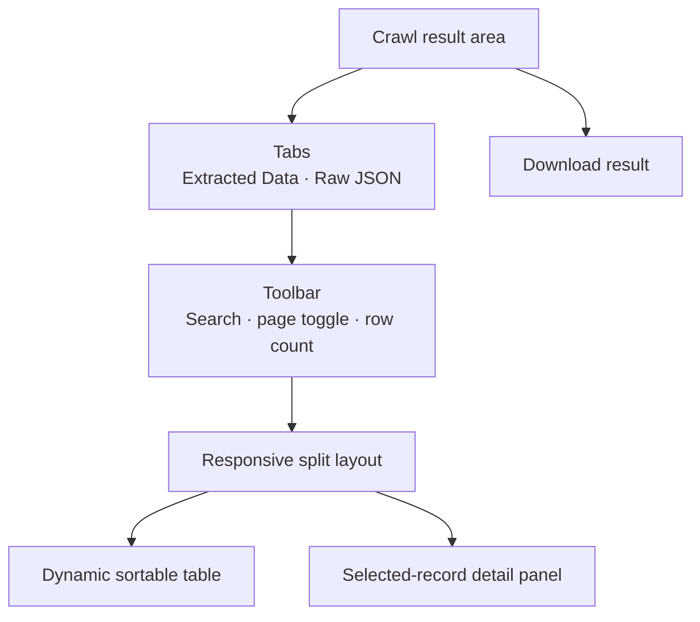

# Extracted Data UI Design

**Prepared:** 2026-06-10

**Revision history:**
- Initial draft: approved design for presenting extracted crawl data in the Gradio interface

---

## Purpose

Replace the result area's JSON-only experience with a scan-friendly extracted-data view
while preserving access to the complete raw crawl payload.

The first version optimizes for users who need to compare many extracted articles and inspect
one selected record without leaving the page.

---

## Scope

The result area will provide:

- An `Extracted Data` tab and a `Raw JSON` tab
- A dynamic table built from fields returned by the extraction process
- Search across all displayed extracted values
- Sorting by table columns
- An `Extracted` / `All pages` toggle
- A detail panel for the selected row
- The existing result download

The first version will not add pagination, per-column filters, column visibility controls,
inline editing, or full article markdown in the detail panel.

---

## Layout

The result area appears after a crawl completes.

On desktop, the extracted-data table occupies the larger left column and the detail panel
occupies the right column. On narrow screens, the detail panel moves below the table.

The `Raw JSON` tab retains the current JSON preview without changing its payload.

---

## Table Behavior

### Row Selection

- The first available row is selected when results load.
- Selecting another row updates the detail panel.
- The selected row uses a restrained accent highlight.
- When no rows match the current view, the detail panel shows an empty state.

### Page Modes

- `Extracted` is the default and includes only pages with successful extracted data.
- `All pages` includes every crawled page.
- Pages without successful extraction show crawl and extraction status using stable system
  columns instead of fabricated extracted values.

### Dynamic Columns

- System columns appear first: row number and extraction status when applicable.
- Extracted columns are derived from the union of keys in successful extraction objects.
- A title-like field, when present, is placed before other extracted fields.
- Missing values display an em dash.
- Source URL remains available in the detail panel rather than consuming table width.

### Complex Values

- Scalars display directly.
- Arrays display as short comma-separated text.
- Objects display a compact summary of their first meaningful entries.
- Long values are truncated visually in the table.
- The complete value remains available in the detail panel.

### Search and Sorting

- Search is case-insensitive and checks the readable representation of every extracted field.
- Search applies within the currently selected page mode.
- Column headers toggle ascending and descending sorting.
- Missing values sort after populated values.
- Sorting complex values uses their readable table representation.

---

## Detail Panel

The detail panel shows:

- Extraction status
- Every extracted field and its complete value
- Source URL

Arrays are displayed as compact chips when values are scalar. Objects use a readable
key-value presentation. Long text wraps naturally.

The panel does not show full article markdown in the first version because that would
duplicate the raw-page payload and make the result view unnecessarily dense.

---

## Data Flow

The crawl execution contract remains unchanged. `run_crawl()` still produces the status,
complete result payload, and download path.

A presentation transformation derives:

- Extracted-only rows
- All-page rows
- Dynamic column names
- Readable table values
- Complete detail values

The transformation must not mutate `PageResult`, extracted metadata, or the raw JSON payload.
The downloaded JSON or JSONL output remains the source-of-truth representation.

---

## Empty and Error States

- No extraction prompt: explain that structured extraction was not requested and direct the
  user to `Raw JSON`.
- Extraction requested but no page succeeded: show an empty extracted table and expose failed
  pages through `All pages`.
- Individual extraction failure: show the page in `All pages` with its error status and error
  message in the detail panel.
- Crawling failure: retain the page record and crawl status in `All pages`.
- Missing extracted field: display an em dash in the table and omit no data from the detail
  panel.

---

## Accessibility and Responsiveness

- Tabs, search, toggle, sortable headers, and rows must be keyboard accessible.
- Selected state must not rely on color alone.
- Table content may scroll horizontally when dynamic columns exceed available width.
- The detail panel moves below the table on narrow screens.
- Status labels use text in addition to color.

---

## Testing

Tests should verify:

- Extracted-only mode excludes pages without successful extraction.
- All-pages mode includes successes, crawl failures, and extraction failures.
- Dynamic columns use the union of extracted keys.
- Missing fields and complex values receive stable readable representations.
- Search matches scalar and complex extracted values.
- Sorting handles populated and missing values.
- Row selection returns the correct complete detail record.
- No-extraction and all-failed runs produce the defined empty states.
- Raw JSON and download payloads remain unchanged.

---

## Acceptance Criteria

| Check | Expected |
|---|---|
| Default result view | Extracted records shown in table-plus-detail layout |
| Raw payload access | Complete payload available in `Raw JSON` tab |
| Dynamic prompts | Table columns adapt to returned extraction keys |
| Complex values | Compact in table and complete in detail panel |
| Page visibility | Extracted pages default; all pages available by toggle |
| Table controls | Search and column sorting available |
| Responsive layout | Detail panel moves below table on narrow screens |
| Output compatibility | Existing JSON and JSONL downloads remain unchanged |
