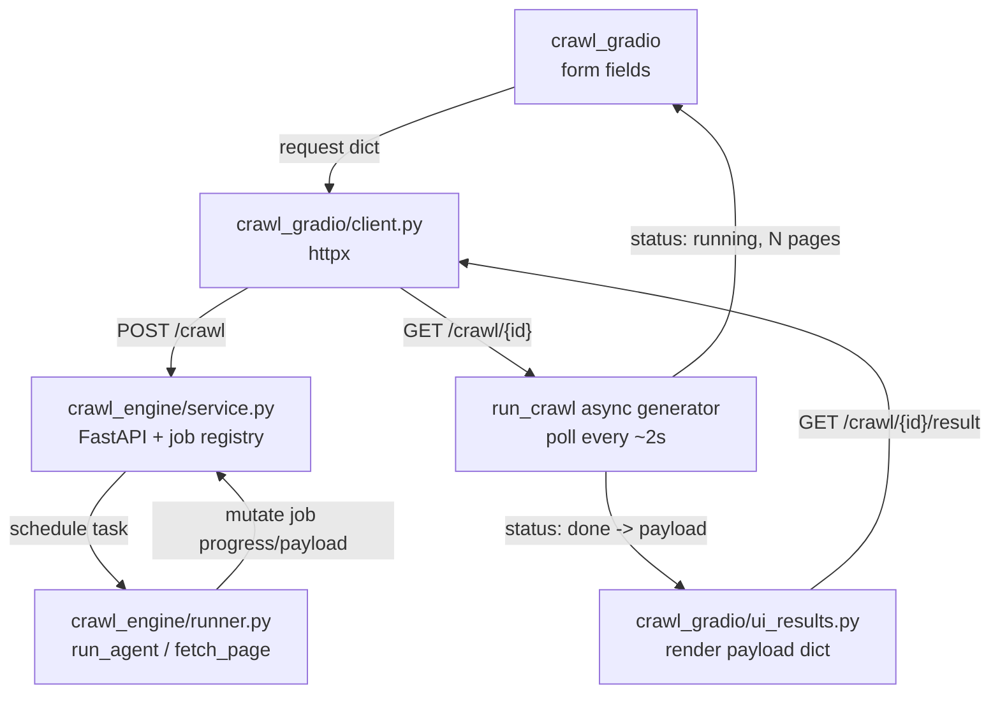

# Engine / UI API Split Design

**Prepared:** 2026-06-12

**Revision history:**
- Initial draft: approved two-package split — OpenAPI-first crawl engine and a pure-HTTP Gradio reference client

---

## Purpose

Separate the crawl engine from the user interface so each can be packaged and deployed as
its own Docker image, and so the interface can be replaced — including by a non-Python
frontend — without touching the engine.

Today the Gradio interface calls the engine in-process (`src/ui.py` awaits `run_agent`),
and the engine's configuration type lives in `src/agent.py`, which imports the
Playwright-backed crawler. Importing the config therefore drags Chromium into any process
that hosts the UI. This design breaks that coupling: the engine becomes a self-contained
HTTP service, and every UI talks to it only over a versioned HTTP contract.

---

## Scope

In scope:

- A self-contained `crawl_engine` package exposing the crawl over an OpenAPI-described HTTP API
- A `crawl_gradio` package: the existing interface refactored into a pure HTTP client that imports nothing from the engine
- Asynchronous job execution with polling, suited to crawls that run 8–10 minutes
- A result-download endpoint so no client needs the engine's serialization code
- CORS support so a browser frontend can call the engine cross-origin
- Per-package Docker images and a `docker-compose.yml` wiring them together
- Tests for the new service, runner, and client layers, plus a boundary test proving the UI does not import the engine

Out of scope:

- The non-Python frontend itself — this design enables it (contract, CORS, OpenAPI) but does not build it; it will live in its own repository
- Authentication between UI and engine — deferred until the engine is exposed beyond a private network
- Job persistence, a job queue broker, or multi-worker scaling — jobs are re-runnable and held in memory
- Streaming per-page events (Server-Sent Events) — polling is sufficient; progress is reported as a collected-page count
- Any change to crawl behavior, extraction logic, guardrails, or output schema

---

## Architecture

The repository becomes a `uv` workspace with two member packages in one repo:

```text
packages/
  engine/   src/crawl_engine/    self-contained service
                                 (crawl4ai, playwright, anthropic, fastapi, uvicorn)
  gradio/   src/crawl_gradio/    pure HTTP client
                                 (gradio, httpx) — imports nothing from crawl_engine
```

The two packages share no Python code. Their only contract is the HTTP API. A future
React/Vue/other frontend is a third, separate project in its own repository that consumes
the same contract.

The discipline that keeps the UI swappable: `crawl_gradio` builds request JSON by hand and
renders response JSON, exactly as a JavaScript client would. It never imports
`AgentConfig`, `PageResult`, or any engine serializer.

---

## Engine Package Layout

`crawl_engine/` absorbs the former `src/` modules — the previously proposed shared "core"
folds in here rather than being a separate package, because no UI imports it.

| Module | Role |
|---|---|
| `models.py` | `PageResult` — moved from `src/models/page.py` |
| `config.py` | `AgentConfig`, `MAX_DEPTH_CEILING` — lifted out of `agent.py` |
| `output.py` | `write_results`, `write_json`, `write_jsonl` |
| `logging_config.py` | structlog configuration |
| `crawler.py` | Crawl4AI wrapper — the only Playwright-touching module |
| `agent.py` | `run_agent` loop; config now imported from `config.py` |
| `extractor.py` | Claude extraction |
| `schema_registry.py` | Registered extraction intents |
| `date_filter.py` | NL date parsing and page-date detection |
| `prompts.py` + `prompts/` | Jinja2 loader and templates |
| `runner.py` | New — the crawl brain extracted from today's `ui.py` `run_crawl`: choose direct fetch vs `run_agent`, build the result payload (`_result_payload`, `_agent_run_meta`, `_direct_run_meta` move here) |
| `contract.py` | New — Pydantic request/response models that define the API and drive the OpenAPI schema |
| `service.py` | New — FastAPI application: endpoints, job registry, CORS |
| `cli.py` | The former `main.py`; calls `runner` directly, no HTTP |

`runner.py` is the shared seam between the CLI and the HTTP service: both produce a result
payload from a request without knowing about each other.

---

## HTTP Contract

The engine exposes these endpoints. FastAPI publishes `/openapi.json` and `/docs`
automatically; non-Python frontends generate typed clients from the schema.

```text
GET  /healthz                                  -> {"status": "ok"}
POST /crawl                CrawlRequest          -> {"job_id": "<uuid>"}
GET  /crawl/{job_id}                             -> JobResult
GET  /crawl/{job_id}/result?format=json|jsonl    -> file download (404 until job is done)
```

`CrawlRequest` carries the seed URL plus the existing crawl parameters:

```json
{
  "seed_url": "https://cafef.vn",
  "goal": "collect the latest banking articles",
  "extract_prompt": "extract title, publish date, author, summary",
  "extract_schema": null,
  "max_depth": 1,
  "max_pages": 5,
  "token_budget": 500000,
  "same_domain": true,
  "include_patterns": [],
  "exclude_patterns": [],
  "date_filter": "last 7 days",
  "include_undated": false,
  "css_selector": "",
  "max_chars": 0
}
```

Output format is not part of the request — the stored payload is format-agnostic, and the
caller chooses `json` or `jsonl` at download time via the `/result` query parameter.

`JobResult` reports progress while running and the full payload when done:

```json
{
  "status": "queued | running | done | error",
  "progress": {"pages_collected": 3},
  "payload": {"meta": {}, "pages": []},
  "error": null
}
```

Validation is authoritative on the server: a request that violates `AgentConfig`
constraints (for example `max_depth` above the ceiling) is rejected with HTTP 422 and a
message any client can surface. The `/result` endpoint returns the serialized artifact, so
no client reimplements or imports the engine's output writer.

---

## Job Lifecycle and Concurrency

The service holds an in-memory registry of jobs keyed by UUID. Each job records its status,
a live progress counter, the final payload or error, and a creation timestamp.

- `POST /crawl` creates a job in `queued`, schedules an asyncio background task, and returns the `job_id` immediately.
- Crawls run **serialized — one at a time — behind an asyncio lock**, matching today's `default_concurrency_limit=1` and protecting against the memory cost of concurrent Chromium instances. A second request waits in `queued` until the lock frees.
- While a crawl runs, `progress.pages_collected` is read from the live `CrawlState`, giving any client a real progress signal.
- Finished jobs (`done` or `error`) are purged after a time-to-live so memory stays bounded.
- Jobs are not persisted. An engine restart loses in-flight and completed jobs; this is acceptable because crawls are re-runnable.

---

## Data Flow



The Gradio `run_crawl` handler becomes an **async generator**: it posts the request, then
polls the status endpoint every ~2 seconds, yielding a "running — N pages collected" status
to the interface on each tick. When the job reaches `done` it renders the payload through
the unchanged `ui_results` renderer and offers the download via `/result`.

---

## Error Handling

- The background crawl task is wrapped so any exception is captured into the job as `{"status": "error", "error": "<message>"}`; the service never crashes. `fetch_page` already never raises, so most failures surface as failed pages inside a successful job.
- An unknown `job_id` returns HTTP 404.
- A `CrawlRequest` that fails validation returns HTTP 422 with field-level detail.
- `GET /result` before a job is `done` returns HTTP 404.
- The Gradio client surfaces engine errors and unreachable-engine conditions as readable status messages rather than tracebacks.

---

## CORS and Authentication

- FastAPI `CORSMiddleware` is enabled with an allowed-origins list read from an environment variable, so a browser-based frontend on another origin can call the engine.
- No authentication is added now. The engine is reachable on the private compose network and, when published, is intended for a trusted frontend during development.
- When the engine is exposed publicly, a shared API token and a restricted CORS origin list are required. This is recorded as a follow-up, not built in this design.

---

## Docker and Deployment

| Image | Base | Command | Environment |
|---|---|---|---|
| engine | `mcr.microsoft.com/playwright/python` (Chromium preinstalled) | `uvicorn crawl_engine.service:app --host 0.0.0.0 --port 8000` | `ANTHROPIC_API_KEY`, `CORS_ALLOW_ORIGINS` |
| gradio | `python:3.11-slim` | `python -m crawl_gradio.app` | `ENGINE_URL` |

`docker-compose.yml` defines both services on one network. It publishes the Gradio port and
**also** the engine port, so a future external frontend can reach the API directly. The
engine carries the Anthropic key and CORS configuration; the Gradio service is configured
only with `ENGINE_URL` (for example `http://engine:8000`).

---

## Testing

- Engine: the existing crawler, agent, extractor, date-filter, output, and model unit tests move into the engine package with updated imports.
- Engine service: new tests using FastAPI `TestClient` cover job creation, polling from `queued`/`running` to `done`, an error job, an unknown-job 404, the `/result` download for both formats, and a 422 on invalid configuration.
- Engine runner: new tests cover the direct-fetch versus agent-run branch and payload shaping, with `fetch_page` and `run_agent` mocked.
- Gradio client: new tests mock the HTTP layer (respx) to verify request shaping, polling until done, and error surfacing.
- Gradio interface: the polling `run_crawl` generator is tested with a mocked client; `ui_results` rendering tests carry over unchanged.
- Boundary test: importing `crawl_gradio` succeeds in an environment where `crawl4ai` and `playwright` are not installed, proving the UI does not depend on engine code.
- The live `@pytest.mark.integration` suite stays with the engine package.

---

## Implementation Sequence

Each step keeps `uv run pytest` green and `ruff check` clean before the next begins.

1. Create the workspace and the `crawl_engine` package; move the current `src/` modules in; lift `AgentConfig`/`MAX_DEPTH_CEILING` into `config.py`; update imports.
2. Extract `runner.py` from the existing `run_crawl` logic; point `cli.py` (former `main.py`) at it.
3. Add `contract.py` and `service.py` — FastAPI app, job registry, endpoints, CORS — with service and runner tests.
4. Create the `crawl_gradio` package: add `client.py`, refactor `run_crawl` into the polling generator, move `ui_results.py`, and remove every engine import; add client and boundary tests.
5. Add the two Dockerfiles and `docker-compose.yml`; verify end-to-end.
6. Update `README.md` and `docs/architecture.md` for the two-package, API-driven layout.

---

## Acceptance Criteria

| Check | Expected |
|---|---|
| Package isolation | `crawl_gradio` imports succeed with `crawl4ai`/`playwright` absent |
| Engine self-description | `/openapi.json` and `/docs` describe the full contract |
| Async crawl | `POST /crawl` returns a `job_id` immediately; `GET /crawl/{id}` reports progress then the payload |
| Result download | `GET /crawl/{id}/result` returns the JSON or JSONL artifact |
| Server validation | Out-of-range `max_depth` is rejected with HTTP 422 |
| Serialized execution | Concurrent requests run one crawl at a time |
| Cross-origin access | A browser frontend on another origin can call the engine |
| Reference UI parity | The Gradio client produces the same results view as today, over HTTP only |
| CLI preserved | `crawl_engine` CLI runs a crawl without the HTTP service |
| Two images | Engine and Gradio build and run as separate containers via compose |
