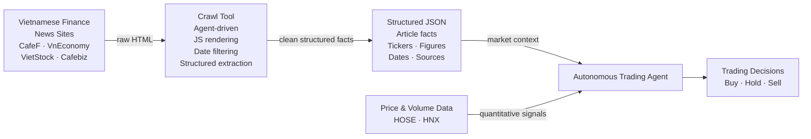

# Week 1 Research Report — Crawl Library Evaluation

**Prepared:** 2026-05-29

**Revision history:**
- Initial draft: evaluated Crawl4AI, Firecrawl, Stagehand
- Post-review: corrected stale API names, Firecrawl async status, Stagehand Python SDK, and markdown usage guidance
- Final merge: added Crawlee Python evaluation and Week 2 implementation contract

---

## Overview

### Motivation

- **Markets move on news, not just numbers** — a stock drops because of bad earnings, regulatory tightening, or a central bank decision, not because a spreadsheet changed
- An autonomous trading agent that reads only price charts sees *what* happened but never *why* — it has no warning before the next move
- Vietnamese finance outlets (CafeF, VnEconomy, VietStock, Cafebiz) publish hundreds of articles per day — far too much for any human analyst to process in real time
- These articles are buried inside HTML pages full of navigation menus, ads, and sidebars — an LLM cannot reason over raw HTML directly
- **Web crawling is the pipeline that bridges public news sites and the trading agent** — it visits a URL, renders the page, strips everything irrelevant, and returns clean article text the LLM can actually read
- Without a crawler, the trading agent has no awareness of the world outside price data

### What the Crawl Tool Does for the Trading Agent

- Acts as the agent's **eyes and ears on the Vietnamese financial internet**
- Given a plain-language goal — e.g. *"collect all news about VIC stock in the last 7 days"* — it:
    - Starts at a seed URL (CafeF homepage, a search results page, etc.)
    - Reads the page and follows only links relevant to the goal
    - Extracts article content from each page it visits
    - Filters out articles outside the requested date range
    - Stops when the goal is satisfied or a page/token budget is exhausted
    - Returns a structured JSON file of everything it found
- The trading agent reads that JSON to reason about market conditions and inform buy / hold / sell decisions

### What Information It Provides

| Category | Examples | Trading relevance |
|---|---|---|
| **Company news** | Earnings announcements, leadership changes, M&A activity, factory incidents | Direct signal for individual stock positions |
| **Macroeconomic data** | GDP growth, inflation figures, trade balance, FDI inflows | Sector rotation, index-level positioning |
| **Monetary policy** | State Bank of Vietnam rate decisions, credit growth targets, FX interventions | Bond market, banking sector, VND/USD positioning |
| **Regulatory changes** | New listing rules, foreign ownership limits, sector restrictions | Compliance risk, sector exposure limits |
| **Market sentiment** | Analyst commentary, retail investor forums (CafeF community), institutional outlooks | Contrarian signals, momentum confirmation |
| **Corporate filings** | Dividend announcements, rights issues, bond issuances, AGM resolutions | Near-term price catalysts |
| **Commodity and input prices** | Steel, oil, agricultural commodity prices reported in Vietnamese context | Cost-side pressure on manufacturers, energy stocks |

Each extracted record includes the article title, publish date, source URL, and the structured fields the agent was asked to pull — for example, stock tickers mentioned, key financial figures, sentiment, or named entities. This gives the trading agent a timestamped, source-attributed fact base to reason from, rather than unverified free text.

---

### The Bigger Picture



- The crawl tool provides the **qualitative, news-driven half** of the agent's information diet
- Price and volume data provides the quantitative half
- Together they give the agent both the *signal* (what the market is doing) and the *story* (why) — closer to how a professional analyst actually works

### This Report

- Documents the **Week 1 library selection** for the Agent Crawl MVP
- The crawl library is **not** responsible for making crawl decisions — Claude owns that
  - Library role: reliable per-page fetch, JS rendering, boilerplate removal, link extraction
  - Agent role: goal interpretation, frontier selection, extraction decisions, stopping conditions
- Four libraries evaluated against nine criteria; **Crawl4AI selected**
- Selection verified against current docs via Context7 MCP; key corrections applied during review


## Objective

- Choose the crawl library for `src/crawler.py` in the Agent Crawl MVP
- Must crawl Vietnamese economy/finance news sites, render JS, respect guardrails, extract LLM-ready content, expose links, and keep operational overhead low
- Library is **not** expected to make crawl decisions — the Claude agent loop owns that

---

## Selection Criteria

| Criterion | Why it matters |
|---|---|
| Async Python | Agent loop is `asyncio`-based; no HTTP bridge processes |
| JS rendering | Vietnamese news sites lazy-load article content, pagination, and metadata |
| robots.txt | Hard guardrail enforced outside the agent in code |
| Rate limiting / concurrency | Avoid hammering public sites; control Playwright memory |
| Clean markdown | Claude receives article content, not nav/footer/ad boilerplate |
| Link extraction | Agent needs candidate URLs for frontier construction |
| License | Apache 2.0 or MIT; AGPL is a distribution and modification risk |
| Operational overhead | Must run locally with `uv` + Playwright — no Docker stack |
| Agent-architecture fit | Library is a deterministic fetch/extract tool, not an agent replacement |

---

## Libraries Evaluated

### 1. Crawl4AI

**Properties**

| Property | Assessment |
|---|---|
| Language | Python native |
| License | Apache 2.0 |
| Maturity | Active — PyPI 0.8.x; pin a tested minor version, not `>=0.4.0` |
| JS rendering | Playwright — `BrowserConfig(browser_type="chromium", headless=True)` |
| Async API | `AsyncWebCrawler` |
| robots.txt | `CrawlerRunConfig(check_robots_txt=True)` |
| Rate/concurrency | `arun_many(...)` + `SemaphoreDispatcher`, `MemoryAdaptiveDispatcher`, `RateLimiter` |
| Markdown | `DefaultMarkdownGenerator` + `PruningContentFilter` / `BM25ContentFilter` |
| Links | `result.links` — dict with `"internal"` / `"external"` lists |
| Operational model | `pip install crawl4ai && playwright install chromium` — nothing else |

**Verified API (single page):**
```python
from crawl4ai import AsyncWebCrawler, BrowserConfig, CrawlerRunConfig, CacheMode
from crawl4ai.content_filter_strategy import PruningContentFilter
from crawl4ai.markdown_generation_strategy import DefaultMarkdownGenerator

browser_config = BrowserConfig(browser_type="chromium", headless=True)
run_config = CrawlerRunConfig(
    cache_mode=CacheMode.BYPASS,
    check_robots_txt=True,
    markdown_generator=DefaultMarkdownGenerator(
        content_filter=PruningContentFilter(threshold=0.6)
    ),
)
async with AsyncWebCrawler(config=browser_config) as crawler:
    result = await crawler.arun(url, config=run_config)
```

**Verified API (multi-page with rate limiting):**
```python
from crawl4ai.async_dispatcher import SemaphoreDispatcher, RateLimiter

dispatcher = SemaphoreDispatcher(
    semaphore_count=5,
    rate_limiter=RateLimiter(base_delay=(1.0, 2.0), max_delay=30.0, max_retries=2),
)
results = await crawler.arun_many(urls, config=run_config, dispatcher=dispatcher)
```

**Markdown output guidance (verified via MCP docs):**
- Use `result.markdown.fit_markdown` for filtered markdown
- `fit_markdown` = boilerplate-pruned output from `PruningContentFilter` / `BM25ContentFilter` — not auto LLM truncation
- Token trimming is the agent/prompt-assembly layer's responsibility

**Strengths:**
- Best match for the MVP's per-page fetch and content normalization layer
- Produces LLM-friendly markdown directly — both raw and filtered variants available
- Pure Python local — no HTTP bridge, no Docker, no subprocess
- Browser and run configuration are separate — maps cleanly to a thin `src/crawler.py` wrapper
- Multi-URL dispatcher gives explicit control over memory and request pacing

**Limitations:**
- API moves quickly — must pin a tested minor version
- Not a full crawl-state engine — frontier, visited set, depth, and link selection remain in `src/agent.py`
- Playwright concurrency consumes significant memory — start conservative (`semaphore_count=2`)

---

### 2. Crawlee Python — Best Fallback

**Properties**

| Property | Assessment |
|---|---|
| Language | Python native |
| License | Apache 2.0 |
| JS rendering | `PlaywrightCrawler` |
| Async API | Yes |
| robots.txt | `BasicCrawlerOptions(respect_robots_txt_file=True)` |
| Rate/concurrency | Request queues, concurrency settings, sessions, proxies — best in class |
| Markdown | Weak — selector/parser driven, not markdown-first |
| Links | Strong — enqueue helpers, glob filters, request queues |
| Operational model | Local Python + optional Playwright |

**Strengths:**
- Best traditional crawler framework in the shortlist
- Request queues, routing, retries, sessions, and recursive crawling primitives out of the box
- Strong fit for structured crawls with known extraction selectors

**Limitations:**
- Does not solve clean LLM-ready markdown extraction without additional tooling
- Queue/router model overlaps with the agent's own frontier decisions — partial duplication
- Would need a readability/markdown layer added for article body extraction

**Verdict:** Best fallback if Crawl4AI proves unstable on Vietnamese news targets in Week 2 smoke tests

---

### 3. Firecrawl — Quality Benchmark Only

**Properties**

| Property | Assessment |
|---|---|
| Language | Service/API product; Python SDK |
| License | Core AGPL-3.0; SDKs MIT |
| JS rendering | Yes — in service/self-hosted stack |
| Async Python | Yes — `AsyncFirecrawl` / `AsyncFirecrawlApp` (confirmed via docs) |
| robots.txt | Service-managed — semantics not transparent for self-hosted deployments |
| Rate/concurrency | Service-side job controls |
| Markdown | Strong — Mozilla Readability + clean markdown output |
| Links | Crawl/map APIs expose discovered pages |
| Operational model | Cloud API or self-hosted Docker stack (API server + worker + Redis) |

**Confirmed async API:**
```python
from firecrawl import AsyncFirecrawl

fc = AsyncFirecrawl(api_key="fc-YOUR-API-KEY")
doc = await fc.scrape("https://firecrawl.dev", formats=["markdown"])
started = await fc.start_crawl("https://docs.firecrawl.dev", limit=3)
status = await fc.get_crawl_status(started.id)
```

**Weaknesses:**
- AGPL core — any server modification must be open-sourced if distributed
- Python SDK is an HTTP client to a Node.js backend — not a Python crawl engine
- Self-hosting requires a multi-container Docker stack
- Service controls crawl behavior — external guardrail enforcement is less transparent

**Verdict:** Not selected. Useful as a markdown quality benchmark; not the default because of AGPL and service overhead

---

### 4. Stagehand — Out of Scope

**Properties**

| Property | Assessment |
|---|---|
| Language | TypeScript primary; official `stagehand-python` with `AsyncStagehand` (confirmed) |
| License | MIT |
| JS rendering | Local Playwright or Browserbase cloud |
| Async Python | Yes — `AsyncStagehand` |
| robots.txt | Not a concern — not a crawler framework |
| Rate/concurrency | Browser-session controls only — no crawl-scale frontier management |
| Markdown | AI browser actions for extraction — not markdown-first |
| Operational model | Local mode possible; production uses Browserbase cloud |

**Confirmed Python SDK:**
```python
from stagehand import AsyncStagehand

client = AsyncStagehand()
session = await client.sessions.start(model_name="anthropic/claude-sonnet-4-6")
response = await session.act(input="click the first link on the page")
```

**Why ruled out:**
- Built for interactive browser sessions (login, form fill, multi-step flows) — wrong abstraction for bulk news crawling
- No robots.txt, no frontier management, no rate limiting
- Per-page LLM action/extraction is expensive and nondeterministic at crawl scale
- Python SDK exists and is async — but the product does not solve the crawl orchestration problem

**Verdict:** Out of scope for the MVP. May be useful for special sites requiring login or interaction in later phases

---

## Comparison Matrix

Scores are relative to this project's MVP requirements, not general library quality.

| Criterion | Crawl4AI | Crawlee Python | Firecrawl | Stagehand |
|---|:---:|:---:|:---:|:---:|
| Python-native local integration | 5 | 5 | 3 | 4 |
| JS rendering | 5 | 5 | 5 | 5 |
| robots.txt as local guardrail | 5 | 5 | 3 | 1 |
| Rate/concurrency control | 4 | 5 | 4 | 2 |
| Clean markdown for LLM input | 5 | 2 | 5 | 2 |
| Link extraction / frontier support | 4 | 5 | 4 | 2 |
| License fit | 5 | 5 | 2 | 5 |
| Operational simplicity | 5 | 4 | 2 | 3 |
| Agent-architecture fit | 5 | 4 | 3 | 2 |
| **Total** | **43/45** | **39/45** | **31/45** | **26/45** |

---

## Decision: Crawl4AI

**Selected for Week 2 implementation.** Rationale:

- Provides the most critical primitive: JS-rendered pages → clean LLM-friendly markdown + links
- Pure local Python — no Docker, no HTTP bridge, no subprocess
- Apache 2.0 — no distribution or modification restrictions
- Responsibilities fit the architecture cleanly: Crawl4AI fetches and normalizes; Claude decides what to do next
- **Fallback:** Crawlee Python if Week 2 smoke tests reveal Crawl4AI instability on Vietnamese news targets

---

## Week 2 Implementation Contract

`src/crawler.py` exposes a small stable interface to insulate the rest of the project from Crawl4AI API churn.

**Public interface:**
```python
from dataclasses import dataclass

@dataclass
class PageResult:
    url: str
    final_url: str
    status_code: int | None
    title: str | None
    markdown: str           # filtered (fit_markdown) — primary Claude input
    raw_markdown: str | None
    html: str | None
    links_internal: list[str]
    links_external: list[str]
    metadata: dict
    success: bool
    error: str | None

async def fetch_page(url: str, css_selector: str | None = None) -> PageResult: ...
```

**Implementation rules:**
- Use `BrowserConfig(browser_type="chromium", headless=True)`
- Use `CrawlerRunConfig(check_robots_txt=True, markdown_generator=...)`
- Use `result.markdown.fit_markdown` for Claude input; keep `result.markdown.raw_markdown` for debugging
- Failed pages → `PageResult(success=False, error=...)` — never raise exceptions that abort the crawl
- Normalize links to plain URL lists — `src/agent.py` must not depend on Crawl4AI result shapes
- Pin a specific tested version after first verified install (e.g. `crawl4ai==0.8.x`)

---

## Smoke Test Plan

Minimum validation before declaring `src/crawler.py` done:

1. `uv sync`
2. `uv run playwright install chromium`
3. Fetch `https://cafef.vn`
4. Fetch one article URL from CafeF or VnEconomy
5. Verify all of:
   - `result.success` is `True`
   - `markdown` is non-empty and article body is recognizable
   - Boilerplate (nav, footer, ads) is absent or minimal
   - `links_internal` list is non-empty
   - robots denial surfaces as a structured error, not a crash
   - Memory stays stable across 3–5 concurrent fetches via `arun_many`

---

## Claude API Notes for the Agent Loop

- **Prompt caching:** apply `cache_control: {"type": "ephemeral"}` to stable system prompt + tool definitions — these are large and static per crawl session, caching cuts cost significantly
- **Token budget:** track `usage.input_tokens + usage.output_tokens` per Claude response; enforce a crawl-level budget in code, not via Claude
- **Markdown compactness:** pass `fit_markdown` first; apply explicit local truncation if still too large for the context window
- **Hard guardrails in code, not Claude:** depth ceiling, same-domain restriction, include/exclude patterns, robots.txt, page cap, and rate limits must all be enforced outside the model — Claude can suggest, but code must enforce

---

## Risks and Mitigations

| Risk | Impact | Mitigation |
|---|---|---|
| Crawl4AI API drift | Week 2 implementation breaks on dependency resolution | Pin tested version; keep wrapper boundary in `src/crawler.py` |
| Poor extraction on Vietnamese news templates | Claude receives noisy input | Test CafeF and VnEconomy early; add `css_selector` overrides per domain |
| Browser memory growth | Local crawl becomes unstable | Start at `semaphore_count=2`; tune up after smoke tests pass |
| Robots / anti-bot denial | Pages fail unexpectedly | Surface as `PageResult(success=False, error=...)` and log the reason |
| Agent over-crawling | Cost and site load increase | Enforce max depth, max pages, same-domain default, and rate limits outside Claude |

---

## Week 2 Entry Criteria

- [x] `pyproject.toml` with uv-managed deps (Crawl4AI, Playwright, Anthropic, Jinja2, jsonschema, dateparser)
- [x] Repo skeleton: `src/`, `tests/`, `prompts/`, `docs/` created
- [x] `src/` placeholder files: `agent.py`, `crawler.py`, `extractor.py`, `date_filter.py`, `prompts.py`, `output.py`
- [x] `main.py` CLI skeleton with all planned flags
- [ ] `PageResult` dataclass and `fetch_page` signature defined in `crawler.py`
- [ ] Crawl4AI pinned to a specific tested version in `pyproject.toml`
- [ ] `uv sync && playwright install chromium` verified locally
- [ ] Smoke test: fetch CafeF homepage + one article, all 6 acceptance criteria pass
