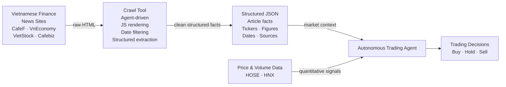

# Week 1 Research Report — Crawl Library Evaluation

Prepared: 2026-05-29

> **Revision history:**
> - Initial draft: evaluated Crawl4AI, Firecrawl, Stagehand (3 libraries)
> - Post-review update: corrected stale Crawl4AI API names (`check_robots_txt`, dispatcher model), updated
>   Firecrawl async status, corrected Stagehand Python SDK availability, clarified `fit_markdown` deprecation
> - Final merge: incorporated Crawlee Python evaluation and Week 2 implementation contract from Codex report

---

## Overview

### Why We Need to Crawl — A Plain-Language Explanation

Financial markets do not move on numbers alone. A stock price drops not because a spreadsheet changed, but because a company announced bad earnings, a government tightened regulations, or a central bank shifted its interest rate stance. An autonomous trading agent that only reads price charts is flying half-blind — it sees *what* the market did but not *why*, and it has no warning before the next move happens.

Public news sites publish this information continuously, for free, in human-readable form. The problem is volume and format: dozens of Vietnamese economy and finance outlets (CafeF, VnEconomy, VietStock, Cafebiz, etc.) publish hundreds of articles per day, buried inside HTML pages full of navigation menus, advertisements, and unrelated sidebar content. A human analyst cannot read all of it. An LLM can — but only if the raw HTML is first converted into clean, structured text that the model can actually reason over.

**Web crawling is the pipeline that bridges public news sites and the trading agent.** It is the automated process of:

1. Visiting a URL
2. Rendering the page (including JavaScript-loaded content)
3. Stripping everything irrelevant — menus, footers, ads, cookie banners
4. Returning the article body, metadata, and outbound links in a form the LLM can read

Without a crawler, the trading agent has no awareness of the world outside price data.

---

### Motivation

Think of the crawl tool as the agent's **eyes and ears on the Vietnamese financial internet**. Given a goal in plain language — for example, *"collect all news about VIC stock in the last 7 days"* — it:

- Starts at a seed URL (e.g., the CafeF homepage or a search results page)
- Reads the page, understands which links are relevant to the goal, and follows them
- Extracts the content from each article it visits
- Filters out articles that fall outside the requested date range
- Stops when the goal is satisfied or a page/token budget is exhausted
- Returns a structured JSON file of everything it found

The trading agent then reads that JSON to reason about market conditions, company news, regulatory changes, or macroeconomic signals — and uses that reasoning to inform buy, hold, or sell decisions.

---

### What Information It Provides

The crawl tool extracts and structures the following categories of information from Vietnamese economy and finance news sites:

| Category | Examples | Trading relevance |
|---|---|---|
| **Company news** | Earnings announcements, leadership changes, M&A activity, factory incidents | Direct signal for individual stock positions |
| **Macroeconomic data** | GDP growth, inflation figures, trade balance, FDI inflows | Sector rotation, index-level positioning |
| **Monetary policy** | State Bank of Vietnam rate decisions, credit growth targets, FX interventions | Bond market, banking sector, VND/USD positioning |
| **Regulatory changes** | New listing rules, foreign ownership limits, sector restrictions | Compliance risk, sector exposure limits |
| **Market sentiment** | Analyst commentary, retail investor forums (CafeF community), institutional outlooks | Contrarian signals, momentum confirmation |
| **Corporate filings** | Dividend announcements, rights issues, bond issuances, AGM resolutions | Near-term price catalysts |
| **Commodity and input prices** | Steel, oil, agricultural commodity prices reported in Vietnamese context | Cost-side pressure on manufacturers, energy stocks |

Each extracted record includes the article title, publish date, source URL, and the structured fields the agent was asked to pull — for example, stock tickers mentioned, key financial figures, sentiment, or named entities. This gives the trading agent a timestamped, source-attributed fact base to reason from, rather than unverified free text.

---

### The Bigger Picture



The crawl tool produces the **qualitative, news-driven half** of the agent's information diet. Price and volume data provides the quantitative half. Together they give the trading agent both the *signal* (what the market is doing) and the *story* (why it is doing it) — which is closer to how a professional analyst actually works.

---

### This Report

This report documents the Week 1 library selection for the Agent Crawl MVP — a goal-directed CLI tool that crawls Vietnamese economy and finance news sites (CafeF, VnEconomy, etc.) and extracts structured data for downstream LLM analysis.

The core architectural decision is that **an LLM agent (Claude) drives all crawl decisions** — which links to follow, what to extract, when to stop. The crawl library sits below the agent and handles only the per-page fetch layer: fetching a URL, rendering JavaScript, stripping boilerplate, returning clean markdown and outbound links. Everything else (frontier management, depth tracking, goal reasoning, extraction prompting) lives in the agent loop.

Four libraries were evaluated against nine criteria weighted for this architecture:

| Library | Role fit | License | Verdict |
|---|---|---|---|
| **Crawl4AI** | Native Python async fetch + markdown engine | Apache 2.0 | **Selected** |
| **Crawlee Python** | Full crawl framework with queues/routing | Apache 2.0 | Best fallback |
| **Firecrawl** | Managed scraping service with Python SDK | AGPL-3.0 core | Quality benchmark only |
| **Stagehand** | AI browser automation (interactive sessions) | MIT | Out of scope |

**Crawl4AI** was selected because it provides the most important primitive for this architecture — JavaScript-rendered pages converted into clean, LLM-friendly markdown with metadata and links — while remaining a pure local Python dependency with no service stack overhead.

The selection was verified against current library documentation via Context7 MCP. Key corrections made during review: `check_robots_txt` parameter name, `SemaphoreDispatcher`/`RateLimiter` dispatcher model for concurrency, and `result.markdown.fit_markdown` access path (top-level `result.fit_markdown` is deprecated).


## Objective

Choose the crawling library for the Agent Crawl MVP. The library must support a Python CLI that crawls Vietnamese economy and finance news sites, renders JavaScript when needed, respects crawl guardrails, extracts LLM-ready page content, exposes links for recursive crawling, and keeps operational overhead low.

The library is **not** expected to make crawl decisions. The Claude-driven agent loop owns goal interpretation, frontier selection, extraction decisions, and stopping conditions. The crawl library provides the reliable per-page and multi-page fetch layer under those decisions.

---

## Selection Criteria

| Criterion | Why it matters |
|---|---|
| Async Python support | The agent loop will be `asyncio`-based; avoid HTTP bridge processes where possible |
| JavaScript rendering | Target news sites lazy-load article content, pagination, and metadata |
| robots.txt support | Compliance is a hard guardrail enforced outside the agent |
| Rate limiting and concurrency | Avoid hammering public sites; control Playwright memory use |
| Clean markdown extraction | Claude should receive article content, not nav/footer/ad boilerplate |
| Link extraction | Agent needs candidate links for frontier construction |
| License | Apache 2.0 or MIT preferred; AGPL is a distribution and modification risk |
| Operational overhead | Week 2 MVP should run locally with `uv` and Playwright, no service stack |
| Fit with agent architecture | Library acts as deterministic fetch/extract tool, not a replacement for the agent loop |

---

## Libraries Evaluated

### 1. Crawl4AI

| Property | Assessment |
|---|---|
| Language/runtime | Python native |
| License | Apache 2.0 |
| Maturity | Active; PyPI shows 0.8.x releases — pin a tested minor version, not `>=0.4.0` |
| JS rendering | Yes — Playwright (`BrowserConfig(browser_type="chromium", headless=True)`) |
| Async API | Yes — `AsyncWebCrawler` |
| robots.txt | `CrawlerRunConfig(check_robots_txt=True)` |
| Rate/concurrency | `arun_many(...)` with `SemaphoreDispatcher`, `MemoryAdaptiveDispatcher`, `RateLimiter` |
| Markdown | Strong — `DefaultMarkdownGenerator` + `PruningContentFilter` / `BM25ContentFilter` |
| Links | `result.links` — dict with `"internal"` / `"external"` lists |
| Operational model | Local Python dependency + `playwright install chromium` |

**Verified API surface:**

```python
from crawl4ai import AsyncWebCrawler, BrowserConfig, CrawlerRunConfig, CacheMode
from crawl4ai.content_filter_strategy import PruningContentFilter
from crawl4ai.markdown_generation_strategy import DefaultMarkdownGenerator

browser_config = BrowserConfig(browser_type="chromium", headless=True)

run_config = CrawlerRunConfig(
    cache_mode=CacheMode.BYPASS,
    check_robots_txt=True,
    markdown_generator=DefaultMarkdownGenerator(
        content_filter=PruningContentFilter(threshold=0.6)
    ),
)

async with AsyncWebCrawler(config=browser_config) as crawler:
    result = await crawler.arun(url, config=run_config)
```

For multi-page crawls, rate limiting lives in a dispatcher passed to `arun_many`:

```python
from crawl4ai.async_dispatcher import SemaphoreDispatcher, RateLimiter

dispatcher = SemaphoreDispatcher(
    semaphore_count=5,
    rate_limiter=RateLimiter(base_delay=(1.0, 2.0), max_delay=30.0, max_retries=2),
)
results = await crawler.arun_many(urls, config=run_config, dispatcher=dispatcher)
```

**`fit_markdown` — important clarification:**
- Top-level `result.fit_markdown` is **deprecated** and raises `AttributeError` — use `result.markdown.fit_markdown`.
- `fit_markdown` is the boilerplate-pruned output from `PruningContentFilter` or `BM25ContentFilter`.
- It does **not** auto-truncate to LLM context windows. Token trimming is the agent/prompt-assembly layer's responsibility.

**Strengths:**
- Best match for the MVP's per-page fetch and content normalization layer.
- Produces LLM-friendly markdown directly, including raw and filtered markdown variants.
- Keeps the implementation Python-native and local.
- Exposes browser and run configuration separately — maps cleanly to a thin `src/crawler.py` wrapper.
- Multi-URL dispatcher model gives explicit control over memory and request pacing.

**Limitations:**
- API is moving quickly — pin a tested minor version.
- Not a complete crawl-state engine: frontier, visited set, depth, canonicalization, and link selection remain in `src/agent.py`.
- Playwright concurrency can consume substantial memory; test conservative defaults first.

---

### 2. Crawlee Python

| Property | Assessment |
|---|---|
| Language/runtime | Python native |
| License | Apache 2.0 |
| JS rendering | Yes — `PlaywrightCrawler` |
| Async API | Yes |
| robots.txt | Yes — `BasicCrawlerOptions(respect_robots_txt_file=True)` |
| Rate/concurrency | Strong — request queues, concurrency settings, sessions, proxies |
| Markdown | Weak for this MVP — extraction is selector/parser driven, not markdown-first |
| Links | Strong — enqueue helpers, glob filters, request queues |
| Operational model | Local Python dependency + optional Playwright install |

**Strengths:**
- Best traditional crawler framework in the shortlist.
- Provides request queues, routing, retries, sessions, and recursive crawling primitives out of the box.
- Good fit for large-scale structured crawls where extraction selectors are known in advance.

**Limitations:**
- Does not solve the core MVP need of clean markdown extraction as directly as Crawl4AI.
- The agent already owns frontier decisions, so Crawlee's queue/router model partially overlaps project code.
- Additional markdown/readability tooling would be needed for high-quality article body extraction.

**Verdict:** Best fallback if Crawl4AI proves unstable on Vietnamese news targets in Week 2 smoke tests. Not the first choice because the MVP's immediate Claude input should be clean markdown.

---

### 3. Firecrawl

| Property | Assessment |
|---|---|
| Language/runtime | Service/API product with Python SDK |
| License | Core AGPL-3.0; SDKs MIT |
| JS rendering | Yes — in service/self-hosted stack |
| Async Python | Yes — `AsyncFirecrawl` / `AsyncFirecrawlApp` (confirmed) |
| robots.txt | Service-managed; verify exact semantics for self-hosted before relying on it as a hard guardrail |
| Rate/concurrency | Service-side job controls |
| Markdown | Strong — returns clean markdown and structured formats |
| Links | Crawl/map APIs expose discovered pages |
| Operational model | Cloud API or self-hosted Docker stack |

**Confirmed async API:**

```python
from firecrawl import AsyncFirecrawl

async def main():
    fc = AsyncFirecrawl(api_key="fc-YOUR-API-KEY")
    doc = await fc.scrape("https://firecrawl.dev", formats=["markdown"])
    started = await fc.start_crawl("https://docs.firecrawl.dev", limit=3)
    status = await fc.get_crawl_status(started.id)
```

**Weaknesses:**
- AGPL core: modifications to the server must be open-sourced if distributed.
- Python SDK is an async HTTP client to a Node.js backend service — not a Python crawl engine.
- Self-hosting requires a multi-container Docker stack (API server + worker + Redis).
- Service owns much of the crawl behavior, making external guardrail enforcement less transparent.

**Verdict:** Not selected for the MVP. Useful as a markdown quality benchmark and possible fallback service option, not the default library.

---

### 4. Stagehand

| Property | Assessment |
|---|---|
| Language/runtime | TypeScript primary; official `stagehand-python` SDK with `AsyncStagehand` |
| License | MIT |
| JS rendering | Yes — local Playwright or Browserbase cloud |
| Async Python | Yes — `AsyncStagehand` (confirmed) |
| robots.txt | Not a crawler framework concern |
| Rate/concurrency | Browser-agent/session controls — not crawl-scale frontier controls |
| Markdown | Extracts structured data via AI browser actions — not markdown-first |
| Links | Can inspect pages; not designed as a respectful recursive crawler |
| Operational model | Local mode possible; production commonly pairs with Browserbase |

**Confirmed Python SDK:**

```python
from stagehand import AsyncStagehand

async def main():
    client = AsyncStagehand()
    session = await client.sessions.start(model_name="anthropic/claude-sonnet-4-6")
    response = await session.act(input="click the first link on the page")
```

**Why ruled out:**
- Wrong abstraction for bulk crawling public news pages.
- No native robots/frontier/rate-limit model for respectful crawling.
- Per-page AI action/extraction is expensive and nondeterministic at crawl scale.
- Python SDK exists but the product does not solve the crawl orchestration problem.

**Verdict:** Not selected. May be useful later for special sites requiring login or multi-step interaction, but must not underpin the MVP crawler.

---

## Comparison Matrix

Scores are relative to this project's MVP requirements, not general library quality.

| Criterion | Crawl4AI | Crawlee Python | Firecrawl | Stagehand |
|---|:---:|:---:|:---:|:---:|
| Python-native local integration | 5 | 5 | 3 | 4 |
| JS rendering | 5 | 5 | 5 | 5 |
| robots.txt as local guardrail | 5 | 5 | 3 | 1 |
| Rate/concurrency control | 4 | 5 | 4 | 2 |
| Clean markdown for LLM input | 5 | 2 | 5 | 2 |
| Link extraction / frontier support | 4 | 5 | 4 | 2 |
| License fit | 5 | 5 | 2 | 5 |
| Operational simplicity | 5 | 4 | 2 | 3 |
| Agent-architecture fit | 5 | 4 | 3 | 2 |
| **Total** | **43/45** | **39/45** | **31/45** | **26/45** |

---

## Decision: Crawl4AI

**Crawl4AI is the chosen library for Week 2 implementation.**

Rationale:
- Gives the MVP the most important primitive: JS-rendered pages converted into clean, LLM-friendly markdown with metadata and links.
- Keeps the stack local and Python-native.
- Satisfies the Apache 2.0 license requirement.
- Responsibilities fit the intended architecture: Crawl4AI fetches and normalizes pages; the Claude agent decides what to do next.

**Fallback:** Crawlee Python is the best alternative if Week 2 smoke tests reveal Crawl4AI instability on target Vietnamese news sites.

---

## Week 2 Implementation Contract

`src/crawler.py` should expose a small stable interface so the rest of the project is insulated from Crawl4AI API churn.

**Public types:**

```python
from dataclasses import dataclass

@dataclass
class PageResult:
    url: str
    final_url: str
    status_code: int | None
    title: str | None
    markdown: str          # filtered (fit_markdown) — primary Claude input
    raw_markdown: str | None
    html: str | None
    links_internal: list[str]
    links_external: list[str]
    metadata: dict
    success: bool
    error: str | None

async def fetch_page(url: str, css_selector: str | None = None) -> PageResult:
    ...
```

**Implementation notes:**
- Use `BrowserConfig(browser_type="chromium", headless=True)`.
- Use `CrawlerRunConfig(check_robots_txt=True, markdown_generator=...)`.
- Prefer filtered markdown (`result.markdown.fit_markdown`) for Claude input; keep `result.markdown.raw_markdown` available for debugging.
- Always check `result.success`; failed pages should become `PageResult(success=False, error=...)`, not exceptions that abort the crawl.
- Normalize links into plain URL lists so `src/agent.py` does not depend on Crawl4AI result shapes.
- Pin a specific tested version after the first verified install (e.g., `crawl4ai==0.8.x`).

---

## Smoke Test Plan

Minimum Week 2 validation before declaring `src/crawler.py` done:

1. `uv sync`
2. `uv run playwright install chromium`
3. Fetch `https://cafef.vn`
4. Fetch one article URL from CafeF or VnEconomy
5. Verify:
   - `result.success` is `True`
   - `markdown` is non-empty and article body is recognizable
   - Boilerplate (nav, footer, ads) is tolerable or absent
   - `links_internal` list is non-empty
   - robots denial is reported as a structured error, not a crash
   - Memory remains stable with 3–5 concurrent fetches via `arun_many`

---

## Claude API Notes for the Agent Loop

- Cache stable system instructions and tool definitions with `cache_control: {"type": "ephemeral"}` when the prompt is large enough to benefit.
- Track token usage from every Claude response and enforce a crawl-level budget outside the model.
- Keep page markdown compact: prefer Crawl4AI filtered markdown first, then apply explicit local truncation if still too large.
- **Do not rely on Claude to enforce hard crawl policy.** Depth ceiling, same-domain restriction, include/exclude patterns, robots.txt, page cap, and rate limits must be checked in code — these are guardrails, not agent suggestions.

---

## Risks and Mitigations

| Risk | Impact | Mitigation |
|---|---|---|
| Crawl4AI API drift | Week 2 implementation may break after dependency resolution | Pin the tested version; maintain a wrapper boundary in `src/crawler.py` |
| Poor extraction on Vietnamese news templates | Claude receives noisy input | Test CafeF and VnEconomy early; add optional `css_selector` overrides per domain |
| Browser memory growth | Local crawl becomes unstable | Start with low concurrency (`semaphore_count=2`); use dispatcher controls for batch mode |
| Robots or anti-bot denial | Pages fail unexpectedly | Surface denial as structured `PageResult(success=False, error=...)` and log the reason |
| Agent over-crawling | Cost and site load increase | Enforce max depth, max pages, same-domain default, and rate limits outside Claude |

---

## Week 2 Entry Criteria

- [x] `pyproject.toml` with uv-managed deps (Crawl4AI, Playwright, Anthropic, Jinja2, jsonschema, dateparser)
- [x] Repo skeleton: directories `src/`, `tests/`, `prompts/`, `docs/` created
- [x] `src/` module placeholder files created (`agent.py`, `crawler.py`, `extractor.py`, `date_filter.py`, `prompts.py`, `output.py`)
- [x] `main.py` CLI skeleton with all planned flags
- [ ] Define public interfaces: `PageResult` dataclass and `fetch_page` in `crawler.py`, extractor contract, output schema
- [ ] Pin Crawl4AI to a specific tested version in `pyproject.toml`
- [ ] `uv sync && playwright install chromium` verified locally
- [ ] Smoke test: fetch CafeF homepage + one article, verify 5 acceptance criteria above
